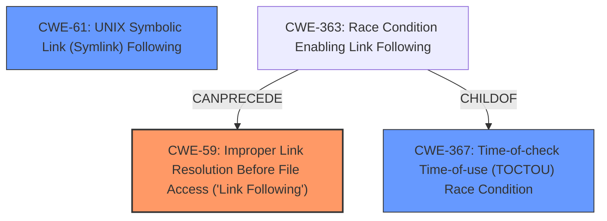

# Raw Analyzer Response for CVE-2024-29068

# Summary
| CWE ID | CWE Name | Confidence | CWE Abstraction Level | CWE Vulnerability Mapping Label | CWE-Vulnerability Mapping Notes |
|---|---|---|---|---|---|
| CWE-59 | Improper Link Resolution Before File Access ('Link Following') | 0.8 | Base | Allowed | Primary CWE.  The **improper file type check** did not prevent the program from following links to unintended resources.|
| CWE-367 | Time-of-check Time-of-use (TOCTOU) Race Condition | 0.6 | Base | Allowed | Secondary Candidate. A race condition could occur if the state of the file changes between the check and the use, leading to unexpected behavior. |
| CWE-61 | UNIX Symbolic Link (Symlink) Following | 0.5 | Compound | Allowed | Secondary Candidate. This is a composite of multiple weaknesses related to symlink handling. |

## Evidence and Confidence

*   **Confidence Score:** 0.7
*   **Evidence Strength:** MEDIUM

## Relationship Analysis
The primary CWE is CWE-59, which describes the **improper link resolution** issue. CWE-367 is a potential secondary issue if a Time-of-Check Time-of-Use race condition exists. CWE-61 is a compound weakness incorporating multiple issues related to symbolic links. The abstraction levels are Base for CWE-59 and CWE-367, and Compound for CWE-61. Choosing CWE-59 is appropriate because it directly addresses the root cause, while CWE-367 and CWE-61 describe related but less precise weaknesses.

## Vulnerability Chain
The vulnerability chain starts with the **improper file type check** (**rootcause**), leading to the ability to include symbolic links. This can then lead to the **improper link resolution** and a potential denial of service.

## Summary of Analysis
The analysis is based on the vulnerability description which states that the snapd application failed to properly check the file type when extracting a snap, which allowed an attacker to cause a denial of service. The CVE reference links content summary confirms that there was insufficient validation of symbolic links within snap packages.

The selection of CWE-59 is primarily influenced by the fact that the **improper file type check** directly leads to the vulnerability where the program does not properly prevent a filename from identifying a link or shortcut that resolves to an unintended resource. This aligns perfectly with the description of CWE-59. The selection is also supported by the retriever results, where CWE-59 is the top-ranked CWE. The fact that the fix includes a new function `evalAndValidateSymlink` further supports the identification of **improper link resolution**.

CWE-23, CWE-22, and CWE-61 were considered but not used as primary CWEs. CWE-23 and CWE-22 are related to path traversal, but the primary issue is the **improper handling of symbolic links** rather than path construction. CWE-61 is a compound weakness related to symlink handling, but CWE-59 is more specific to the root cause. CWE-367 could be a secondary issue, but it is not the direct cause of the vulnerability. Other CWEs like CWE-923, CWE-1284, CWE-1333, and CWE-863 are less relevant to the specific vulnerability described.