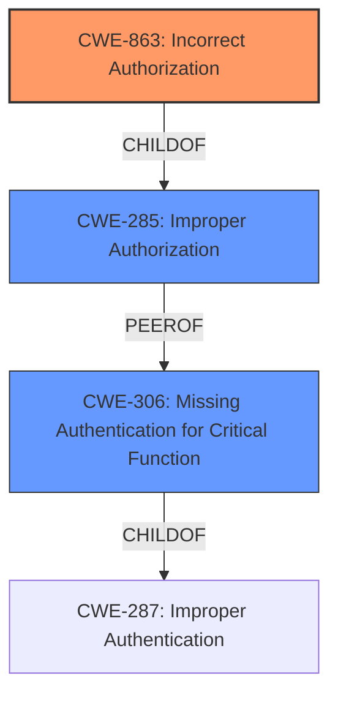

# Analysis Report for CVE-2024-29153

# Vulnerability Analysis Report: CVE-2024-29153

## Description

A vulnerability was discovered in Samsung Mobile Processor, Wearable Processor, and Modems with versions Exynos 9820, Exynos 9825, Exynos 980, Exynos 990, Exynos 850, Exynos 1080, Exynos 2100, Exynos 2200, Exynos 1280, Exynos 1380, Exynos 1330, Exynos 9110, Exynos W920, Exynos W930, Exynos Modem 5123, and Exynos Modem 5300 that involves **incorrect authorization of LTE NAS messages** and leads to downgrading to lower network generations and repeated DDOS.

## Vulnerability Description Key Phrases

- **Rootcause:** incorrect authorization of LTE NAS messages
- **Impact:** downgrading to lower network generations and repeated DDOS
- **Product:** Samsung Mobile Processor, Wearable Processor, and Modems
- **Version:** ['Exynos 9820', 'Exynos 9825', 'Exynos 980', 'Exynos 990', 'Exynos 850', 'Exynos 1080', 'Exynos 2100', 'Exynos 2200', 'Exynos 1280', 'Exynos 1380', 'Exynos 1330', 'Exynos 9110', 'Exynos W920', 'Exynos W930', 'Exynos Modem 5123', 'Exynos Modem 5300']

## Analysis (with Relationship Data)

# Summary
| CWE ID    | CWE Name                                                              | Confidence | CWE Abstraction Level | CWE Vulnerability Mapping Label | CWE-Vulnerability Mapping Notes |
| :-------- | :-------------------------------------------------------------------- | :--------- | :-------------------- | :------------------------------ | :------------------------------ |
| CWE-863   | Incorrect Authorization                                               | 0.9        | Class                 | Allowed-with-Review             | Primary CWE                     |
| CWE-285   | Improper Authorization                                                | 0.7        | Class                 | Discouraged                     | Secondary Candidate             |
| CWE-306   | Missing Authentication for Critical Function                          | 0.5        | Base                  | Allowed                         | Secondary Candidate             |

## Evidence and Confidence

*   **Confidence Score:** 0.8
*   **Evidence Strength:** HIGH

## Relationship Analysis
The primary relationship influencing the CWE selection is the parent-child relationship between CWE-285 (Improper Authorization) and CWE-863 (Incorrect Authorization). CWE-863 is a more specific type of improper authorization, where an authorization check is performed, but incorrectly. The description indicates that the authorization of LTE NAS messages is **incorrect**, leading to the vulnerability. Therefore, CWE-863 is a more precise classification than its parent, CWE-285. CWE-306 was also considered, but the vulnerability seems to be related to incorrect authorization rather than missing authentication.



## Vulnerability Chain
The vulnerability chain starts with the **incorrect authorization** of LTE NAS messages (CWE-863). This leads to the impact of downgrading to lower network generations and repeated DDOS attacks.

CWE-863 (Incorrect Authorization) -> Impact: Downgrading to lower network generations and repeated DDOS.

## Summary of Analysis
The initial analysis considered CWE-285 (Improper Authorization) because the vulnerability description mentions "**incorrect authorization of LTE NAS messages**". However, after further review and considering the CWE specifications, CWE-863 (Incorrect Authorization) was selected as the primary CWE. This is because CWE-863 is a more specific child of CWE-285, indicating that an authorization check is performed, but it is done incorrectly. This aligns with the description, which states that the authorization is **incorrect**.

The CWE-306 (Missing Authentication for Critical Function) was also considered, but it was ruled out because the vulnerability is related to authorization rather than authentication.

The final decision to use CWE-863 was based on the evidence that the authorization check is present but **incorrect**, leading to the vulnerability. CWE-863 is at the Class level of abstraction, which is appropriate for this vulnerability.

Relevant CWE Information:

# Enhanced Context (25 CWEs)
The following CWEs were identified as potentially relevant to this vulnerability:

## CWE-703: Improper Check or Handling of Exceptional Conditions
**Abstraction Level**: Pillar
**Similarity Score**: 0.77
**Source**: dense

**Description**:
The product does not properly anticipate or handle exceptional conditions that rarely occur during normal operation of the product.

**Mapping Guidance**:
- Usage: Discouraged
- Rationale: This CWE entry is extremely high-level, a Pillar.


## CWE-345: Insufficient Verification of Data Authenticity
**Abstraction Level**: Class
**Similarity Score**: 0.77
**Source**: dense

**Description**:
The product does not sufficiently verify the origin or authenticity of data, in a way that causes it to accept invalid data.

**Mapping Guidance**:
- Usage: Discouraged
- Rationale: This CWE entry is a level-1 Class (i.e., a child of a Pillar). It might have lower-level children that would be more appropriate


## CWE-754: Improper Check for Unusual or Exceptional Conditions
**Abstraction Level**: Class
**Similarity Score**: 0.76
**Source**: dense

**Description**:
The product does not check or incorrectly checks for unusual or exceptional conditions that are not expected to occur frequently during day to day operation of the product.

**Mapping Guidance**:
- Usage: Allowed-with-Review
- Rationale: This CWE entry is a Class and might have Base-level children that would be more appropriate


## CWE-668: Exposure of Resource to Wrong Sphere
**Abstraction Level**: Class
**Similarity Score**: 0.76
**Source**: dense

**Description**:
The product exposes a resource to the wrong control sphere, providing unintended actors with inappropriate access to the resource.

**Mapping Guidance**:
- Usage: Discouraged
- Rationale: CWE-668 is high-level and is often misused as a catch-all when lower-level CWE IDs might be applicable. It is sometimes used for low-information vulnerability reports [REF-1287]. It is a level-1 Class (i.e., a child of a Pillar). It is not useful for trend analysis.


## CWE-203: Observable Discrepancy
**Abstraction Level**: Base
**Similarity Score**: 0.75
**Source**: dense

**Description**:
The product behaves differently or sends different responses under different circumstances in a way that is observable to an unauthorized actor, which exposes security-relevant information about the state of the product, such as whether a particular operation was successful or not.

**Mapping Guidance**:
- Usage: Allowed
- Rationale: This CWE entry is at the Base level of abstraction, which is a preferred level of abstraction for mapping to the root causes of vulnerabilities.


## CWE-755: Improper Handling of Exceptional Conditions
**Abstraction Level**: Class
**Similarity Score**: 0.75
**Source**: dense

**Description**:
The product does not handle or incorrectly handles an exceptional condition.

**Mapping Guidance**:
- Usage: Discouraged
- Rationale: This CWE entry is a level-1 Class (i.e., a child of a Pillar). It might have lower-level children that would be more appropriate


## CWE-280: Improper Handling of Insufficient Permissions or Privileges 
**Abstraction Level**: Base
**Similarity Score**: 0.75
**Source**: dense

**Description**:
The product does not handle or incorrectly handles when it has insufficient privileges to access resources or functionality as specified by their permissions. This may cause it to follow unexpected code paths that may leave the product in an invalid state.

**Mapping Guidance**:
- Usage: Allowed
- Rationale: This CWE entry is at the Base level of abstraction, which is a preferred level of abstraction for mapping to the root causes of vulnerabilities.


## CWE-41: Improper Resolution of Path Equivalence
**Abstraction Level**: Base
**Similarity Score**: 0.75
**Source**: dense

**Description**:
The product is vulnerable to file system contents disclosure through path equivalence. Path equivalence involves the use of special characters in file and directory names. The associated manipulations are intended to generate multiple names for the same object.

**Mapping Guidance**:
- Usage: Allowed
- Rationale: This CWE entry is at the Base level of abstraction, which is a preferred level of abstraction for mapping to the root causes of vulnerabilities.


## CWE-697: Incorrect Comparison
**Abstraction Level**: Pillar
**Similarity Score**: 0.74
**Source**: dense

**Description**:
The product compares two entities in a security-relevant context, but the comparison is incorrect, which may lead to resultant weaknesses.

**Mapping Guidance**:
- Usage: Discouraged
- Rationale: This CWE entry is extremely high-level, a Pillar. However, sometimes this weakness is forced to be used due to the lack of in-depth weakness research. See Research Gaps.


## CWE-696: Incorrect Behavior Order
**Abstraction Level**: Class
**Similarity Score**: 0.74
**Source**: dense

**Description**:
The product performs multiple related behaviors, but the behaviors are performed in the wrong order in ways which may produce resultant weaknesses.

**Mapping Guidance**:
- Usage: Allowed-with-Review
- Rationale: This CWE entry is a Class and might have Base-level children that would be more appropriate


## CWE-285: Improper Authorization
**Abstraction Level**: Class
**Similarity Score**: 1453.87
**Source**: sparse

**Description**:
The product does not perform or incorrectly performs an authorization check when an actor attempts to access a resource or perform an action.

**Mapping Guidance**:
- Usage: Discouraged
- R


## CWE Relationship Analysis

Current CWEs represent these abstraction levels: .


### Vulnerability Chain Analysis

**Chain starting from CWE-863:**
- 863 (Incorrect Authorization) - ROOT


**Chain starting from CWE-280:**
- 280 (Improper Handling of Insufficient Permissions or Privileges ) - ROOT


### CWE Relationship Diagram

```mermaid
graph TD
    classDef primary fill:#f96,stroke:#333,stroke-width:2px
    classDef secondary fill:#69f,stroke:#333
    classDef tertiary fill:#9e9,stroke:#333
```


*Report generated on 2025-07-13 06:59:53*
