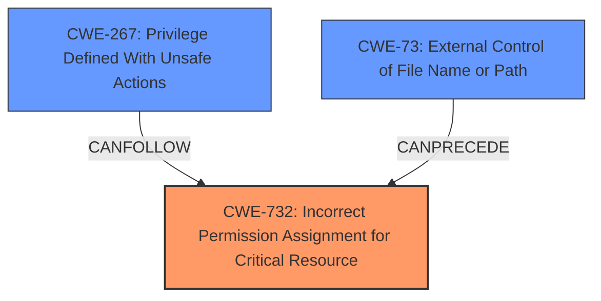

# Analysis Report for CVE-2024-29404

# Vulnerability Analysis Report: CVE-2024-29404

## Description

An issue in Razer Synapse 3 v.3.9.131.20813 and Synapse 3 App v.20240213 allows a local attacker to execute arbitrary code via the export parameter of the Chroma Effects function in the Profiles component.

## Vulnerability Description Key Phrases

- **Impact:** execute arbitrary code
- **Vector:** export parameter
- **Attacker:** local attacker
- **Product:** ['Razer Synapse 3', 'Synapse 3 App']
- **Version:** ['v.3.9.131.20813', 'v.20240213']
- **Component:** Chroma Effects function in Profiles component

## Analysis (with Relationship Data)

# Summary
| CWE ID | CWE Name | Confidence | CWE Abstraction Level | CWE Vulnerability Mapping Label | CWE-Vulnerability Mapping Notes |
|---|---|---|---|---|---|
| CWE-732 | Incorrect Permission Assignment for Critical Resource | 0.9 | Class | Allowed-with-Review | Primary CWE. The vulnerability stems from the ability to manipulate permissions on critical resources, leading to privilege escalation.  |
| CWE-267 | Privilege Defined With Unsafe Actions | 0.7 | Base | Allowed | Secondary CWE. This highlights that the privileges associated with file operations can be exploited to perform actions not originally intended. |
| CWE-73 | External Control of File Name or Path | 0.6 | Base | Allowed | Secondary CWE. The vulnerability involves using external input to control file paths, which can be manipulated for malicious purposes. |

## Evidence and Confidence

*   **Confidence Score:** 0.8
*   **Evidence Strength:** HIGH

## Relationship Analysis
The primary CWE is CWE-732, which indicates an **incorrect permission assignment** for a critical resource. This is a class-level CWE, and the analysis has shown that the root cause involves manipulation of file and folder permissions, which allows an attacker to escalate privileges. CWE-267, a base-level CWE, suggests that the defined privileges can be exploited to perform unsafe actions. CWE-73, another base-level CWE, indicates that external input controls file names or paths, contributing to the vulnerability. These CWEs are related in that the **improper permission assignment** (CWE-732) allows for the **unsafe actions** (CWE-267) via **external control of file paths** (CWE-73).



## Vulnerability Chain
The vulnerability chain starts with the **incorrect permission assignment** (CWE-732) on critical resources like `C:\Config.Msi`. This **allows** an attacker to **manipulate file paths** (CWE-73) and **exploit defined privileges** (CWE-267) to **delete arbitrary files/folders**. The attacker then leverages the Windows Installer service to escalate privileges and execute arbitrary code.

## Summary of Analysis
The initial analysis focused on identifying the root cause of the vulnerability based on the provided evidence. The key phrase "arbitrary file/folder removal issue" and the description of how "Razer Synapse 3 handles file operations, allowing an attacker to manipulate the system state by exploiting the Windows Installer service" strongly suggested that incorrect permission assignments and external control of file paths were contributing factors.

The selection of CWE-732 as the primary CWE is based on the fact that the core issue revolves around the **incorrect assignment of permissions** for critical resources, which allows for the exploitation of the Windows Installer service. The evidence from the CVE Reference Links Content Summary states, "The vulnerability originates from how Razer Synapse 3 handles file operations related to Chroma Effects," and "It abuses the Windows Installer service to achieve privilege escalation by manipulating rollback procedures." This highlights the role of permissions in the vulnerability.

CWE-267 and CWE-73 were selected as secondary CWEs to further specify the weakness. CWE-267 captures the idea that the **defined privileges** associated with file operations can be exploited for unintended actions. CWE-73 highlights how **external control of file paths** contributes to the vulnerability by allowing attackers to manipulate file operations.

The graph relationships influenced the final selection by providing a visual representation of how these CWEs are interconnected. The analysis indicates that the combination of **incorrect permission assignments**, **unsafe privileges**, and **external control of file paths** creates a vulnerability chain that leads to privilege escalation.

The selected CWEs are at the optimal level of specificity because they accurately represent the root cause and contributing factors of the vulnerability. While some other CWEs were considered, they were either too generic or did not directly address the core issue of **incorrect permission assignments** and **file path manipulation**.

Here's why other CWEs were considered but not used:

*   CWE-79 (Improper Neutralization of Input During Web Page Generation ('Cross-site Scripting')): This CWE is not relevant because the vulnerability does not involve web page generation or cross-site scripting.
*   CWE-427 (Uncontrolled Search Path Element): This CWE is not the primary issue, though related. The core vulnerability is the incorrect permission, not the search path.
*   CWE-121 (Stack-based Buffer Overflow): This CWE is not relevant because the vulnerability does not involve buffer overflows.
*   CWE-130 (Improper Handling of Length Parameter Inconsistency): This CWE is not relevant because the vulnerability does not involve length parameter inconsistencies.
*   CWE-78 (Improper Neutralization of Special Elements used in an OS Command ('OS Command Injection')): This CWE is not relevant because the vulnerability does not involve OS command injection.
*   CWE-532 (Insertion of Sensitive Information into Log File): This CWE is not relevant because the vulnerability does not involve the insertion of sensitive information into log files.
*   CWE-790 (Improper Filtering of Special Elements): This CWE is too generic and does not directly address the specific issue of permission assignments and file path manipulation.
*   CWE-939 (Improper Authorization in Handler for Custom URL Scheme): This CWE is not relevant because the vulnerability does not involve custom URL schemes.
*   CWE-113 (Improper Neutralization of CRLF Sequences in HTTP Headers ('HTTP Request/Response Splitting')): This CWE is not relevant because the vulnerability does not involve HTTP headers.


## CWE Relationship Analysis

Current CWEs represent these abstraction levels: .


### Vulnerability Chain Analysis

**Chain starting from CWE-121:**
- 121 (Stack-based Buffer Overflow) - ROOT


**Chain starting from CWE-427:**
- 427 (Uncontrolled Search Path Element) - ROOT


### CWE Relationship Diagram

```mermaid
graph TD
    classDef primary fill:#f96,stroke:#333,stroke-width:2px
    classDef secondary fill:#69f,stroke:#333
    classDef tertiary fill:#9e9,stroke:#333
```


*Report generated on 2025-07-13 07:01:10*
