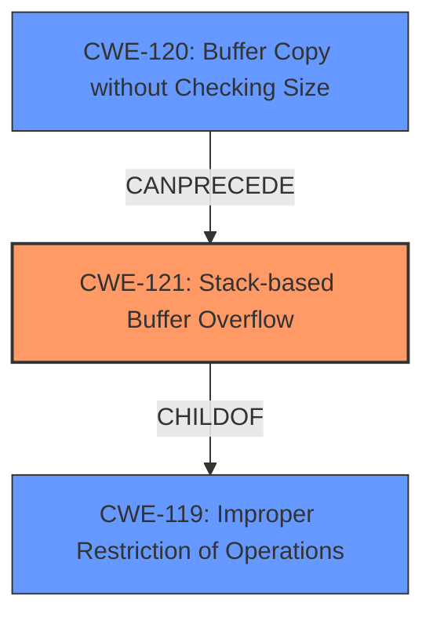

# Raw Analyzer Response for CVE-2024-29507

# Summary

| CWE ID | CWE Name | Confidence | CWE Abstraction Level | CWE Vulnerability Mapping Label | CWE-Vulnerability Mapping Notes |
|---|---|---|---|---|---|
| CWE-121 | Stack-based Buffer Overflow | 1.0 | Variant | Allowed | Primary CWE. Matches the vulnerability description and key phrases exactly. |
| CWE-120 | Buffer Copy without Checking Size of Input ('Classic Buffer Overflow') | 0.7 | Base | Allowed-with-Review | Secondary candidate. The root cause is copying without checking size, leading to the overflow. |
| CWE-119 | Improper Restriction of Operations within the Bounds of a Memory Buffer | 0.6 | Class | Discouraged | Secondary candidate. This is a parent class of the primary CWE. |

## Evidence and Confidence

*   **Confidence Score:** 0.9
*   **Evidence Strength:** HIGH

## Relationship Analysis
The primary relationship is the parent-child relationship between CWE-119 [Improper Restriction of Operations within the Bounds of a Memory Buffer] and CWE-121 [Stack-based Buffer Overflow], where the latter is a specific type of the former. CWE-120 [Buffer Copy without Checking Size of Input ('Classic Buffer Overflow')] can precede CWE-121, as the **buffer copy without checking size** leads to the **stack-based buffer overflow**.

## Vulnerability Chain
The vulnerability chain starts with the **improper buffer copy without checking the input size (CWE-120)**, leading to the **stack-based buffer overflow (CWE-121)**. The final impact is potential arbitrary code execution.
  - CWE-120: **Buffer Copy without Checking Size of Input ('Classic Buffer Overflow')**
  - CWE-121: **Stack-based Buffer Overflow**
  - Impact: Arbitrary code execution

## Summary of Analysis
The primary weakness is a **stack-based buffer overflow (CWE-121)**, which occurs because the code copies data into a buffer on the stack without proper bounds checking. The vulnerability description and key phrases explicitly mention "stack-based buffer overflow", making CWE-121 the most accurate and specific classification. The evidence from "CVE Reference Links Content Summary" confirms that the `memcpy` operation copies attacker-controlled data into a fixed-size buffer on the stack without checking if the size of the attacker-controlled input exceeds the buffer's capacity. This leads to a buffer overflow on the stack, which is precisely what CWE-121 describes.

The selection of CWE-121 is further supported by its Variant abstraction level, which is a preferred level of abstraction. The retriever results also list CWE-121, giving additional confidence.

CWE-120 [Buffer Copy without Checking Size of Input ('Classic Buffer Overflow')] is considered as a secondary CWE because it describes the root cause, where the buffer is copied without checking the size of the input. This action leads to the overflow.

CWE-119 [Improper Restriction of Operations within the Bounds of a Memory Buffer] is the parent Class of CWE-121, representing a more general form of the vulnerability. While relevant, it is less specific than CWE-121.

Other CWEs considered but not used:

*   CWE-190 [Integer Overflow or Wraparound]: Although listed in the retriever results, there's no evidence of integer overflow in the provided vulnerability description.
*   CWE-124 [Buffer Underwrite ('Buffer Underflow')]: This CWE is for buffer underflows, which is the opposite of what the vulnerability description indicates.
*   CWE-131 [Incorrect Calculation of Buffer Size]: While potentially related, the primary issue isn't the incorrect calculation of the buffer size but the **lack of bounds checking** during the `memcpy` operation.
*   CWE-788 [Access of Memory Location After End of Buffer]: Similar to CWE-125, this is a symptom rather than the root cause.
*   CWE-125 [Out-of-bounds Read]: Not applicable, as the vulnerability is a buffer overflow (write), not a read.
*    CWE-193 [Off-by-one Error]: There is no evidence of an off-by-one error in the vulnerability description.

The choice of CWE-121 is based on its precise match with the vulnerability description, its appropriate abstraction level, and the supporting evidence from the CVE reference links content summary.