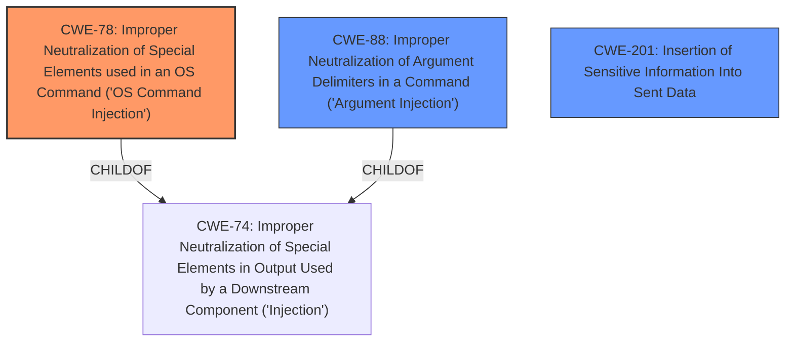

# Analysis for CVE-2024-29737

# Summary
| CWE ID | CWE Name | Confidence | CWE Abstraction Level | CWE Vulnerability Mapping Label | CWE-Vulnerability Mapping Notes |
|---|---|---|---|---|---|
| CWE-78 | Improper Neutralization of Special Elements used in an OS Command ('OS Command Injection') | 0.9 | Base | Primary | Allowed |
| CWE-88 | Improper Neutralization of Argument Delimiters in a Command ('Argument Injection') | 0.7 | Base | Secondary | Allowed |
| CWE-201 | Insertion of Sensitive Information Into Sent Data | 0.4 | Base | Secondary | Allowed |

## Evidence and Confidence

*   **Confidence Score:** 0.8
*   **Evidence Strength:** MEDIUM

## Relationship Analysis
The primary relationship influencing the CWE selection is the parent-child relationship between CWE-74 (Improper Neutralization of Special Elements in Output Used by a Downstream Component ('Injection')) and CWE-78. CWE-78 is a more specific case of CWE-74, focusing on OS command injection. The vulnerability description clearly indicates the injection occurs within an OS command, making CWE-78 the more appropriate choice. CWE-88 is also a child of CWE-74 and represents argument injection, which is similar but the focus is less on argument delimiters. CWE-201 is related to sensitive data exposure, and may be related as the injected commands could expose system data.

## Vulnerability Chain
The vulnerability chain starts with **improper input validation**, leading to **command injection**, and ultimately resulting in **command execution**. The **improper input validation** allows an attacker to insert arbitrary commands into the build arguments, which are then executed by the system.

## Summary of Analysis
The primary CWE identified is CWE-78 (Improper Neutralization of Special Elements used in an OS Command ('OS Command Injection')). This is because the vulnerability description explicitly states that attackers can insert commands into the build arguments, leading to command execution. The phrase "input `touch /tmp/success_2.1.2` as the Build Argument" is key evidence. This directly aligns with the description of CWE-78, which involves constructing an OS command using externally influenced input without proper neutralization.

CWE-88 (Improper Neutralization of Argument Delimiters in a Command ('Argument Injection')) is considered as a secondary CWE. While the vulnerability involves injecting commands, the focus is less on argument delimiters and more on the overall command being injected. CWE-88 could still be applicable as argument delimiters might be involved in crafting the injected command.

CWE-201 (Insertion of Sensitive Information Into Sent Data) is also considered as a secondary CWE. Although the primary concern is command injection, the injected commands could potentially lead to the exposure of sensitive system information. The execution of arbitrary commands might allow an attacker to access and exfiltrate sensitive data.

CWE-863, CWE-285, CWE-138, CWE-95, and CWE-79 were considered but not selected as primary CWEs. CWE-863 and CWE-285 relate to authorization issues, but the primary weakness is the lack of proper input validation. CWE-138 is a higher-level class related to improper neutralization, but CWE-78 is a more specific base-level CWE. CWE-95 relates to eval injection, which is not the case here, and CWE-79 relates to cross-site scripting, which is also not applicable.

The selection of CWE-78 is at the optimal level of specificity because it directly addresses the root cause of the vulnerability: the lack of proper neutralization of special elements in OS commands. The provided evidence and the relationship analysis support this classification.