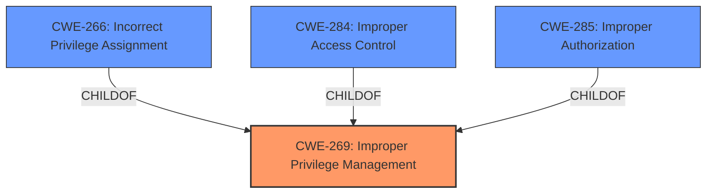

# Enhanced Analysis for CVE-2024-30087

# Summary
| CWE ID       | CWE Name                                                                    | Confidence | CWE Abstraction Level | CWE Vulnerability Mapping Label | CWE-Vulnerability Mapping Notes |
|--------------|-----------------------------------------------------------------------------|------------|-----------------------|---------------------------------|---------------------------------|
| CWE-269      | Improper Privilege Management                                               | 0.6        | Class                 | Primary CWE                       | Discouraged                     |
| CWE-NVD-noinfo | No Information Available                                                | 0.4        | N/A                   | Secondary Candidate               | N/A                             |

## Evidence and Confidence

*   **Confidence Score:** 0.6
*   **Evidence Strength:** LOW

## Relationship Analysis
The primary relationship considered was the hierarchical structure, particularly the parent-child relationships. The initial inclination was to select a more specific CWE, but the limited evidence made it difficult. The relationship guidance pointed to more specific CWEs based on privilege vs permissions, but this information was not included in the evidence.



## Vulnerability Chain
The vulnerability chain is not clearly defined due to the limited information. The description only mentions "Elevation of Privilege", without specifying the root cause. Therefore, only the impact is known.

## Summary of Analysis
The initial assessment favored CWE-NVD-noinfo due to the lack of specific information in the CVE description and reference links content summary. However, the "Vulnerability Description Key Phrases" includes "impact: elevation of privilege", which suggests a problem with privilege management. Given the limited information, CWE-269 Improper Privilege Management was selected as the primary CWE as it is a high level class.

The selection of CWE-269 is based on the vulnerability's stated impact of privilege elevation and is further supported by its inclusion in the Top CWEs for similar CVE Descriptions. The guidance also suggests that when root cause is unknown but the impact is privilege related, then CWE-269 is the right selection.

Other CWEs Considered:

*   **CWE-NVD-noinfo:** Initially considered due to the lack of detail, but the "elevation of privilege" impact suggested a more specific CWE was possible. While CWE-NVD-noinfo is the Primary CWE Match for similar Vulnerability Descriptions. It is better to provide a CWE that identifies the vulnerability when possible.
*   **CWE-266, CWE-284, CWE-285**: These are more specific CWEs related to privilege and permission issues. However, without more information, it is difficult to determine if the vulnerability stems from incorrect privilege assignment, improper access control, or improper authorization.
*   **CWE-787 Out-of-bounds Write, CWE-123 Write-what-where Condition**: These are memory corruption issues that could lead to privilege escalation. But there is no evidence in the description to support these.

Relevant CWE Information:

# Enhanced Context (25 CWEs)
The following CWEs were identified as potentially relevant to this vulnerability:

## CWE-266: Incorrect Privilege Assignment
**Abstraction Level**: Base
**Similarity Score**: 0.79
**Source**: dense

**Description**:
A product incorrectly assigns a privilege to a particular actor, creating an unintended sphere of control for that actor.

**Mapping Guidance**:
- Usage: Allowed
- Rationale: This CWE entry is at the Base level of abstraction, which is a preferred level of abstraction for mapping to the root causes of vulnerabilities.

## CWE-269: Improper Privilege Management
**Abstraction Level**: Class
**Similarity Score**: 1229.37
**Source**: sparse

**Description**:
The product does not properly assign, modify, track, or check privileges for an actor, creating an unintended sphere of control for that actor.

**Mapping Guidance**:
- Usage: Discouraged
- Rationale: CWE-269 is commonly misused. It can be conflated with "privilege escalation," which is a technical impact that is listed in many low-information vulnerability reports [REF-1287]. It is not useful for trend analysis.

## CWE-NVD-noinfo
CWE-NVD-noinfo: No Information Available


## CWE Relationship Analysis

Current CWEs represent these abstraction levels: .


### Vulnerability Chain Analysis

**Chain starting from CWE-123:**
- 123 (Write-what-where Condition) - ROOT


**Chain starting from CWE-787:**
- 787 (Out-of-bounds Write) - ROOT


### CWE Relationship Diagram

```mermaid
graph TD
    classDef primary fill:#f96,stroke:#333,stroke-width:2px
    classDef secondary fill:#69f,stroke:#333
    classDef tertiary fill:#9e9,stroke:#333
```