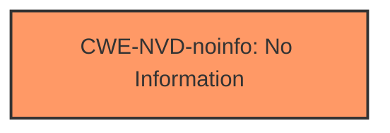

# Enhanced Analysis for CVE-2024-30090

# Summary
| CWE ID       | CWE Name                                                         | Confidence | CWE Abstraction Level | CWE Vulnerability Mapping Label | CWE-Vulnerability Mapping Notes |
|--------------|-------------------------------------------------------------------|------------|-----------------------|---------------------------------|-----------------------------------|
| CWE-NVD-noinfo | No Information                                                  | 0.9        | N/A                   | Primary                         | N/A                              |

## Evidence and Confidence

*   **Confidence Score:** 0.9
*   **Evidence Strength:** LOW

## Relationship Analysis
Since the primary CWE is CWE-NVD-noinfo, there are no meaningful relationships to analyze. The vulnerability description provides insufficient information to determine the root cause or specific weakness.



## Vulnerability Chain
Due to the lack of information, it is impossible to construct a vulnerability chain. The vulnerability description only mentions "Elevation of Privilege" as the impact, but it does not provide any details about the root cause or the sequence of events that lead to the privilege escalation.

## Summary of Analysis
The primary recommendation from the **CWE for similar CVE Descriptions** is CWE-NVD-noinfo (No Information), with a significantly higher count than other CWEs. The **Vulnerability Description Key Phrases** only provides the impact and the product, but no rootcause. The **CVE Reference Links Content Summary** section shows "UNRELATED", indicating that no additional information can be extracted from the CVE references.

Given the very limited information and the prevalence of CWE-NVD-noinfo for similar CVEs, it is the most appropriate choice. The other CWEs suggested by the retriever results are not applicable because there is no information to support a specific type of weakness.

Relevant CWE Information:

# Enhanced Context (25 CWEs)
The following CWEs were identified as potentially relevant to this vulnerability:

## CWE-59: Improper Link Resolution Before File Access ('Link Following')
## CWE-266: Incorrect Privilege Assignment
## CWE-267: Privilege Defined With Unsafe Actions
## CWE-280: Improper Handling of Insufficient Permissions or Privileges
## CWE-274: Improper Handling of Insufficient Privileges
## CWE-41: Improper Resolution of Path Equivalence
## CWE-668: Exposure of Resource to Wrong Sphere
## CWE-73: External Control of File Name or Path
## CWE-276: Incorrect Default Permissions
## CWE-754: Improper Check for Unusual or Exceptional Conditions
## CWE-269: Improper Privilege Management
## CWE-863: Incorrect Authorization
## CWE-59: Improper Link Resolution Before File Access ('Link Following')
## CWE-267: Privilege Defined With Unsafe Actions
## CWE-266: Incorrect Privilege Assignment
## CWE-363: Race Condition Enabling Link Following
## CWE-123: Write-what-where Condition
## CWE-59: Improper Link Resolution Before File Access ('Link Following')
## CWE-426: Untrusted Search Path
## CWE-280: Improper Handling of Insufficient Permissions or Privileges
## CWE-274: Improper Handling of Insufficient Privileges
## CWE-250: Execution with Unnecessary Privileges
## CWE-1386: Insecure Operation on Windows Junction / Mount Point
## CWE-306: Missing Authentication for Critical Function
## CWE-787: Out-of-bounds Write


## CWE Relationship Analysis

Current CWEs represent these abstraction levels: .


### Vulnerability Chain Analysis

**Chain starting from CWE-274:**
- 274 (Improper Handling of Insufficient Privileges) - ROOT


**Chain starting from CWE-787:**
- 787 (Out-of-bounds Write) - ROOT


### CWE Relationship Diagram

```mermaid
graph TD
    classDef primary fill:#f96,stroke:#333,stroke-width:2px
    classDef secondary fill:#69f,stroke:#333
    classDef tertiary fill:#9e9,stroke:#333
```