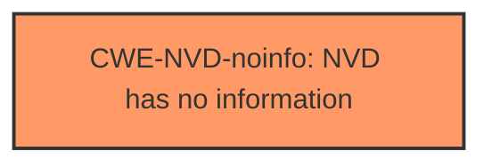

# Enhanced Analysis for CVE-2024-30105

# Summary

| CWE ID        | CWE Name                                                                   | Confidence | CWE Abstraction Level | CWE Vulnerability Mapping Label | CWE-Vulnerability Mapping Notes |
| ------------- | -------------------------------------------------------------------------- | ---------- | --------------------- | ------------------------------- | ------------------------------- |
| CWE-NVD-noinfo | NVD has no information for this Common Weakness Enumeration assignment    | 0.7        | -                     | Primary                         | -                               |

## Evidence and Confidence

*   **Confidence Score:** 0.7
*   **Evidence Strength:** LOW

## Relationship Analysis

There is no specific CWE selected. The relationships are not applicable as CWE-NVD-noinfo indicates a lack of information.



## Vulnerability Chain

The description only mentions a denial of service vulnerability in .NET, but it doesn't provide any details about the root cause. Therefore, there is no vulnerability chain to map.

## Summary of Analysis

The vulnerability description provides very limited information, stating only that there is a Denial of Service vulnerability in .NET. The "CVE Reference Links Content Summary" section is unhelpful, and the "Vulnerability Description Key Phrases" only identifies the impact (Denial of Service) and the affected product (.NET).

The "CWE for similar CVE Descriptions" section lists "CWE-NVD-noinfo" as the primary CWE match and the top CWE. Given the lack of detailed information, assigning CWE-NVD-noinfo is the most appropriate action.

I considered the other CWEs in the Retriever Results but none of them can be applied given the lack of detail in the vulnerability description. For example, CWE-119 (Improper Restriction of Operations within the Bounds of a Memory Buffer) is too generic, and there's no evidence to support a buffer overflow condition. Similarly, CWE-520 (.NET Misconfiguration: Use of Impersonation) is specific to .NET misconfigurations, but there's no indication of such a misconfiguration in the description.

My assessment is based on the provided evidence only, which is quite limited. Because the evidence is limited, I am assigning a confidence score of 0.7.


## CWE Relationship Analysis

Current CWEs represent these abstraction levels: .


### Vulnerability Chain Analysis

**Chain starting from CWE-520:**
- 520 (.NET Misconfiguration: Use of Impersonation) - ROOT


**Chain starting from CWE-119:**
- 119 (Improper Restriction of Operations within the Bounds of a Memory Buffer) - ROOT


### CWE Relationship Diagram

```mermaid
graph TD
    classDef primary fill:#f96,stroke:#333,stroke-width:2px
    classDef secondary fill:#69f,stroke:#333
    classDef tertiary fill:#9e9,stroke:#333
```