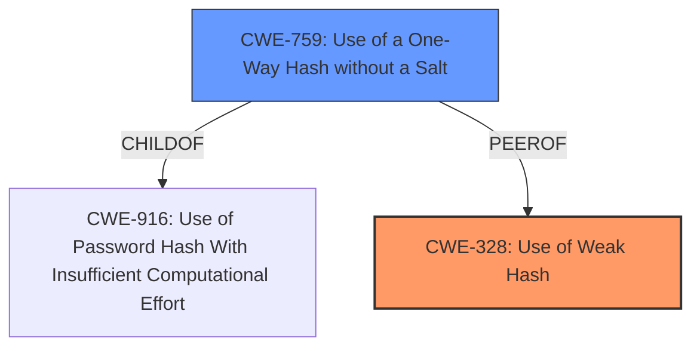

# Raw Analyzer Response for CVE-2024-3049

# Summary
| CWE ID | CWE Name | Confidence | CWE Abstraction Level | CWE Vulnerability Mapping Label | CWE-Vulnerability Mapping Notes |
|---|---|---|---|---|---|
| CWE-328 | Use of Weak Hash | 0.9 | Base | Allowed | Primary CWE |
| CWE-759 | Use of a One-Way Hash without a Salt | 0.7 | Variant | Allowed | Secondary Candidate |

## Evidence and Confidence

*   **Confidence Score:** 0.8
*   **Evidence Strength:** HIGH

## Relationship Analysis
The primary CWE is CWE-328, which describes the use of a weak hash algorithm. CWE-759 is a variant of CWE-916 and describes using a one-way hash without a salt. Since the vulnerability involves a specially-crafted hash, CWE-328 is more appropriate.

## Vulnerability Chain
The vulnerability chain starts with the **use of a specially crafted hash** that is passed to `gcry_md_get_algo_dlen()`. This leads to an invalid HMAC being accepted, ultimately allowing unauthorized access or resource manipulation.
  - Root Cause: **Use of Weak Hash (CWE-328)**
  - Impact: Acceptance of invalid HMAC leading to unauthorized access.

## Summary of Analysis
The initial analysis focused on identifying the root cause of the vulnerability. The vulnerability description and CVE details clearly indicate a problem with the hash being used in the HMAC verification process. The selection of CWE-328 is primarily based on the following evidence from the "CVE Reference Links Content Summary":
- "The vulnerability lies in the `gcry_md_get_algo_dlen()` function, which returns 0 for an unknown or specially crafted hash."
- "Improper validation of cryptographic hash algorithm."
- "An attacker can bypass the HMAC authentication, potentially leading to unauthorized access"

The retriever results also suggested CWE-759 as a potential candidate, but the primary issue is the **use of a specially crafted hash** algorithm rather than the absence of a salt. Therefore, CWE-328 is the more accurate representation of the root cause. The graph relationships helped to visualize the connection between CWE-328 and other related CWEs, confirming its appropriateness. The selected CWE is at the Base level of specificity.

Relevant CWE Information:

# Enhanced Context (25 CWEs)
The following CWEs were identified as potentially relevant to this vulnerability:

## CWE-328: Use of Weak Hash
**Abstraction Level**: Base
**Similarity Score**: 0.76
**Source**: dense

**Description**:
The product uses an algorithm that produces a digest (output value) that does not meet security expectations for a hash function that allows an adversary to reasonably determine the original input (preimage attack), find another input that can produce the same hash (2nd preimage attack), or find multiple inputs that evaluate to the same hash (birthday attack).

**Mapping Guidance**:
- Usage: Allowed
- Rationale: This CWE entry is at the Base level of abstraction, which is a preferred level of abstraction for mapping to the root causes of vulnerabilities.

## CWE-759: Use of a One-Way Hash without a Salt
**Abstraction Level**: variant
**Similarity Score**: 2.16
**Source**: graph

**Description**:
CWE-759: Use of a One-Way Hash without a Salt

**Mapping Guidance**:
- Usage: Allowed
- Rationale: This CWE entry is at the Variant level of abstraction, which is a preferred level of abstraction for mapping to the root causes of vulnerabilities.

**Relationships**:
- CHILDOF -> CWE-916
- PARENTOF -> CWE-759