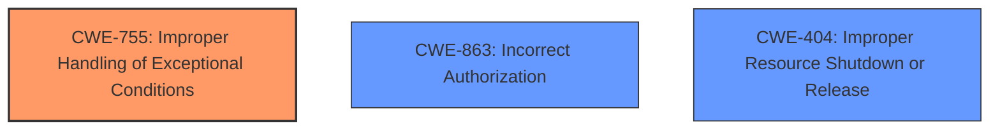

# Analysis Report for CVE-2024-31145

# Vulnerability Analysis Report: CVE-2024-31145

## Description

Certain PCI devices in a system might be assigned Reserved Memory Regions (specified via Reserved Memory Region Reporting, RMRR) for Intel VT-d or Unity Mapping ranges for AMD-Vi. These are typically used for platform tasks such as legacy USB emulation. Since the precise purpose of these regions is unknown, once a device associated with such a region is active, the mappings of these regions need to remain continuouly accessible by the device. In the logic establishing these mappings, **error handling was flawed**, resulting in such mappings to potentially remain in place when they should have been removed again. Respective guests would then gain access to memory regions which they arent supposed to have access to.

## Vulnerability Description Key Phrases

- **Rootcause:** error handling was flawed
- **Impact:** gain access to memory regions which they aren't supposed to have access to
- **Product:** PCI devices

## Analysis (with Relationship Data)

# Summary
| CWE ID | CWE Name | Confidence | CWE Abstraction Level | CWE Vulnerability Mapping Label | CWE-Vulnerability Mapping Notes |
|---|---|---|---|---|---|
| CWE-755 | Improper Handling of Exceptional Conditions | 0.8 | Class | Primary | Allowed-with-Review |
| CWE-863 | Incorrect Authorization | 0.6 | Class | Secondary Candidate | Allowed-with-Review |
| CWE-404 | Improper Resource Shutdown or Release | 0.5 | Class | Secondary Candidate | Allowed-with-Review |

## Evidence and Confidence

*   **Confidence Score:** 0.7
*   **Evidence Strength:** MEDIUM

## Relationship Analysis
The primary relationship influencing the decision is the parent-child relationship. CWE-755 is a class-level CWE, and there might be more specific child CWEs, but the provided information doesn't give enough details to select a child. CWE-863 and CWE-404 are also class-level CWEs that could be considered as secondary issues because of the memory access and resource issues.



## Vulnerability Chain
The vulnerability chain starts with **flawed error handling** (CWE-755), which leads to incorrect mapping deallocation. This results in unauthorized memory access.
- **Root Cause:** CWE-755: Improper Handling of Exceptional Conditions
- **Weakness:** Incorrect IOMMU Mapping Deallocation
- **Impact:** Unauthorized memory access, potential privilege escalation, information leaks.

## Summary of Analysis
The primary CWE is CWE-755 because the root cause is described as "**error handling was flawed**". The content summary also mentions the "lack of proper error handling". This is the most direct match to the provided information. The graph relationships suggest that other issues like incorrect authorization (CWE-863) or improper resource shutdown (CWE-404) could be contributing factors. However, the lack of detail makes it difficult to confirm. Therefore, CWE-755 is the most accurate and specific choice based on the available evidence.

Relevant CWE Information:

# Enhanced Context (25 CWEs)
The following CWEs were identified as potentially relevant to this vulnerability:

## CWE-755: Improper Handling of Exceptional Conditions
**Abstraction Level**: Class
**Similarity Score**: 0.77
**Source**: dense

**Description**:
The product does not handle or incorrectly handles an exceptional condition.

**Mapping Guidance**:
- Usage: Discouraged
- Rationale: This CWE entry is a level-1 Class (i.e., a child of a Pillar). It might have lower-level children that would be more appropriate

**Analysis:** The vulnerability description says "**error handling was flawed**", which aligns with CWE-755. The mapping guidance discourages using class-level CWEs if more specific ones are available. However, without more detail, a more specific CWE cannot be selected.

## CWE-667: Improper Locking
**Abstraction Level**: Class
**Similarity Score**: 0.76
**Source**: dense

**Description**:
The product does not properly acquire or release a lock on a resource, leading to unexpected resource state changes and behaviors.

**Mapping Guidance**:
- Usage: Allowed-with-Review
- Rationale: This CWE entry is a Class and might have Base-level children that would be more appropriate

**Analysis:** While concurrency issues might exist, the primary issue is with error handling during memory mapping. So, not selected.

## CWE-1285: Improper Validation of Specified Index, Position, or Offset in Input
**Abstraction Level**: Base
**Similarity Score**: 0.75
**Source**: dense

**Description**:
The product receives input that is expected to specify an index, position, or offset into an indexable resource such as a buffer or file, but it does not validate or incorrectly validates that the specified index/position/offset has the required properties.

**Mapping Guidance**:
- Usage: Allowed
- Rationale: This CWE entry is at the Base level of abstraction, which is a preferred level of abstraction for mapping to the root causes of vulnerabilities.

**Analysis:** The problem isn't necessarily with validating an index, position, or offset, but with the overall error handling of the memory mapping process. So, not selected.

## CWE-119: Improper Restriction of Operations within the Bounds of a Memory Buffer
**Abstraction Level**: Class
**Similarity Score**: 0.75
**Source**: dense

**Description**:
The product performs operations on a memory buffer, but it reads from or writes to a memory location outside the buffer's intended boundary. This may result in read or write operations on unexpected memory locations that could be linked to other variables, data structures, or internal program data.

**Mapping Guidance**:
- Usage: Discouraged
- Rationale: CWE-119 is commonly misused in low-information vulnerability reports when lower-level CWEs could be used instead, or when more details about the vulnerability are available.

**Analysis:** While the vulnerability leads to memory access violations, the root cause isn't directly related to improper restriction of operations within a buffer. So, not selected.

## CWE-362: Concurrent Execution using Shared Resource with Improper Synchronization ('Race Condition')
**Abstraction Level**: Class
**Similarity Score**: 0.75
**Source**: dense

**Description**:
The product contains a concurrent code sequence that requires temporary, exclusive access to a shared resource, but a timing window exists in which the shared resource can be modified by another code sequence operating concurrently.

**Mapping Guidance**:
- Usage: Allowed-with-Review
- Rationale: This CWE entry is a Class and might have Base-level children that would be more appropriate

**Analysis:** There is no explicit mention of concurrency or race conditions in the description. So, not selected.

## CWE-824: Access of Uninitialized Pointer
**Abstraction Level**: Base
**Similarity Score**: 0.75
**Source**: dense

**Description**:
The product accesses or uses a pointer that has not been initialized.

**Mapping Guidance**:
- Usage: Allowed
- Rationale: This CWE entry is at the Base level of abstraction, which is a preferred level of abstraction for mapping to the root causes of vulnerabilities.

**Analysis:** There is no mention of uninitialized pointers. So, not selected.

## CWE-404: Improper Resource Shutdown or Release
**Abstraction Level**: Class
**Similarity Score**: 0.74
**Source**: dense

**Description**:
The product does not release or incorrectly releases a resource before it is made available for re-use.

**Mapping Guidance**:
- Usage: Allowed-with-Review
- Rationale: This CWE entry is a Class and might have Base-level children that would be more appropriate

**Analysis:** The mappings should have been removed. So this is a possible secondary issue. The mappings can be considered a resource.

## CWE-131: Incorrect Calculation of Buffer Size
**Abstraction Level**: Base
**Similarity Score**: 0.74
**Source**: dense

**Description**:
The product does not correctly calculate the size to be used when allocating a buffer, which could lead to a buffer overflow.

**Mapping Guidance**:
- Usage: Allowed
- Rationale: This CWE entry is at the Base level of abstraction, which is a preferred level of abstraction for mapping to the root causes of vulnerabilities.

**Analysis:** There is no indication of buffer size calculation issues. So, not selected.

## CWE-252: Unchecked Return Value
**Abstraction Level**: Base
**Similarity Score**: 0.74
**Source**: dense

**Description**:
The product does not check the return value from a method or function, which can prevent it from detecting unexpected states and conditions.

**Mapping Guidance**:
- Usage: Allowed
- Rationale: This CWE entry is at the Base level of abstraction, which is a preferred level of abstraction for mapping to the root causes of vulnerabilities.

**Analysis:** While this could be related to the error handling, the description doesn't provide sufficient information to confirm. So, not selected.

## CWE-908: Use of Uninitialized Resource
**Abstraction Level**: Base
**Similarity Score**: 0.74
**Source**: dense

**Description**:
The product uses or accesses a resource that has not been initialized.

**Mapping Guidance**:
- Usage: Allowed
- Rationale: This CWE entry is at the Base level of abstraction, which is a preferred level of abstraction for mapping to the root causes of vulnerabilities.

**Analysis:** There is no mention of uninitialized resources. So, not selected.

## CWE-755: Improper Handling of Exceptional Conditions
**Abstraction Level**: Class
**Similarity Score**: 1194.74
**Source**: sparse


## CWE Relationship Analysis

Current CWEs represent these abstraction levels: .


### Vulnerability Chain Analysis

**Chain starting from CWE-863:**
- 863 (Incorrect Authorization) - ROOT


**Chain starting from CWE-404:**
- 404 (Improper Resource Shutdown or Release) - ROOT


### CWE Relationship Diagram

```mermaid
graph TD
    classDef primary fill:#f96,stroke:#333,stroke-width:2px
    classDef secondary fill:#69f,stroke:#333
    classDef tertiary fill:#9e9,stroke:#333
```


*Report generated on 2025-07-13 07:18:44*
