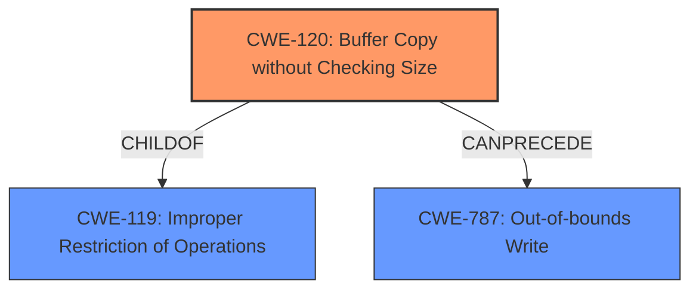

# Analysis for CVE-2024-31155

# Summary
| CWE ID | CWE Name | Confidence | CWE Abstraction Level | CWE Vulnerability Mapping Label | CWE-Vulnerability Mapping Notes |
|---|---|---|---|---|---|
| CWE-120 | Buffer Copy without Checking Size of Input ('Classic Buffer Overflow') | 0.75 | Base | Allowed | Primary CWE. **Improper buffer restrictions** can lead to buffer overflows if the size of the input isn't checked before copying it to a buffer. |

## Evidence and Confidence

*   **Confidence Score:** 0.75
*   **Evidence Strength:** MEDIUM

## Relationship Analysis
The primary CWE is CWE-120 (Buffer Copy without Checking Size of Input). CWE-120 is a child of CWE-119 (Improper Restriction of Operations within the Bounds of a Memory Buffer), which is a more general class of vulnerability. CWE-120 can precede CWE-787 (Out-of-bounds Write).

## Vulnerability Chain
The vulnerability chain starts with **improper buffer restrictions** (CWE-120). If the input size isn't checked, a buffer overflow can occur, leading to an out-of-bounds write (CWE-787). This can then lead to escalation of privilege.

## Summary of Analysis
The vulnerability description clearly indicates **improper buffer restrictions** as the root cause. While the description also mentions "escalation of privilege," this is an impact of the vulnerability rather than the root cause itself. The retriever results suggest CWE-119 (Improper Restriction of Operations within the Bounds of a Memory Buffer), which is a parent of CWE-120. However, CWE-120 (Buffer Copy without Checking Size of Input) is a more specific and accurate representation of the **improper buffer restrictions**, making it a better fit. CWE-120 is a Base level CWE, which is the preferred level of abstraction.

Relevant CWE Information:
- The vulnerability description mentions "**Improper buffer restrictions**", which directly relates to the concept of not properly restricting the size of data copied into a buffer.
- The retriever results and graph relationships support the link between buffer restrictions and buffer overflows.
- The description specifies that a privileged user can escalate privileges, which is a common consequence of buffer overflows.
- The mitigation involves UEFI firmware updates, which typically address coding errors related to buffer handling.
- There's a potential mapping to CWE-787 (Out-of-bounds Write) as a consequence of the buffer overflow, but I'm focusing on the root cause (CWE-120) for now.

I considered the following CWEs but did not select them:

*   CWE-691 (Insufficient Control Flow Management): This is a high-level CWE and doesn't accurately represent the specific weakness.
*   CWE-119 (Improper Restriction of Operations within the Bounds of a Memory Buffer): While related, CWE-120 provides a more specific description of the vulnerability.
*   CWE-453 (Insecure Default Variable Initialization): This CWE is not directly related to the **improper buffer restrictions**.
*   CWE-284 (Improper Access Control): This is a very high-level CWE (Pillar) and doesn't fit the specifics of the vulnerability.
*   CWE-277 (Insecure Inherited Permissions): This CWE is not relevant to the described vulnerability.
*   CWE-466 (Return of Pointer Value Outside of Expected Range): This CWE is not directly related to the **improper buffer restrictions**.
*   CWE-693 (Protection Mechanism Failure): This is a high-level CWE and doesn't accurately represent the specific weakness.
*   CWE-248 (Uncaught Exception): This CWE is not relevant to the described vulnerability.
*   CWE-1256 (Improper Restriction of Software Interfaces to Hardware Features): This CWE is not directly related to the **improper buffer restrictions**.
*   CWE-1257 (Improper Access Control Applied to Mirrored or Aliased Memory Regions): This CWE is not directly related to the **improper buffer restrictions**.

I am providing a confidence score of 0.75 because while the evidence points strongly to CWE-120, there's a slight possibility that the **improper buffer restrictions** could manifest in a different way. However, based on the information available, CWE-120 is the most likely and accurate classification.