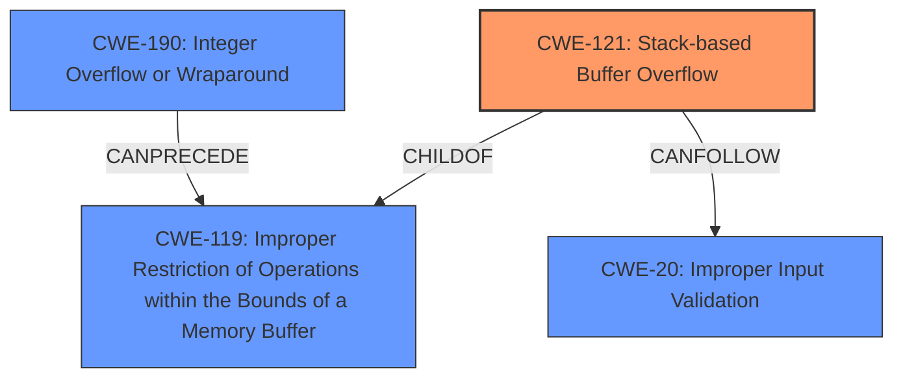

# Enhanced Analysis for CVE-2024-31449

# Summary

| CWE ID  | CWE Name                                                                         | Confidence | CWE Abstraction Level | CWE Vulnerability Mapping Label | CWE-Vulnerability Mapping Notes |
| :-------- | :------------------------------------------------------------------------------- | :--------- | :---------------------- | :------------------------------ | :------------------------------ |
| CWE-121   | Stack-based Buffer Overflow                                                      | 1.0        | Variant                 | Primary                         | Allowed                         |
| CWE-20    | Improper Input Validation                                                        | 0.7        | Class                   | Secondary                       | Allowed                         |
| CWE-190   | Integer Overflow or Wraparound                                                   | 0.6        | Base                    | Secondary                       | Allowed                         |

## Evidence and Confidence

*   **Confidence Score:** 0.8
*   **Evidence Strength:** HIGH

## Relationship Analysis

The primary CWE is CWE-121 (Stack-based Buffer Overflow), which is a variant of CWE-119 (Improper Restriction of Operations within the Bounds of a Memory Buffer). CWE-190 (Integer Overflow or Wraparound) can precede CWE-119. CWE-20 (Improper Input Validation) is a broad weakness class, but is appropriate here to represent the **improper handling of edge cases** that led to the overflow.



## Vulnerability Chain

The vulnerability chain starts with **improper handling of edge cases (specifically INT_MIN)**, potentially involving an **integer overflow**, leading to a **stack buffer overflow**, which ultimately results in the potential for **remote code execution**.

`Improper handling of INT_MIN -> Integer Overflow (Potential) -> Stack Buffer Overflow -> Remote Code Execution`

## Summary of Analysis

The primary vulnerability is a **stack buffer overflow** (CWE-121) in the bit library of Redis. The root cause is due to the function not properly handling the `INT_MIN` value. The **improper handling of edge cases** can be generalized to **improper input validation** (CWE-20). The integer overflow (CWE-190) may be an intermediate step in the vulnerability chain, although the description focuses more on the final buffer overflow. The evidence provided clearly points to a stack buffer overflow due to an edge case in the input, therefore CWE-121 is the most specific and appropriate primary mapping.

The selection is based on the following evidence from the vulnerability description and CVE Reference Links Content Summary:

*   "Redis is an open source, in-memory database that persists on disk. An authenticated user may use a specially crafted Lua script to trigger a **stack buffer overflow** in the bit library, which may potentially lead to remote code execution."
*   "**Root cause of vulnerability:** The vulnerability is caused by a **stack buffer overflow** in the `bit.tohex` function of the Lua bit library used in Redis. The function does not properly handle the `INT_MIN` value when converting it to a hexadecimal string, leading to incorrect behavior and a potential overflow."
*   "Weaknesses/vulnerabilities present: - Stack buffer overflow (CWE-121) - Improper handling of edge cases leading to unexpected behavior (CWE-20) - Specifically, integer negation of `INT_MIN` results in the same value, causing issues in subsequent logic within the `bit.tohex` function."

CWE-121 is at the Variant level of abstraction, making it the most specific option for this vulnerability.

The other CWEs from the Retriever Results were considered:
*   CWE-119 (Improper Restriction of Operations within the Bounds of a Memory Buffer): This is a parent of CWE-121, and therefore less specific.
*   CWE-125 (Out-of-bounds Read): The vulnerability is focused on writing past the buffer boundary, so this is not the best fit.
*   CWE-674 (Uncontrolled Recursion): This is not relevant to the vulnerability description.
*   CWE-94 (Improper Control of Generation of Code ('Code Injection')): This is not directly relevant to the overflow. The overflow could lead to code execution, but that is the impact, not the root cause.
*   CWE-1284 (Improper Validation of Specified Quantity in Input): This is a possibility, but CWE-20 (Improper Input Validation) captures the essence of the input validation issue more broadly.
*   CWE-770 (Allocation of Resources Without Limits or Throttling): This is not relevant to the vulnerability description.
*   CWE-126 (Buffer Over-read): The vulnerability is focused on writing past the buffer boundary, so this is not the best fit.
*   CWE-128 (Wrap-around Error): This could be related, but CWE-190 (Integer Overflow or Wraparound) is more descriptive of the potential integer issue related to INT_MIN.

# Enhanced Context (25 CWEs)
The following CWEs were identified as potentially relevant to this vulnerability:

## CWE-824: Access of Uninitialized Pointer
**Abstraction Level**: Base
**Similarity Score**: 0.70
**Source**: dense

**Description**:
The product accesses or uses a pointer that has not been initialized.

**Mapping Guidance**:
- Usage: Allowed
- Rationale: This CWE entry is at the Base level of abstraction, which is a preferred level of abstraction for mapping to the root causes of vulnerabilities.

## CWE-193: Off-by-one Error
**Abstraction Level**: Base
**Similarity Score**: 0.69
**Source**: dense

**Description**:
A product calculates or uses an incorrect maximum or minimum value that is 1 more, or 1 less, than the correct value.

**Mapping Guidance**:
- Usage: Allowed
- Rationale: This CWE entry is at the Base level of abstraction, which is a preferred level of abstraction for mapping to the root causes of vulnerabilities.

## CWE-330: Use of Insufficiently Random Values
**Abstraction Level**: Class
**Similarity Score**: 0.69
**Source**: dense

**Description**:
The product uses insufficiently random numbers or values in a security context that depends on unpredictable numbers.

**Mapping Guidance**:
- Usage: Discouraged
- Rationale: This CWE entry is a level-1 Class (i.e., a child of a Pillar). It might have lower-level children that would be more appropriate

## CWE-1286: Improper Validation of Syntactic Correctness of Input
**Abstraction Level**: Base
**Similarity Score**: 0.69
**Source**: dense

**Description**:
The product receives input that is expected to be well-formed - i.e., to comply with a certain syntax - but it does not validate or incorrectly validates that the input complies with the syntax.

**Mapping Guidance**:
- Usage: Allowed
- Rationale: This CWE entry is at the Base level of abstraction, which is a preferred level of abstraction for mapping to the root causes of vulnerabilities.

## CWE-294: Authentication Bypass by Capture-replay
**Abstraction Level**: Base
**Similarity Score**: 0.69
**Source**: dense

**Description**:
A capture-replay flaw exists when the design of the product makes it possible for a malicious user to sniff network traffic and bypass authentication by replaying it to the server in question to the same effect as the original message (or with minor changes).

**Mapping Guidance**:
- Usage: Allowed
- Rationale: This CWE entry is at the Base level of abstraction, which is a preferred level of abstraction for mapping to the root causes of vulnerabilities.

## CWE-789: Memory Allocation with Excessive Size Value
**Abstraction Level**: Variant
**Similarity Score**: 0.69
**Source**: dense

**Description**:
The product allocates memory based on an untrusted, large size value, but it does not ensure that the size is within expected limits, allowing arbitrary amounts of memory to be allocated.

**Mapping Guidance**:
- Usage: Allowed
- Rationale: This CWE entry is at the Variant level of abstraction, which is a preferred level of abstraction for mapping to the root causes of vulnerabilities.

## CWE-131: Incorrect Calculation of Buffer Size
**Abstraction Level**: Base
**Similarity Score**: 0.68
**Source**: dense

**Description**:
The product does not correctly calculate the size to be used when allocating a buffer, which


## CWE Relationship Analysis

Current CWEs represent these abstraction levels: .


### Vulnerability Chain Analysis

**Chain starting from CWE-121:**
- 121 (Stack-based Buffer Overflow) - ROOT


**Chain starting from CWE-1284:**
- 1284 (Improper Validation of Specified Quantity in Input) - ROOT


### CWE Relationship Diagram

```mermaid
graph TD
    classDef primary fill:#f96,stroke:#333,stroke-width:2px
    classDef secondary fill:#69f,stroke:#333
    classDef tertiary fill:#9e9,stroke:#333
```