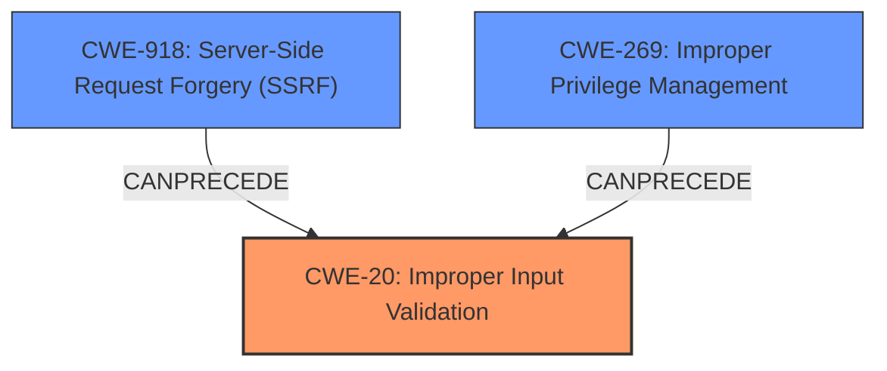

# Analysis Report for CVE-2024-3152

# Vulnerability Analysis Report: CVE-2024-3152

## Description

mintplex-labs/anything-llm is vulnerable to multiple security issues due to **improper input validation** in several endpoints. An attacker can exploit these vulnerabilities to escalate privileges from a default user role to an admin role, read and delete arbitrary files on the system, and perform **Server-Side Request Forgery** (SSRF) attacks. The vulnerabilities are present in the `/request-token`, `/workspace/slug/thread/threadSlug/update`, `/system/remove-logo`, `/system/logo`, and collectors `/process` endpoints. These issues are due to the applications failure to properly validate user input before passing it to `prisma` functions and other critical operations. Affected versions include the latest version prior to 1.0.0.

## Vulnerability Description Key Phrases

- **Rootcause:** improper input validation
- **Weakness:** Server-Side Request Forgery
- **Impact:** ["['escalate privileges'", "'read and delete arbitrary files'", "'perform Server-Side Request Forgery (SSRF) attacks']"]
- **Attacker:** attacker
- **Product:** mintplex-labs/anything-llm
- **Version:** latest version prior to 1.0.0
- **Component:** ["['/request-token'", "'/workspace/slug/thread/threadSlug/update'", "'/system/remove-logo'", "'/system/logo'", "'collectors /process endpoints']"]

## Analysis (with Relationship Data)

# Summary
| CWE ID | CWE Name | Confidence | CWE Abstraction Level | CWE Vulnerability Mapping Label | CWE-Vulnerability Mapping Notes |
|---|---|---|---|---|---|
| CWE-20 | Improper Input Validation | 0.9 | Class | Primary CWE | Discouraged |
| CWE-918 | Server-Side Request Forgery (SSRF) | 0.7 | Base | Secondary Candidate | Allowed |
| CWE-269 | Improper Privilege Management | 0.6 | Class | Secondary Candidate | Discouraged |

## Evidence and Confidence

*   **Confidence Score:** 0.7
*   **Evidence Strength:** MEDIUM

## Relationship Analysis
The primary relationship observed is that **Improper Input Validation** (CWE-20) can lead to other vulnerabilities. In this case, it leads to **Server-Side Request Forgery (SSRF)** (CWE-918) and **Improper Privilege Management** (CWE-269). CWE-20 is a class-level CWE, and while more specific CWEs might exist, the description broadly points to input validation issues across multiple endpoints, making CWE-20 a reasonable starting point. However, because it is a Class type, the documentation recommends looking for more specific Base-level children.



## Vulnerability Chain
The vulnerability chain starts with **improper input validation** (CWE-20). This leads to multiple impacts, including the ability to escalate privileges, read and delete arbitrary files, and perform **Server-Side Request Forgery** (SSRF) attacks (CWE-918). The **improper input validation** is the root cause, as the application's failure to validate user input is what allows the subsequent exploits. An additional weakness is **Improper Privilege Management** (CWE-269), since the attacker is able to escalate privileges.

## Summary of Analysis
The primary weakness is **improper input validation** (CWE-20). The description explicitly states that the vulnerabilities are due to the application's failure to properly validate user input. The **Server-Side Request Forgery** (CWE-918) and **Improper Privilege Management** (CWE-269) are secondary weaknesses that arise as a consequence of the **improper input validation**.

The retriever results listed CWE-20 as a candidate, but the documentation states that it is discouraged because it is a class-level CWE. However, given the information available, it is the most appropriate starting point, and more specific CWEs may be identified with further analysis.

I'm relying heavily on the explicit statement in the vulnerability description that the root cause is "**improper input validation**". Without this statement, the classification would be more challenging. The relationships influenced my decision, as the chain of events clearly shows **improper input validation** leading to other weaknesses.

Relevant CWE Information:

# Enhanced Context (25 CWEs)
The following CWEs were identified as potentially relevant to this vulnerability:

## CWE-267: Privilege Defined With Unsafe Actions
**Abstraction Level**: Base
**Similarity Score**: 0.80
**Source**: dense

**Description**:
A particular privilege, role, capability, or right can be used to perform unsafe actions that were not intended, even when it is assigned to the correct entity.

**Mapping Guidance**:
- Usage: Allowed
- Rationale: This CWE entry is at the Base level of abstraction, which is a preferred level of abstraction for mapping to the root causes of vulnerabilities.


## CWE-266: Incorrect Privilege Assignment
**Abstraction Level**: Base
**Similarity Score**: 0.80
**Source**: dense

**Description**:
A product incorrectly assigns a privilege to a particular actor, creating an unintended sphere of control for that actor.

**Mapping Guidance**:
- Usage: Allowed
- Rationale: This CWE entry is at the Base level of abstraction, which is a preferred level of abstraction for mapping to the root causes of vulnerabilities.


## CWE-472: External Control of Assumed-Immutable Web Parameter
**Abstraction Level**: Base
**Similarity Score**: 0.79
**Source**: dense

**Description**:
The web application does not sufficiently verify inputs that are assumed to be immutable but are actually externally controllable, such as hidden form fields.

**Mapping Guidance**:
- Usage: Allowed
- Rationale: This CWE entry is at the Base level of abstraction, which is a preferred level of abstraction for mapping to the root causes of vulnerabilities.


## CWE-639: Authorization Bypass Through User-Controlled Key
**Abstraction Level**: Base
**Similarity Score**: 0.78
**Source**: dense

**Description**:
The system's authorization functionality does not prevent one user from gaining access to another user's data or record by modifying the key value identifying the data.

**Mapping Guidance**:
- Usage: Allowed
- Rationale: This CWE entry is at the Base level of abstraction, which is a preferred level of abstraction for mapping to the root causes of vulnerabilities.


## CWE-212: Improper Removal of Sensitive Information Before Storage or Transfer
**Abstraction Level**: Base
**Similarity Score**: 0.78
**Source**: dense

**Description**:
The product stores, transfers, or shares a resource that contains sensitive information, but it does not properly remove that information before the product makes the resource available to unauthorized actors.

**Mapping Guidance**:
- Usage: Allowed
- Rationale: This CWE entry is at the Base level of abstraction, which is a preferred level of abstraction for mapping to the root causes of vulnerabilities.


## CWE-668: Exposure of Resource to Wrong Sphere
**Abstraction Level**: Class
**Similarity Score**: 0.77
**Source**: dense

**Description**:
The product exposes a resource to the wrong control sphere, providing unintended actors with inappropriate access to the resource.

**Mapping Guidance**:
- Usage: Discouraged
- Rationale: CWE-668 is high-level and is often misused as a catch-all when lower-level CWE IDs might be applicable. It is sometimes used for low-information vulnerability reports [REF-1287]. It is a level-1 Class (i.e., a child of a Pillar). It is not useful for trend analysis.


## CWE-274: Improper Handling of Insufficient Privileges
**Abstraction Level**: Base
**Similarity Score**: 0.77
**Source**: dense

**Description**:
The product does not handle or incorrectly handles when it has insufficient privileges to perform an operation, leading to resultant weaknesses.

**Mapping Guidance**:
- Usage: Discouraged
- Rationale: This CWE entry could be deprecated in a future version of CWE.


## CWE-807: Reliance on Untrusted Inputs in a Security Decision
**Abstraction Level**: Base
**Similarity Score**: 0.77
**Source**: dense

**Description**:
The product uses a protection mechanism that relies on the existence or values of an input, but the input can be modified by an untrusted actor in a way that bypasses the protection mechanism.

**Mapping Guidance**:
- Usage: Allowed
- Rationale: This CWE entry is at the Base level of abstraction, which is a preferred level of abstraction for mapping to the root causes of vulnerabilities.


## CWE-303: Incorrect Implementation of Authentication Algorithm
**Abstraction Level**: Base
**Similarity Score**: 0.77
**Source**: dense

**Description**:
The requirements for the product dictate the use of an established authentication algorithm, but the implementation of the algorithm is incorrect.

**Mapping Guidance**:
- Usage: Allowed
- Rationale: This CWE entry is at the Base level of abstraction, which is a preferred level of abstraction for mapping to the root causes of vulnerabilities.


## CWE-280: Improper Handling of Insufficient Permissions or Privileges 
**Abstraction Level**: Base
**Similarity Score**: 0.77
**Source**: dense

**Description**:
The product does not handle or incorrectly handles when it has insufficient privileges to access resources or functionality as specified by their permissions. This may cause it to follow unexpected code paths that may leave the product in an invalid state.

**Mapping Guidance**:
- Usage: Allowed
- Rationale: This CWE entry is at the Base level of abstraction, which is a preferred level of abstraction for mapping to the root causes of vulnerabilities.


## CWE-863: Incorrect Authorization
**Abstraction Level**: Class
**Similarity Score**: 1599.60
**Source**: sparse

**Description**:
The product performs an authorization check when an actor attempts to access a resource or perform an action, but it does not correctly perform the check.

**Mapping Guidance


## CWE Relationship Analysis

Current CWEs represent these abstraction levels: .


### Vulnerability Chain Analysis

**Chain starting from CWE-274:**
- 274 (Improper Handling of Insufficient Privileges) - ROOT


**Chain starting from CWE-863:**
- 863 (Incorrect Authorization) - ROOT


### CWE Relationship Diagram

```mermaid
graph TD
    classDef primary fill:#f96,stroke:#333,stroke-width:2px
    classDef secondary fill:#69f,stroke:#333
    classDef tertiary fill:#9e9,stroke:#333
```


*Report generated on 2025-07-13 07:27:47*
