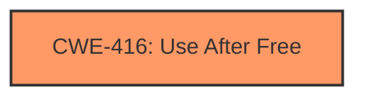

# Analysis Report for CVE-2024-3168

# Vulnerability Analysis Report: CVE-2024-3168

## Description

Use after free in DevTools in Google Chrome prior to 122.0.6261.57 allowed a remote attacker to potentially exploit heap corruption via a crafted HTML page. (Chromium security severity Medium)

## Vulnerability Description Key Phrases

- **Rootcause:** use after free
- **Impact:** potentially exploit heap corruption
- **Vector:** crafted HTML page
- **Attacker:** remote attacker
- **Product:** Google Chrome
- **Version:** prior to 122.0.6261.57
- **Component:** DevTools

## Analysis (with Relationship Data)

# Summary
| CWE ID | CWE Name | Confidence | CWE Abstraction Level | CWE Vulnerability Mapping Label | CWE-Vulnerability Mapping Notes |
|---|---|---|---|---|---|
| CWE-416 | Use After Free | 1.0 | Variant | Allowed | Primary CWE |

## Evidence and Confidence

*   **Confidence Score:** 1.0
*   **Evidence Strength:** HIGH

## Relationship Analysis
The primary relationship considered here is the direct identification of "**use after free**" as the root cause in the vulnerability description. The abstraction level is Variant, which is preferred. The graph relationships CANFOLLOW, CANPRECEDE, and CHILDOF relationships were reviewed to understand the context of CWE-416, but they did not influence the selection as the evidence directly points to Use After Free.



## Vulnerability Chain
The vulnerability chain starts with the **use after free** condition, triggered by a crafted HTML page within DevTools, potentially leading to heap corruption.

## Summary of Analysis
The vulnerability description explicitly states "**rootcause:** **use after free**", and the CVE Reference Links Content Summary reiterates this. The Retriever Results also list CWE-416 as the top candidate. Therefore, CWE-416 is selected as the primary CWE. The other CWEs listed in Retriever Results were considered but not chosen because they did not directly align with the root cause presented in the vulnerability description. This assessment is based on direct evidence, and the confidence is high.

Relevant CWE Information:

# Enhanced Context (25 CWEs)
The following CWEs were identified as potentially relevant to this vulnerability:

## CWE-416: Use After Free
**Abstraction Level**: Variant
**Similarity Score**: 0.79
**Source**: dense

**Description**:
The product reuses or references memory after it has been freed. At some point afterward, the memory may be allocated again and saved in another pointer, while the original pointer references a location somewhere within the new allocation. Any operations using the original pointer are no longer valid because the memory "belongs" to the code that operates on the new pointer.

**Mapping Guidance**:
- Usage: Allowed
- Rationale: This CWE entry is at the Variant level of abstraction, which is a preferred level of abstraction for mapping to the root causes of vulnerabilities.

# Complete CWE Specifications

CWE-416: Use After Free
The product reuses or references memory after it has been freed. At some point afterward, the memory may be allocated again and saved in another pointer, while the original pointer references a location somewhere within the new allocation. Any operations using the original pointer are no longer valid because the memory "belongs" to the code that operates on the new pointer.


## CWE Relationship Analysis

Current CWEs represent these abstraction levels: .


### Vulnerability Chain Analysis

**Chain starting from CWE-416:**
- 416 (Use After Free) - ROOT


### CWE Relationship Diagram

```mermaid
graph TD
    classDef primary fill:#f96,stroke:#333,stroke-width:2px
    classDef secondary fill:#69f,stroke:#333
    classDef tertiary fill:#9e9,stroke:#333
```


*Report generated on 2025-07-13 07:28:32*
