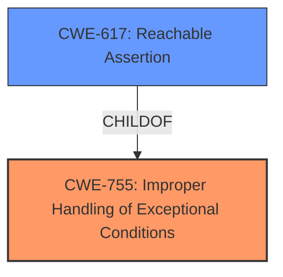

# Enhanced Analysis for CVE-2024-31882

# Summary
| CWE ID | CWE Name | Confidence | CWE Abstraction Level | CWE Vulnerability Mapping Label | CWE-Vulnerability Mapping Notes |
|---|---|---|---|---|---|
| CWE-755 | Improper Handling of Exceptional Conditions | 0.6 | Class | Primary CWE | Allowed |
| CWE-617 | Reachable Assertion | 0.4 | Base | Secondary Candidate | Allowed |

## Evidence and Confidence

*   **Confidence Score:** 0.6
*   **Evidence Strength:** MEDIUM

## Relationship Analysis
The primary relationship considered was the parent-child relationship. CWE-755 is a class level CWE, while CWE-617 is a base level CWE. Due to the limited information, the higher level CWE-755 was selected as the primary weakness.



## Vulnerability Chain
The vulnerability chain starts with a **default configuration**, leading to the server crashing when a specially crafted SQL statement is used, resulting in a denial of service.

## Summary of Analysis
The initial assessment was based on the provided evidence. The weakness lies in the server crashing due to a specially crafted SQL statement under specific non-**default configurations**. This can be seen as a failure to properly handle an exceptional condition.

The selection of CWE-755 is based on the description matching the server's failure to handle a specific SQL statement properly, leading to a crash. The evidence is from the "CVE Reference Links Content Summary" section: "The vulnerability leads to a denial of service by causing the server to crash." The abstraction level is appropriate as the description points to a general failure in handling exceptional conditions.

CWE-617 was considered as a secondary candidate because a crash could potentially be triggered by an assertion.

Relevant CWE Information:

# Enhanced Context (25 CWEs)
The following CWEs were identified as potentially relevant to this vulnerability:

## CWE-1391: Use of Weak Credentials
**Abstraction Level**: Class
**Similarity Score**: 0.71

## CWE-755: Improper Handling of Exceptional Conditions
**Abstraction Level**: Class
**Similarity Score**: 0.71
The product does not handle or incorrectly handles an exceptional condition.

## CWE-918: Server-Side Request Forgery (SSRF)
**Abstraction Level**: Base
**Similarity Score**: 0.70

## CWE-269: Improper Privilege Management
**Abstraction Level**: Class
**Similarity Score**: 0.70

## CWE-200: Exposure of Sensitive Information to an Unauthorized Actor
**Abstraction Level**: Class
**Similarity Score**: 0.70

## CWE-303: Incorrect Implementation of Authentication Algorithm
**Abstraction Level**: Base
**Similarity Score**: 0.69

## CWE-326: Inadequate Encryption Strength
**Abstraction Level**: Class
**Similarity Score**: 0.69

## CWE-89: Improper Neutralization of Special Elements used in an SQL Command ('SQL Injection')
**Abstraction Level**: Base
**Similarity Score**: 0.69

## CWE-280: Improper Handling of Insufficient Permissions or Privileges 
**Abstraction Level**: Base
**Similarity Score**: 0.69

## CWE-617: Reachable Assertion
**Abstraction Level**: Base
**Similarity Score**: 0.69
The product contains an assert() or similar statement that can be triggered by an attacker, which leads to an application exit or other behavior that is more severe than necessary.

## CWE-362: Concurrent Execution using Shared Resource with Improper Synchronization ('Race Condition')
**Abstraction Level**: Class
**Similarity Score**: 551.21

## CWE-732: Incorrect Permission Assignment for Critical Resource
**Abstraction Level**: Class
**Similarity Score**: 540.52

## CWE-269: Improper Privilege Management
**Abstraction Level**: Class
**Similarity Score**: 538.55

## CWE-20: Improper Input Validation
**Abstraction Level**: Class
**Similarity Score**: 522.74

## CWE-327: Use of a Broken or Risky Cryptographic Algorithm
**Abstraction Level**: Class
**Similarity Score**: 517.09

## CWE-476: NULL Pointer Dereference
**Abstraction Level**: base
**Similarity Score**: 4.33

## CWE-208: Observable Timing Discrepancy
**Abstraction Level**: base
**Similarity Score**: 2.73

## CWE-362: Concurrent Execution using Shared Resource with Improper Synchronization ('Race Condition')
**Abstraction Level**: class
**Similarity Score**: 2.55

## CWE-276: Incorrect Default Permissions
**Abstraction Level**: base
**Similarity Score**: 2.47

## CWE-201: Insertion of Sensitive Information Into Sent Data
**Abstraction Level**: base
**Similarity Score**: 2.47

## CWE-73: External Control of File Name or Path
**Abstraction Level**: base
**Similarity Score**: 2.42

## CWE-120: Buffer Copy without Checking Size of Input ('Classic Buffer Overflow')
**Abstraction Level**: base
**Similarity Score**: 2.42

## CWE-1284: Improper Validation of Specified Quantity in Input
**Abstraction Level**: base
**Similarity Score**: 2.42

## CWE-94: Improper Control of Generation of Code ('Code Injection')
**Abstraction Level**: base
**Similarity Score**: 2.40

## CWE-129: Improper Validation of Array Index
**Abstraction Level**: variant
**Similarity Score**: 2.27


## CWE Relationship Analysis

Current CWEs represent these abstraction levels: .


### Vulnerability Chain Analysis

**Chain starting from CWE-476:**
- 476 (NULL Pointer Dereference) - ROOT


**Chain starting from CWE-94:**
- 94 (Improper Control of Generation of Code ('Code Injection')) - ROOT


### CWE Relationship Diagram

```mermaid
graph TD
    classDef primary fill:#f96,stroke:#333,stroke-width:2px
    classDef secondary fill:#69f,stroke:#333
    classDef tertiary fill:#9e9,stroke:#333
```