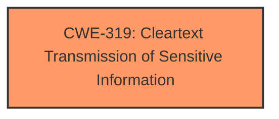

# Raw Analyzer Response for CVE-2024-31905

# Summary
| CWE ID | CWE Name | Confidence | CWE Abstraction Level | CWE Vulnerability Mapping Label | CWE-Vulnerability Mapping Notes |
|---|---|---|---|---|---|
| CWE-319 | Cleartext Transmission of Sensitive Information | 0.9 | Base | Allowed | Primary CWE - The vulnerability is caused by the **failure to properly enable HTTP Strict Transport Security**, which results in sensitive information being transmitted in cleartext, making it vulnerable to man-in-the-middle attacks. |

## Evidence and Confidence

*   **Confidence Score:** 0.9
*   **Evidence Strength:** HIGH

## Relationship Analysis
The primary CWE selected is CWE-319, which is at the Base level of abstraction. The vulnerability description explicitly mentions the **failure to properly enable HTTP Strict Transport Security**, leading to the transmission of sensitive information in cleartext. This aligns directly with the characteristics of CWE-319.

## Vulnerability Chain
The vulnerability chain starts with the **failure to properly enable HTTP Strict Transport Security**. This leads directly to the transmission of sensitive information in cleartext, which can be intercepted by a remote attacker using man-in-the-middle techniques, resulting in the exposure of sensitive information.

## Summary of Analysis
The analysis strongly supports CWE-319 as the primary CWE. The vulnerability description explicitly states the **failure to properly enable HTTP Strict Transport Security**, which is the root cause. This directly leads to sensitive information being transmitted in cleartext.

The selection of CWE-319 is based on:
- Direct evidence from the vulnerability description stating the **failure to properly enable HTTP Strict Transport Security**.
- The definition of CWE-319 perfectly matches the vulnerability: "The product transmits sensitive or security-critical data in cleartext in a communication channel that can be sniffed by unauthorized actors."

CWEs Considered but Not Used:
- CWE-200 Exposure of Sensitive Information to an Unauthorized Actor: While this is an impact of the vulnerability, it is not the root cause. The root cause is the cleartext transmission.
- CWE-614 Sensitive Cookie in HTTPS Session Without 'Secure' Attribute: This is a more specific case of cleartext transmission and is not applicable here as the vulnerability description doesn't specify cookies.
- CWE-311 Missing Encryption of Sensitive Data: This is a more general case that includes data at rest, which is not the focus of this vulnerability.
- CWE-327 Use of a Broken or Risky Cryptographic Algorithm: This is not applicable as the issue is not about the cryptographic algorithm itself, but the absence of encryption due to the **failure to properly enable HTTP Strict Transport Security**.
- CWE-300 Channel Accessible by Non-Endpoint: This is related to the channel being accessed by unauthorized actors, but the root cause is the cleartext transmission of data rather than the channel access itself.