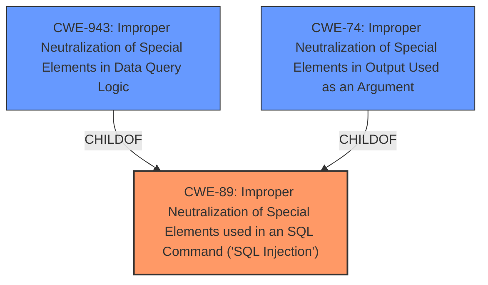

# Raw Analyzer Response for CVE-2024-3200

# Summary

| CWE ID | CWE Name | Confidence | CWE Abstraction Level | CWE Vulnerability Mapping Label | CWE-Vulnerability Mapping Notes |
|---|---|---|---|---|---|
| CWE-89 | Improper Neutralization of Special Elements used in an SQL Command ('SQL Injection') | 1.0 | Base | Primary | Allowed |

## Evidence and Confidence

*   **Confidence Score:** 1.0
*   **Evidence Strength:** HIGH

## Relationship Analysis
The primary relationship that influenced the CWE selection is the ChildOf relationship between CWE-89 and CWE-943 (Improper Neutralization of Special Elements in Data Query Logic), and CWE-74 (Improper Neutralization of Special Elements in Output Used as an Argument). Although CWE-943 and CWE-74 are more specific, CWE-89 directly addresses the root cause of **SQL Injection**. The evidence clearly points to the construction of an SQL command using externally-influenced input without proper neutralization.

## Vulnerability Chain
The vulnerability chain starts with the **insufficient escaping on the user supplied parameter and lack of sufficient preparation on the existing SQL query** (the root cause), which leads to **SQL Injection**. The impact of this is the ability to extract sensitive information from the database.

## Summary of Analysis
The analysis is strongly based on the evidence provided in the vulnerability description and CVE summary. The key phrases "insufficient escaping on the user supplied parameter and lack of sufficient preparation on the existing SQL query" and "SQL injection" clearly indicate CWE-89 as the appropriate classification. The relationship analysis confirms that CWE-89 is a suitable base-level CWE that directly addresses the identified weakness. The selection is at the optimal level of specificity, focusing on the root cause rather than a more general weakness category.

Relevant CWE Information:

# Enhanced Context (25 CWEs)
The following CWEs were identified as potentially relevant to this vulnerability:

## CWE-352: Cross-Site Request Forgery (CSRF)
**Abstraction Level**: Compound
**Similarity Score**: 0.75
**Source**: dense

**Description**:
The web application does not, or can not, sufficiently verify whether a well-formed, valid, consistent request was intentionally provided by the user who submitted the request.

**Mapping Guidance**:
- Usage: Allowed
- Rationale: This is a well-known Composite of multiple weaknesses that must all occur simultaneously, although it is attack-oriented in nature.

*Reason for Exclusion:* This CWE does not directly relate to the **insufficient input validation** and **improper SQL query preparation** that are the root causes of the vulnerability. It is related to request validation and not the root cause.

## CWE-425: Direct Request ('Forced Browsing')
**Abstraction Level**: Base
**Similarity Score**: 0.71
**Source**: dense

**Description**:
The web application does not adequately enforce appropriate authorization on all restricted URLs, scripts, or files.

**Mapping Guidance**:
- Usage: Allowed
- Rationale: This CWE entry is at the Base level of abstraction, which is a preferred level of abstraction for mapping to the root causes of vulnerabilities.

*Reason for Exclusion:* While authorization issues might be present, the primary weakness lies in the **improper handling of SQL queries**, making CWE-89 more appropriate.

## CWE-472: External Control of Assumed-Immutable Web Parameter
**Abstraction Level**: Base
**Similarity Score**: 0.70
**Source**: dense

**Description**:
The web application does not sufficiently verify inputs that are assumed to be immutable but are actually externally controllable, such as hidden form fields.

**Mapping Guidance**:
- Usage: Allowed
- Rationale: This CWE entry is at the Base level of abstraction, which is a preferred level of abstraction for mapping to the root causes of vulnerabilities.

*Reason for Exclusion:* The vulnerability is not specifically related to immutable parameters but rather to the **lack of sanitization in SQL queries**.

## CWE-96: Improper Neutralization of Directives in Statically Saved Code ('Static Code Injection')
**Abstraction Level**: Base
**Similarity Score**: 0.70
**Source**: dense

**Description**:
The product receives input from an upstream component, but it does not neutralize or incorrectly neutralizes code syntax before inserting the input into an executable resource, such as a library, configuration file, or template.

**Mapping Guidance**:
- Usage: Allowed
- Rationale: This CWE entry is at the Base level of abstraction, which is a preferred level of abstraction for mapping to the root causes of vulnerabilities.

*Reason for Exclusion:* The vulnerability involves **SQL injection** not code injection, making CWE-89 the more suitable choice.

## CWE-116: Improper Encoding or Escaping of Output
**Abstraction Level**: Class
**Similarity Score**: 0.70
**Source**: dense

**Description**:
The product prepares a structured message for communication with another component, but encoding or escaping of the data is either missing or done incorrectly. As a result, the intended structure of the message is not preserved.

**Mapping Guidance**:
- Usage: Allowed-with-Review
- Rationale: This CWE entry is a Class and might have Base-level children that would be more appropriate

*Reason for Exclusion:* While encoding/escaping issues might contribute, the core problem is the **lack of sanitization leading to SQL Injection**, making CWE-89 a better fit.

## CWE-201: Insertion of Sensitive Information Into Sent Data
**Abstraction Level**: Base
**Similarity Score**: 0.70
**Source**: dense

**Description**:
The code transmits data to another actor, but a portion of the data includes sensitive information that should not be accessible to that actor.

**Mapping Guidance**:
- Usage: Allowed
- Rationale: This CWE entry is at the Base level of abstraction, which is a preferred level of abstraction for mapping to the root causes of vulnerabilities.

*Reason for Exclusion:* The vulnerability's primary concern is not directly related to the insertion of sensitive information, but rather the **SQL Injection vulnerability**, where **improper sanitization** of input leads to the extraction of sensitive data.

## CWE-89: Improper Neutralization of Special Elements used in an SQL Command ('SQL Injection')
**Abstraction Level**: Base
**Similarity Score**: 0.69
**Source**: dense

**Description**:
The product constructs all or part of an SQL command using externally-influenced input from an upstream component, but it does not neutralize or incorrectly neutralizes special elements that could modify the intended SQL command when it is sent to a downstream component. Without sufficient removal or quoting of SQL syntax in user-controllable inputs, the generated SQL query can cause those inputs to be interpreted as SQL instead of ordinary user data.

**Mapping Guidance**:
- Usage: Allowed
- Rationale: This CWE entry is at the Base level of abstraction, which is a preferred level of abstraction for mapping to the root causes of vulnerabilities.

*Reason for Inclusion:* This CWE directly addresses the **SQL Injection vulnerability** caused by **insufficient sanitization and improper SQL query preparation**. It is the most accurate representation of the identified weakness.

## CWE-79: Improper Neutralization of Input During Web Page Generation ('Cross-site Scripting')
**Abstraction Level**: Base
**Similarity Score**: 0.69
**Source**: dense

**Description**:
The product does not neutralize or incorrectly neutralizes user-controllable input before it is placed in output that is used as a web page that is served to other users.

**Mapping Guidance**:
- Usage: Allowed
- Rationale: This CWE entry is at the Base level of abstraction, which is a preferred level of abstraction for mapping to the root causes of vulnerabilities.

*Reason for Exclusion:* The vulnerability is not directly related to Cross-Site Scripting (XSS), but rather the **SQL Injection vulnerability**, where **improper sanitization** of input leads to the extraction of sensitive data.

## CWE-434: Unrestricted Upload of File with Dangerous Type
**Abstraction Level**: Base
**Similarity Score**: 0.69
**Source**: dense

**Description**:
The product allows the upload or transfer of dangerous file types that are automatically processed within its environment.

**Mapping Guidance**:
- Usage: Allowed
- Rationale: This CWE entry is at the Base level of abstraction, which is a preferred level of abstraction for mapping to the root causes of vulnerabilities.

*Reason for Exclusion:* The vulnerability is not related to file uploads, but rather the **SQL Injection vulnerability**, where **improper sanitization** of input leads to the extraction of sensitive data.

## CWE-95: Improper Neutralization of Directives in Dynamically