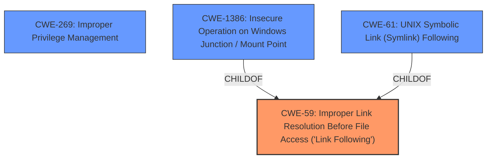

# Analysis Report for CVE-2024-32849

# Vulnerability Analysis Report: CVE-2024-32849

## Description

Trend Micro Security 17.x (Consumer) is vulnerable to a **Privilege Escalation vulnerability** that could allow a local attacker to unintentionally delete privileged Trend Micro files including its own.

## Vulnerability Description Key Phrases

- **Weakness:** Privilege Escalation vulnerability
- **Impact:** ['Privilege Escalation', 'delete privileged Trend Micro files']
- **Attacker:** local attacker
- **Product:** Trend Micro Security
- **Version:** 17.x

## Analysis (with Relationship Data)

# Summary
| CWE ID | CWE Name | Confidence | CWE Abstraction Level | CWE Vulnerability Mapping Label | CWE-Vulnerability Mapping Notes |
|---|---|---|---|---|---|
| CWE-59 | Improper Link Resolution Before File Access ('Link Following') | 0.9 | Base | Allowed | Primary CWE. The vulnerability stems from a flaw in how `coreServiceShell` handles symbolic links. An attacker can trick the service into deleting arbitrary files by creating a symbolic link.|
| CWE-269 | Improper Privilege Management | 0.7 | Class | Discouraged | Secondary Candidate. The vulnerability leads to **Privilege Escalation**, allowing a low-privileged user to manipulate privileged system files. However, this CWE is discouraged, and CWE-59 is the root cause.|

## Evidence and Confidence

*   **Confidence Score:** 0.8
*   **Evidence Strength:** HIGH

## Relationship Analysis
The primary relationship influencing the decision is the parent-child relationship between CWE-59 and other CWEs. CWE-59 is a base-level CWE that accurately describes the **improper link resolution** that leads to the vulnerability.



## Vulnerability Chain
The vulnerability chain starts with the **improper handling of symbolic links** (CWE-59), which leads to arbitrary file deletion, and ultimately enables **privilege escalation**.

## Summary of Analysis
The primary CWE is CWE-59 because the root cause of the vulnerability is the **improper handling of symbolic links**. The service's failure to properly validate the target of the symbolic link allows an attacker to manipulate the file system in unintended ways. The evidence for this is clearly stated in the "CVE Reference Links Content Summary" which says: "The vulnerability stems from a flaw in the `coreServiceShell` component of Trend Micro Maximum Security, specifically how it handles symbolic links. By creating a symbolic link, an attacker can trick the service into deleting arbitrary files."

CWE-269 was considered due to the **privilege escalation** aspect, but is discouraged. It is not the root cause but rather a consequence of the **improper link resolution**.

The selection of CWE-59 is at the optimal level of specificity because it directly addresses the technical flaw that leads to the vulnerability.

Relevant CWE Information:

# Enhanced Context (25 CWEs)
The following CWEs were identified as potentially relevant to this vulnerability:

## CWE-59: Improper Link Resolution Before File Access ('Link Following')
**Abstraction Level**: Base
**Similarity Score**: 0.79
**Source**: dense

**Description**:
The product attempts to access a file based on the filename, but it does not properly prevent that filename from identifying a link or shortcut that resolves to an unintended resource.

**Mapping Guidance**:
- Usage: Allowed
- Rationale: This CWE entry is at the Base level of abstraction, which is a preferred level of abstraction for mapping to the root causes of vulnerabilities.


## CWE Relationship Analysis

Current CWEs represent these abstraction levels: .


### Vulnerability Chain Analysis

**Chain starting from CWE-1386:**
- 1386 (Insecure Operation on Windows Junction / Mount Point) - ROOT


**Chain starting from CWE-59:**
- 59 (Improper Link Resolution Before File Access ('Link Following')) - ROOT


### CWE Relationship Diagram

```mermaid
graph TD
    classDef primary fill:#f96,stroke:#333,stroke-width:2px
    classDef secondary fill:#69f,stroke:#333
    classDef tertiary fill:#9e9,stroke:#333
```


*Report generated on 2025-07-13 07:38:14*
