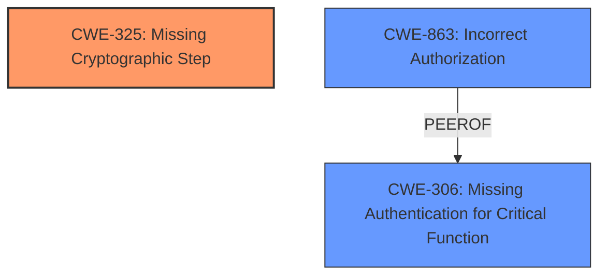

# Enhanced Analysis for CVE-2024-32918

# Summary
| CWE ID    | CWE Name                                                | Confidence | CWE Abstraction Level | CWE Vulnerability Mapping Label | CWE-Vulnerability Mapping Notes |
| :-------- | :------------------------------------------------------ | :--------- | :-------------------- | :------------------------------ | :------------------------------ |
| CWE-325   | Missing Cryptographic Step                              | 0.8        | Base                  | Primary CWE                   | Allowed                       |
| CWE-863   | CWE-863: Incorrect Authorization                       | 0.5        | Class                  | Secondary Candidate             | Allowed-with-Review           |
| CWE-306   | CWE-306: Missing Authentication for Critical Function   | 0.4        | Base                  | Secondary Candidate             | Allowed                       |

## Evidence and Confidence

*   **Confidence Score:** 0.7
*   **Evidence Strength:** MEDIUM

## Relationship Analysis
The primary relationship influencing the CWE selection is the hierarchical relationship. CWE-325 is a Base level CWE which helps identify the root cause. While CWE-863 and CWE-306 are related to authorization and authentication, they are not as precise in describing the **missing cryptographic step**. CWE-325 directly addresses the root cause of the vulnerability, where a necessary cryptographic operation is skipped, leading to a bypass of HDCP 2.2 encryption.



## Vulnerability Chain
The vulnerability chain starts with the **missing cryptographic step**, leading to the bypass of HDCP 2.2 encryption.
  - **Root Cause:** CWE-325: Missing Cryptographic Step
  - **Weakness:** Failure to complete HDCP Key Exchange initialization
  - **Impact:** Permission Bypass, disabling HDCP 2.2 encryption

## Summary of Analysis
Initially, the description indicates a **missing step** in the HDCP Key Exchange, which points directly to cryptographic flaws. The "CVE Reference Links Content Summary" supports a root cause within the Trusty component, leading to information disclosure, and an attack vector within that component.

CWE-325, *Missing Cryptographic Step*, is the most accurate because the vulnerability stems from the **failure to complete the HDCP Key Exchange initialization steps**, directly impacting the cryptographic process. The "Vulnerability Description Key Phrases" identifies the **rootcause** as "**not completing the HDCP Key Exchange initialization steps**". This aligns with the **missing** aspect of CWE-325.

CWE-863, *Incorrect Authorization*, and CWE-306, *Missing Authentication for Critical Function*, were considered but are less precise. While the vulnerability leads to a permission bypass, the underlying cause is the **missing cryptographic step**, not necessarily a flaw in the authorization or authentication logic itself.

The selection of CWE-325 is at the optimal level of specificity because it clearly identifies the root cause as a **missing step** in the cryptographic process. The evidence clearly supports this classification with a confidence level of 0.8.

Relevant CWE Information:

# Enhanced Context (25 CWEs)
The following CWEs were identified as potentially relevant to this vulnerability:

## CWE-1204: Generation of Weak Initialization Vector (IV)
**Abstraction Level**: Base
**Similarity Score**: 0.167
**Source**: sparse

**Description**:
CWE-1204: Generation of Weak Initialization Vector (IV)

**Mapping Guidance**:
- Usage: Allowed
- Rationale: This CWE entry is at the Base level of abstraction, which is a preferred level of abstraction for mapping to the root causes of vulnerabilities.

**Relationships**:
- PARENTOF -> CWE-329
- CHILDOF -> CWE-330
- PARENTOF -> CWE-1204
- CHILDOF -> CWE-1204

## CWE-325: Missing Cryptographic Step
**Abstraction Level**: Base
**Similarity Score**: 0.152
**Source**: sparse

**Description**:
CWE-325: Missing Cryptographic Step

**Mapping Guidance**:
- Usage: Allowed
- Rationale: This CWE entry is at the Base level of abstraction, which is a preferred level of abstraction for mapping to the root causes of vulnerabilities.

## CWE-602: Client-Side Enforcement of Server-Side Security
**Abstraction Level**: Class
**Similarity Score**: 0.137
**Source**: sparse

**Description**:
CWE-602: Client-Side Enforcement of Server-Side Security

**Mapping Guidance**:
- Usage: Allowed-with-Review
- Rationale: This CWE entry is a Class and might have Base-level children that would be more appropriate

## CWE-338: Use of Cryptographically Weak Pseudo-Random Number Generator (PRNG)
**Abstraction Level**: Base
**Similarity Score**: 0.136
**Source**: sparse

**Description**:
CWE-338: Use of Cryptographically Weak Pseudo-Random Number Generator (PRNG)

**Mapping Guidance**:
- Usage: Allowed
- Rationale: This CWE entry is at the Base level of abstraction, which is a preferred level of abstraction for mapping to the root causes of vulnerabilities.

**Relationships**:
- CHILDOF -> CWE-330
- CHILDOF -> CWE-330
- PARENTOF -> CWE-338

## CWE-841: Improper Enforcement of Behavioral Workflow
**Abstraction Level**: Base
**Similarity Score**: 0.135
**Source**: sparse

**Description**:
CWE-841: Improper Enforcement of Behavioral Workflow

**Mapping Guidance**:
- Usage: Allowed
- Rationale: This CWE entry is at the Base level of abstraction, which is a preferred level of abstraction for mapping to the root causes of vulnerabilities.

## CWE-321: Use of Hard-coded Cryptographic Key
**Abstraction Level**: Variant
**Similarity Score**: 0.131
**Source**: sparse

**Description**:
CWE-321: Use of Hard-coded Cryptographic Key

**Mapping Guidance**:
- Usage: Allowed
- Rationale: This CWE entry is at the Variant level of abstraction, which is a preferred level of abstraction for mapping to the root causes of vulnerabilities.

**Relationships**:
- CANFOLLOW -> CWE-656
- CHILDOF -> CWE-798
- CHILDOF -> CWE-798
- CHILDOF -> CWE-798
- PARENTOF -> CWE-321

## CWE-665: Improper Initialization
**Abstraction Level**: Class
**Similarity Score**: 0.127
**Source**: sparse

**Description**:
CWE-665: Improper Initialization

**Mapping Guidance**:
- Usage: Discouraged
- Rationale: This CWE entry is a Class and might have Base-level children that would be more appropriate

## CWE-415: Double Free
**Abstraction Level**: Variant
**Similarity Score**: 0.125
**Source**: sparse

**Description**:
CWE-415: Double Free

**Mapping Guidance**:
- Usage: Allowed
- Rationale: This CWE entry is at the Variant level of abstraction, which is a preferred level of abstraction for mapping to the root causes of vulnerabilities.

## CWE-289: Authentication Bypass by Alternate Name
**Abstraction Level**: Base
**Similarity Score**: 0.500
**Source**: dense

**Description**:
CWE-289: Authentication Bypass by Alternate Name

**Mapping Guidance**:
- Usage: Allowed
- Rationale: This CWE entry is at the Base level of abstraction, which is a preferred level of abstraction for mapping to the root causes of vulnerabilities.

## CWE-425: Direct Request ('Forced Browsing')
**Abstraction Level**: base
**Similarity Score**: 0.002
**Source**: graph

**Description**:
CWE-425: Direct Request ('Forced Browsing')

**Mapping Guidance**:
- Usage: Allowed
- Rationale: This CWE entry is at the Base level of abstraction, which is a preferred level of abstraction for mapping to the root causes of vulnerabilities.

**Relationships**:
- CANPRECEDE -> CWE-98
- CANPRECEDE -> CWE-471
- CHILDOF -> CWE-424
- CHILDOF -> CWE-288
- CHILDOF -> CWE-862

## CWE-306: Missing Authentication for Critical Function
**Abstraction Level**: base
**Similarity Score**: 2.40
**Source**: graph

**Description**:
CWE-306: Missing Authentication for Critical Function

**Mapping Guidance**:
-


## CWE Relationship Analysis

Current CWEs represent these abstraction levels: .


### Vulnerability Chain Analysis

**Chain starting from CWE-471:**
- 471 (Modification of Assumed-Immutable Data (MAID)) - ROOT


**Chain starting from CWE-862:**
- 862 (Missing Authorization) - ROOT


### CWE Relationship Diagram

```mermaid
graph TD
    classDef primary fill:#f96,stroke:#333,stroke-width:2px
    classDef secondary fill:#69f,stroke:#333
    classDef tertiary fill:#9e9,stroke:#333
```