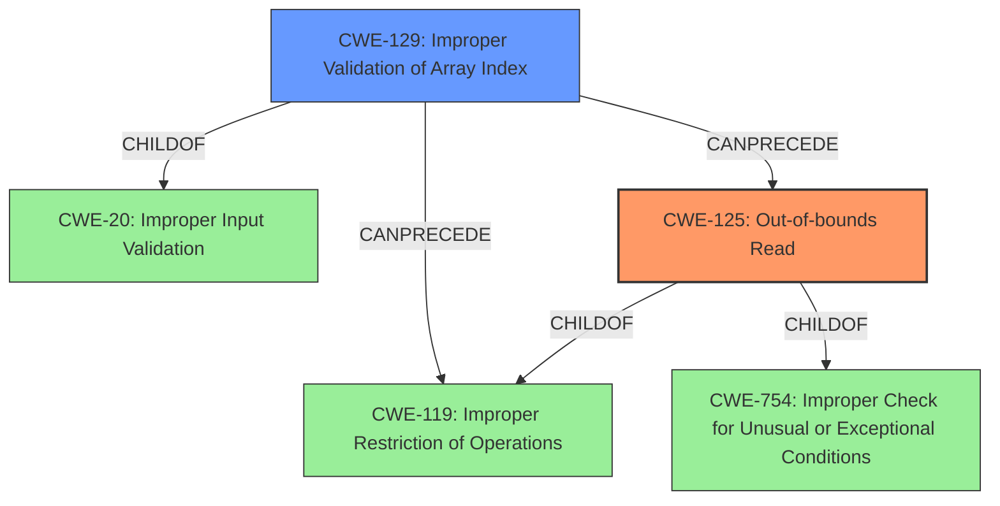

# Analysis Report for CVE-2024-32925

# Vulnerability Analysis Report: CVE-2024-32925

## Description

In dhd_prot_txstatus_process of dhd_msgbuf.c, there is a possible **out of bounds write** due to a **missing bounds check**. This could lead to remote code execution with no additional execution privileges needed. User interaction is not needed for exploitation.

## Vulnerability Description Key Phrases

- **Rootcause:** missing bounds check
- **Weakness:** out of bounds write
- **Impact:** remote code execution
- **Component:** dhd_prot_txstatus_process of dhd_msgbuf.c

## Analysis (with Relationship Data)

# Summary
| CWE ID | CWE Name | Confidence | CWE Abstraction Level | CWE Vulnerability Mapping Label | CWE-Vulnerability Mapping Notes |
|---|---|---|---|---|---|
| CWE-125 | Out-of-bounds Read | 0.9 | Base |  Primary CWE | Allowed |
| CWE-129 | Improper Validation of Array Index | 0.7 | Variant | Secondary Candidate | Allowed |
| CWE-754 | Improper Check for Unusual or Exceptional Conditions | 0.6 | Class | Secondary Candidate | Allowed-with-Review |

## Evidence and Confidence

*   **Confidence Score:** 0.8
*   **Evidence Strength:** MEDIUM

## Relationship Analysis
The primary weakness is CWE-125, which is caused by a **missing bounds check** and results in an **out of bounds write**. CWE-125 (Out-of-bounds Read) is a base-level CWE. There is a hierarchical relationship between CWE-125 and CWE-119 (Improper Restriction of Operations within the Bounds of a Memory Buffer), with CWE-125 being a child of CWE-119. CWE-129 (Improper Validation of Array Index) is also a child of CWE-20 (Improper Input Validation) and can precede CWE-119. CWE-754 (Improper Check for Unusual or Exceptional Conditions) is a class-level CWE. The abstraction levels were chosen to be as specific as possible given the available evidence.



## Vulnerability Chain
The vulnerability chain starts with a **missing bounds check**, which leads to an **out of bounds write**. This allows an attacker to perform remote code execution.

`Missing Bounds Check` -> `Out-of-bounds Write` -> `Remote Code Execution`

## Summary of Analysis
The primary weakness, CWE-125 (Out-of-bounds Read), stems from the **missing bounds check**, enabling an **out of bounds write**. This is supported by the vulnerability description stating, "In dhd_prot_txstatus_process of dhd_msgbuf.c, there is a possible **out of bounds write** due to a **missing bounds check**."

The retriever results also list CWE-125 as a potentially relevant CWE.

CWE-129 (Improper Validation of Array Index) is also considered as a secondary weakness because the **missing bounds check** could be seen as an improper validation of the array index.

CWE-754 (Improper Check for Unusual or Exceptional Conditions) is considered as a secondary weakness because the **missing bounds check** falls under this category.

The chosen CWEs are at the optimal level of specificity because they directly address the root cause (**missing bounds check**) and the resulting weakness (**out of bounds write**).

Relevant CWE Information:

# Enhanced Context (25 CWEs)
The following CWEs were identified as potentially relevant to this vulnerability:

## CWE-754: Improper Check for Unusual or Exceptional Conditions
**Abstraction Level**: Class
**Similarity Score**: 0.79

**Description**:
The product does not check or incorrectly checks for unusual or exceptional conditions that are not expected to occur frequently during day to day operation of the product.

**Mapping Guidance**:
- Usage: Allowed-with-Review

## CWE-125: Out-of-bounds Read
**Abstraction Level**: Base
**Similarity Score**: 2.90

**Description**:
The product reads data past the end, or before the beginning, of the intended buffer.

**Mapping Guidance**:
- Usage: Allowed

## CWE-129: Improper Validation of Array Index
**Abstraction Level**: variant
**Similarity Score**: 2.68

**Description**:
CWE-129: Improper Validation of Array Index

**Mapping Guidance**:
- Usage: Allowed


## CWE Relationship Analysis

Current CWEs represent these abstraction levels: .


### Vulnerability Chain Analysis

**Chain starting from CWE-125:**
- 125 (Out-of-bounds Read) - ROOT


**Chain starting from CWE-20:**
- 20 (Improper Input Validation) - ROOT


### CWE Relationship Diagram

```mermaid
graph TD
    classDef primary fill:#f96,stroke:#333,stroke-width:2px
    classDef secondary fill:#69f,stroke:#333
    classDef tertiary fill:#9e9,stroke:#333
```


*Report generated on 2025-07-13 07:44:10*
