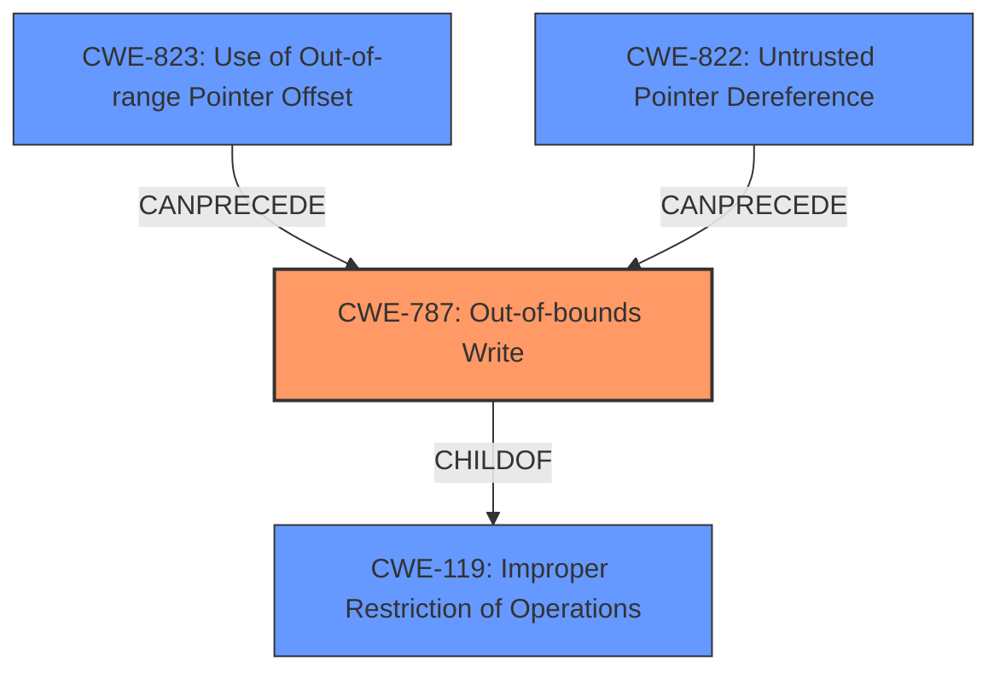

# Raw Analyzer Response for CVE-2024-33021

# Summary

| CWE ID | CWE Name | Confidence | CWE Abstraction Level | CWE Vulnerability Mapping Label | CWE-Vulnerability Mapping Notes |
|---|---|---|---|---|---|
| CWE-787 | Out-of-bounds Write | 0.9 | Base | Primary CWE | Allowed |

## Evidence and Confidence

*   **Confidence Score:** 0.9
*   **Evidence Strength:** LOW

## Relationship Analysis
The primary CWE, CWE-787, is a base-level CWE and is related to other CWEs through hierarchical and chain relationships. For instance, CWE-787 is a child of CWE-119 (Improper Restriction of Operations within a Memory Buffer), indicating a broader class of memory safety issues. The `CANPRECEDE` relationships of CWE-823 and CWE-822 to CWE-787 suggest that out-of-bounds writes can often be preceded by issues like out-of-range pointer offsets or untrusted pointer dereferences.

## Vulnerability Chain
The vulnerability chain in this scenario appears relatively simple based on the provided information. The **memory corruption** during the IOCTL call suggests a direct out-of-bounds write. There might be a preceding step that contributes to the **out-of-bounds write**, but the description doesn't offer any details on this.

## Summary of Analysis
The primary weakness identified is **memory corruption** occurring during an IOCTL call. The retriever results strongly suggest CWE-787 (Out-of-bounds Write) as the most relevant CWE, with a score of 1.000. This aligns with the description of **memory corruption**, indicating that data is being written outside the intended buffer boundaries.

The evidence is weak, as the description is terse and lacking in technical details. However, "Memory corruption" is explicitly mentioned, and the top retriever result maps directly to CWE-787.

CWE-823 (Use of Out-of-range Pointer Offset) and CWE-822 (Untrusted Pointer Dereference) were considered because they can often lead to **out-of-bounds writes**, but there isn't sufficient evidence in the description to confirm either of these. The same logic applies for the other CWEs.

The selection of CWE-787 is at the base level of abstraction, which is appropriate given the available information.
The confidence score is 0.9 due to the limited information in the vulnerability description, but the direct mapping of "**memory corruption**" to CWE-787 justifies a strong degree of confidence.

Relevant CWE Information:

CWE-787: Out-of-bounds Write:
The product writes data past the end, or before the beginning, of the intended buffer. By overrunning a buffer, the attacker might be able to overwrite critical program data, such as variables on the stack or heap, or function return addresses.

CWE-823: Use of Out-of-range Pointer Offset:
The product performs pointer arithmetic on a valid pointer, but it uses an offset that can point outside of the intended range of valid memory locations for the resulting pointer.

CWE-822: Untrusted Pointer Dereference:
The product obtains a value from an untrusted source, converts this value to a pointer, and dereferences the resulting pointer.