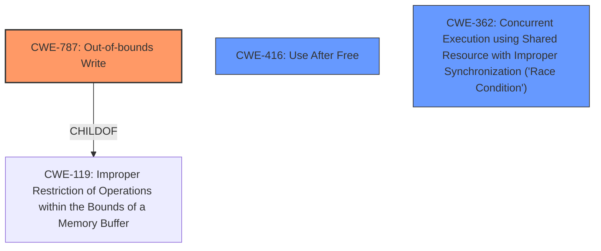

# Analysis Report for CVE-2024-33027

# Vulnerability Analysis Report: CVE-2024-33027

## Description

**Memory corruption** can occur when **arbitrary user-space app gains kernel level privilege** to modify DDR memory by corrupting the GPU page table.

## Vulnerability Description Key Phrases

- **Weakness:** ['Memory corruption', 'arbitrary user-space app gains kernel level privilege']
- **Component:** GPU page table

## Analysis (with Relationship Data)

# Summary
| CWE ID | CWE Name | Confidence | CWE Abstraction Level | CWE Vulnerability Mapping Label | CWE-Vulnerability Mapping Notes |
|---|---|---|---|---|---|
| CWE-787 | Out-of-bounds Write | 0.9 | Base |  Primary CWE | Allowed |
| CWE-416 | Use After Free | 0.6 | Variant | Secondary | Allowed |
| CWE-362 | Concurrent Execution using Shared Resource with Improper Synchronization ('Race Condition') | 0.5 | Class | Secondary | Allowed-with-Review |

## Evidence and Confidence

*   **Confidence Score:** 0.7
*   **Evidence Strength:** MEDIUM

## Relationship Analysis
The primary CWE is CWE-787, which is a base-level CWE. It is related to CWE-119 (Improper Restriction of Operations within the Bounds of a Memory Buffer) through a ChildOf relationship. CWE-416 and CWE-362 are also considered. CWE-362 is a class-level CWE and has potential base-level children that could be more appropriate. CWE-416 is a variant-level CWE. There is no direct relationship between CWE-787, CWE-416, and CWE-362.



## Vulnerability Chain
The vulnerability chain starts with an arbitrary user-space application gaining kernel-level privilege, potentially leading to memory corruption through the modification of the GPU page table. The **memory corruption** is likely achieved via an **out-of-bounds write** (CWE-787). A **use-after-free** (CWE-416) could be a contributing factor or a consequence of the initial memory corruption. A **race condition** (CWE-362) could also be a factor if multiple threads are accessing the GPU page table concurrently without proper synchronization.

## Summary of Analysis
The primary weakness is **memory corruption** arising from an **arbitrary user-space app gains kernel level privilege** to modify DDR memory by corrupting the GPU page table. The most relevant CWE for this scenario is CWE-787 (Out-of-bounds Write), as it directly addresses the **memory corruption** aspect, especially when the GPU page table is corrupted.

CWE-416 (Use After Free) is a plausible secondary weakness, as it could explain how the memory is corrupted. CWE-362 (Concurrent Execution using Shared Resource with Improper Synchronization ('Race Condition')) could also be present if the GPU page table is accessed concurrently without proper locking mechanisms.

The selection of CWE-787 is based on the vulnerability description highlighting **memory corruption** in the context of modifying the GPU page table. The description strongly suggests that data is being written outside the intended memory boundaries.

Other CWEs Considered:

*   CWE-226, CWE-367, CWE-667, and CWE-908 were considered but deemed less relevant as they did not directly address the core issue of **memory corruption** via an **out-of-bounds write** to the GPU page table.
*   CWE-415 (Double Free) was considered but deemed less likely, as the description focuses more on **memory corruption** and privilege escalation rather than freeing memory twice.

Relevant CWE Information:

# Enhanced Context (25 CWEs)
The following CWEs were identified as potentially relevant to this vulnerability:

## CWE-667: Improper Locking
**Abstraction Level**: Class
**Similarity Score**: 0.74
**Source**: dense

**Description**:
The product does not properly acquire or release a lock on a resource, leading to unexpected resource state changes and behaviors.

**Mapping Guidance**:
- Usage: Allowed-with-Review
- Rationale: This CWE entry is a Class and might have Base-level children that would be more appropriate


## CWE-226: Sensitive Information in Resource Not Removed Before Reuse
**Abstraction Level**: Base
**Similarity Score**: 0.74
**Source**: dense

**Description**:
The product releases a resource such as memory or a file so that it can be made available for reuse, but it does not clear or "zeroize" the information contained in the resource before the product performs a critical state transition or makes the resource available for reuse by other entities.

**Mapping Guidance**:
- Usage: Allowed
- Rationale: This CWE entry is at the Base level of abstraction, which is a preferred level of abstraction for mapping to the root causes of vulnerabilities.


## CWE-404: Improper Resource Shutdown or Release
**Abstraction Level**: Class
**Similarity Score**: 0.74
**Source**: dense

**Description**:
The product does not release or incorrectly releases a resource before it is made available for re-use.

**Mapping Guidance**:
- Usage: Allowed-with-Review
- Rationale: This CWE entry is a Class and might have Base-level children that would be more appropriate


## CWE-824: Access of Uninitialized Pointer
**Abstraction Level**: Base
**Similarity Score**: 0.73
**Source**: dense

**Description**:
The product accesses or uses a pointer that has not been initialized.

**Mapping Guidance**:
- Usage: Allowed
- Rationale: This CWE entry is at the Base level of abstraction, which is a preferred level of abstraction for mapping to the root causes of vulnerabilities.


## CWE-665: Improper Initialization
**Abstraction Level**: Class
**Similarity Score**: 0.73
**Source**: dense

**Description**:
The product does not initialize or incorrectly initializes a resource, which might leave the resource in an unexpected state when it is accessed or used.

**Mapping Guidance**:
- Usage: Discouraged
- Rationale: This CWE entry is a level-1 Class (i.e., a child of a Pillar). It might have lower-level children that would be more appropriate


## CWE-696: Incorrect Behavior Order
**Abstraction Level**: Class
**Similarity Score**: 0.73
**Source**: dense

**Description**:
The product performs multiple related behaviors, but the behaviors are performed in the wrong order in ways which may produce resultant weaknesses.

**Mapping Guidance**:
- Usage: Allowed-with-Review
- Rationale: This CWE entry is a Class and might have Base-level children that would be more appropriate


## CWE-703: Improper Check or Handling of Exceptional Conditions
**Abstraction Level**: Pillar
**Similarity Score**: 0.73
**Source**: dense

**Description**:
The product does not properly anticipate or handle exceptional conditions that rarely occur during normal operation of the product.

**Mapping Guidance**:
- Usage: Discouraged
- Rationale: This CWE entry is extremely high-level, a Pillar.


## CWE-131: Incorrect Calculation of Buffer Size
**Abstraction Level**: Base
**Similarity Score**: 0.73
**Source**: dense

**Description**:
The product does not correctly calculate the size to be used when allocating a buffer, which could lead to a buffer overflow.

**Mapping Guidance**:
- Usage: Allowed
- Rationale: This CWE entry is at the Base level of abstraction, which is a preferred level of abstraction for mapping to the root causes of vulnerabilities.


## CWE-657: Violation of Secure Design Principles
**Abstraction Level**: Class
**Similarity Score**: 0.72
**Source**: dense

**Description**:
The product violates well-established principles for secure design.

**Mapping Guidance**:
- Usage: Discouraged
- Rationale: This CWE entry is a level-1 Class (i.e., a child of a Pillar). It might have lower-level children that would be more appropriate


## CWE-212: Improper Removal of Sensitive Information Before Storage or Transfer
**Abstraction Level**: Base
**Similarity Score**: 0.72
**Source**: dense

**Description**:
The product stores, transfers, or shares a resource that contains sensitive information, but it does not properly remove that information before the product makes the resource available to unauthorized actors.

**Mapping Guidance**:
- Usage: Allowed
- Rationale: This CWE entry is at the Base level of abstraction, which is a preferred level of abstraction for mapping to the root causes of vulnerabilities.


## CWE-362: Concurrent Execution using Shared Resource with Improper Synchronization ('Race Condition')
**Abstraction Level**: Class
**Similarity Score**: 1430.36
**Source**: sparse

**Description**:
The product contains a concurrent code sequence that requires temporary, exclusive access to a


## CWE Relationship Analysis

Current CWEs represent these abstraction levels: .


### Vulnerability Chain Analysis

**Chain starting from CWE-416:**
- 416 (Use After Free) - ROOT


**Chain starting from CWE-226:**
- 226 (Sensitive Information in Resource Not Removed Before Reuse) - ROOT


### CWE Relationship Diagram

```mermaid
graph TD
    classDef primary fill:#f96,stroke:#333,stroke-width:2px
    classDef secondary fill:#69f,stroke:#333
    classDef tertiary fill:#9e9,stroke:#333
```


*Report generated on 2025-07-13 07:46:51*
