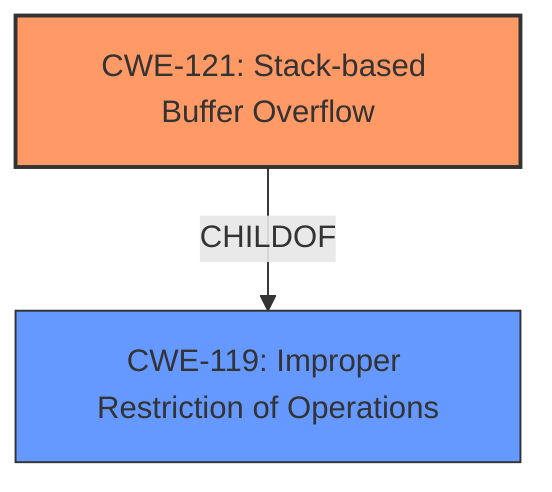

# Analysis for CVE-2024-33180

# Summary
| CWE ID | CWE Name | Confidence | CWE Abstraction Level | CWE Vulnerability Mapping Label | CWE-Vulnerability Mapping Notes |
|---|---|---|---|---|---|
| CWE-121 | Stack-based Buffer Overflow | 1.0 | Variant | Primary | Allowed |

## Evidence and Confidence

*   **Confidence Score:** 1.0
*   **Evidence Strength:** HIGH

## Relationship Analysis
The primary relationship that influenced the decision was the direct match of the vulnerability description to CWE-121. CWE-121 is a variant of CWE-119, which indicates a more specific type of buffer overflow occurring on the stack. The hierarchical relationship helps refine the selection from a general buffer overflow (CWE-119) to a more precise stack-based overflow (CWE-121).

## Vulnerability Chain
The vulnerability chain starts with the **stack-based buffer overflow** due to the `deviceId` parameter. This leads to potential code execution or denial of service.

## Summary of Analysis
The vulnerability description explicitly mentions "**stack-based buffer overflow** vulnerability via the deviceId parameter". This directly aligns with CWE-121, which is a variant-level CWE representing a buffer overflow occurring specifically on the stack.

The retriever results also list CWE-121 as a highly relevant candidate, further supporting this selection. The confidence level is high because the description provides clear evidence of a stack-based buffer overflow.

Other CWEs were considered but not selected:
*   CWE-119: This is a more general class of weakness, and CWE-121 is a more specific variant that fits the vulnerability description better.
*   CWE-120: This CWE describes a buffer copy without checking the size of the input. While it's related to buffer overflows, the provided description doesn't specify a buffer copy operation, making CWE-121 a more accurate fit.
*   CWE-190: Integer Overflow or Wraparound is not directly related to the provided vulnerability description, which focuses on buffer overflows.

Relevant CWE Information:

# Enhanced Context (25 CWEs)
The following CWEs were identified as potentially relevant to this vulnerability:

## CWE-121: Stack-based Buffer Overflow
**Abstraction Level**: Variant
**Similarity Score**: 0.72
**Source**: dense

**Description**:
A stack-based buffer overflow condition is a condition where the buffer being overwritten is allocated on the stack (i.e., is a local variable or, rarely, a parameter to a function).

**Mapping Guidance**:
- Usage: Allowed
- Rationale: This CWE entry is at the Variant level of abstraction, which is a preferred level of abstraction for mapping to the root causes of vulnerabilities.