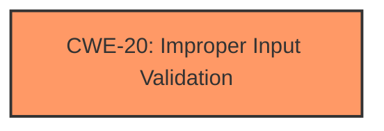

# Enhanced Analysis for CVE-2024-33611

# Summary
| CWE ID | CWE Name | Confidence | CWE Abstraction Level | CWE Vulnerability Mapping Label | CWE-Vulnerability Mapping Notes |
|---|---|---|---|---|---|
| CWE-20 | Improper Input Validation | 0.9 | Class | Allowed | The root cause is **improper input validation** which can lead to a denial of service. |

## Evidence and Confidence

*   **Confidence Score:** 0.9
*   **Evidence Strength:** HIGH

## Relationship Analysis
The primary identified CWE is CWE-20. Although CWE-20 is a Class-level CWE, and therefore discouraged, there isn't enough information provided to determine the specific type of **improper input validation** that is occurring. The vulnerability description states the **root cause** explicitly, but does not provide any additional information.



## Vulnerability Chain
The vulnerability chain is short: **Improper input validation** leads to denial of service.

## Summary of Analysis
The vulnerability is due to **improper input validation**. The evidence provided is the vulnerability description itself, which clearly states that the root cause is **improper input validation**.

Although the Retriever Results provided some potential CWEs, the vulnerability description is too generic and only mentions **improper input validation**. Without additional information it is impossible to pick a more specific CWE.

The selected CWE, CWE-20, is at the appropriate level of specificity, given the provided evidence.

Relevant CWE Information:

# Enhanced Context (25 CWEs)
The following CWEs were identified as potentially relevant to this vulnerability:

## CWE-807: Reliance on Untrusted Inputs in a Security Decision
**Abstraction Level**: Base
**Similarity Score**: 0.75

## CWE-1173: Improper Use of Validation Framework
**Abstraction Level**: Base
**Similarity Score**: 0.74

## CWE-1288: Improper Validation of Consistency within Input
**Abstraction Level**: Base
**Similarity Score**: 0.74

## CWE-280: Improper Handling of Insufficient Permissions or Privileges
**Abstraction Level**: Base
**Similarity Score**: 0.74

## CWE-1285: Improper Validation of Specified Index, Position, or Offset in Input
**Abstraction Level**: Base
**Similarity Score**: 0.73

## CWE-274: Improper Handling of Insufficient Privileges
**Abstraction Level**: Base
**Similarity Score**: 0.73

## CWE-1289: Improper Validation of Unsafe Equivalence in Input
**Abstraction Level**: Base
**Similarity Score**: 0.73

## CWE-755: Improper Handling of Exceptional Conditions
**Abstraction Level**: Class
**Similarity Score**: 0.73

## CWE-497: Exposure of Sensitive System Information to an Unauthorized Control Sphere
**Abstraction Level**: Base
**Similarity Score**: 0.73

## CWE-134: Use of Externally-Controlled Format String
**Abstraction Level**: Base
**Similarity Score**: 0.72

## CWE-1285: Improper Validation of Specified Index, Position, or Offset in Input
**Abstraction Level**: Base
**Similarity Score**: 518.74

## CWE-1288: Improper Validation of Consistency within Input
**Abstraction Level**: Base
**Similarity Score**: 500.97

## CWE-20: Improper Input Validation
**Abstraction Level**: Class
**Similarity Score**: 494.22

**Description**:
The product receives input or data, but it does
        not validate or incorrectly validates that the input has the
        properties that are required to process the data safely and
        correctly.

## CWE-119: Improper Restriction of Operations within the Bounds of a Memory Buffer
**Abstraction Level**: Class
**Similarity Score**: 476.36

## CWE-284: Improper Access Control
**Abstraction Level**: Pillar
**Similarity Score**: 460.23

## CWE-22: Improper Limitation of a Pathname to a Restricted Directory ('Path Traversal')
**Abstraction Level**: base
**Similarity Score**: 4.33

## CWE-73: External Control of File Name or Path
**Abstraction Level**: base
**Similarity Score**: 2.87

## CWE-190: Integer Overflow or Wraparound
**Abstraction Level**: base
**Similarity Score**: 2.87

## CWE-1257: Improper Access Control Applied to Mirrored or Aliased Memory Regions
**Abstraction Level**: base
**Similarity Score**: 2.87

## CWE-1260: Improper Handling of Overlap Between Protected Memory Ranges
**Abstraction Level**: base
**Similarity Score**: 2.87

## CWE-129: Improper Validation of Array Index
**Abstraction Level**: variant
**Similarity Score**: 2.68

## CWE-170: Improper Null Termination
**Abstraction Level**: base
**Similarity Score**: 2.42

## CWE-823: Use of Out-of-range Pointer Offset
**Abstraction Level**: base
**Similarity Score**: 2.42

## CWE-1256: Improper Restriction of Software Interfaces to Hardware Features
**Abstraction Level**: base
**Similarity Score**: 2.40

## CWE-617: Reachable Assertion
**Abstraction Level**: base
**Similarity Score**: 2.29


## CWE Relationship Analysis

Current CWEs represent these abstraction levels: .


### Vulnerability Chain Analysis

**Chain starting from CWE-274:**
- 274 (Improper Handling of Insufficient Privileges) - ROOT


**Chain starting from CWE-1257:**
- 1257 (Improper Access Control Applied to Mirrored or Aliased Memory Regions) - ROOT


### CWE Relationship Diagram

```mermaid
graph TD
    classDef primary fill:#f96,stroke:#333,stroke-width:2px
    classDef secondary fill:#69f,stroke:#333
    classDef tertiary fill:#9e9,stroke:#333
```