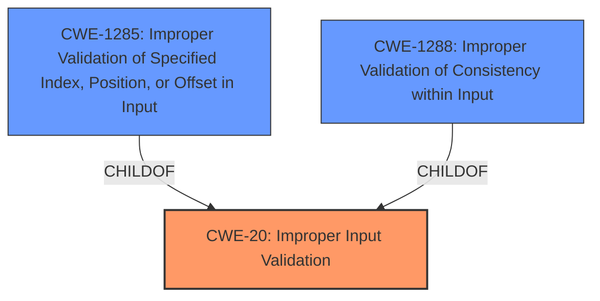

# Raw Analyzer Response for CVE-2024-33624

# Summary
| CWE ID | CWE Name | Confidence | CWE Abstraction Level | CWE Vulnerability Mapping Label | CWE-Vulnerability Mapping Notes |
|---|---|---|---|---|---|
| CWE-20 | Improper Input Validation | 0.9 | Class | Primary | Discouraged |
| CWE-1288 | Improper Validation of Consistency within Input | 0.6 | Base | Secondary | Allowed |
| CWE-1285 | Improper Validation of Specified Index, Position, or Offset in Input | 0.5 | Base | Secondary | Allowed |

## Evidence and Confidence

*   **Confidence Score:** 0.8
*   **Evidence Strength:** MEDIUM

## Relationship Analysis
The primary relationship that influenced the decision was the hierarchical structure, specifically the parent-child relationship between CWE-20 [CWE-20: Improper Input Validation] and its potential children like CWE-129 [CWE-129: Improper Validation of Array Index] or CWE-1285 [CWE-1285: Improper Validation of Specified Index, Position, or Offset in Input]. While the description points towards **improper input validation**, the specific nature of the input being validated (e.g., an array index, a specific type of data) isn't detailed enough to warrant a more specific child CWE with high confidence. The retriever results suggested CWE-1288 [CWE-1288: Improper Validation of Consistency within Input] and CWE-1285 [CWE-1285: Improper Validation of Specified Index, Position, or Offset in Input] which are both children of CWE-20 [CWE-20: Improper Input Validation], but the evidence is not strong enough to support them as the primary CWE.

## Vulnerability Chain
The vulnerability chain starts with **improper input validation** (CWE-20 [CWE-20: Improper Input Validation]), leading to a denial-of-service (DoS) impact. The specific mechanism by which the invalid input causes the DoS is not detailed, so the chain is relatively short.

## Summary of Analysis
The initial assessment, guided by the vulnerability description's key phrase "**Improper input validation**" and the CVE Reference Links Content Summary, strongly suggested CWE-20 [CWE-20: Improper Input Validation] as the primary CWE. The retriever results reinforced this, listing CWE-20 [CWE-20: Improper Input Validation] and related CWEs like CWE-1288 [CWE-1288: Improper Validation of Consistency within Input] and CWE-1285 [CWE-1285: Improper Validation of Specified Index, Position, or Offset in Input].

The MITRE mapping guidance discourages the use of CWE-20 [CWE-20: Improper Input Validation] when more specific CWEs are available. However, in this case, the available information doesn't provide enough detail to confidently select a more specific CWE. The description only mentions "**Improper input validation**" without specifying the type of input, the validation that is missing, or the specific properties that are not being checked.

Therefore, while acknowledging the discouraged usage of CWE-20 [CWE-20: Improper Input Validation], it remains the most accurate representation of the vulnerability based on the provided evidence. The selection of CWE-20 [CWE-20: Improper Input Validation] is a deliberate choice due to the lack of specific information, and while a more specific CWE might exist, there's insufficient evidence to support it. The **improper input validation** leads directly to a denial of service.

Relevant CWE Information:

# Enhanced Context (25 CWEs)
The following CWEs were identified as potentially relevant to this vulnerability:

## CWE-1285: Improper Validation of Specified Index, Position, or Offset in Input
**Abstraction Level**: Base
**Similarity Score**: 0.74
**Source**: dense

**Description**:
The product receives input that is expected to specify an index, position, or offset into an indexable resource such as a buffer or file, but it does not validate or incorrectly validates that the specified index/position/offset has the required properties.

**Mapping Guidance**:
- Usage: Allowed
- Rationale: This CWE entry is at the Base level of abstraction, which is a preferred level of abstraction for mapping to the root causes of vulnerabilities.

## CWE-1288: Improper Validation of Consistency within Input
**Abstraction Level**: Base
**Similarity Score**: 0.73
**Source**: dense

**Description**:
The product receives a complex input with multiple elements or fields that must be consistent with each other, but it does not validate or incorrectly validates that the input is actually consistent.

**Mapping Guidance**:
- Usage: Allowed
- Rationale: This CWE entry is at the Base level of abstraction, which is a preferred level of abstraction for mapping to the root causes of vulnerabilities.

## CWE-20: Improper Input Validation
**Abstraction Level**: Class
**Similarity Score**: 0.73
**Source**: dense

**Description**:
The product receives input or data, but it does
        not validate or incorrectly validates that the input has the
        properties that are required to process the data safely and
        correctly.

**Mapping Guidance**:
- Usage: Discouraged
- Rationale: CWE-20 is commonly misused in low-information vulnerability reports when lower-level CWEs could be used instead, or when more details about the vulnerability are available [REF-1287]. It is not useful for trend analysis. It is also a level-1 Class (i.e., a child of a Pillar).

## Other CWEs Considered:

*   CWE-1285 [CWE-1285: Improper Validation of Specified Index, Position, or Offset in Input] and CWE-1288 [CWE-1288: Improper Validation of Consistency within Input] were considered as more specific alternatives to CWE-20 [CWE-20: Improper Input Validation], but the vulnerability description lacks the detail necessary to confidently assert that the **improper input validation** relates to a specific index/position/offset or to the consistency of multiple input elements.
*   CWE-1173 [CWE-1173: Improper Use of Validation Framework] was not selected because the description doesn't indicate a problem with a validation framework, but rather with the general practice of input validation.
*   CWE-284 [CWE-284: Improper Access Control] was considered and rejected, as the description focuses on input validation rather than access control mechanisms.
*   CWE-119 [CWE-119: Improper Restriction of Operations within the Bounds of a Memory Buffer] was considered because **improper input validation** could potentially lead to buffer overflows. However, there's no direct evidence of memory corruption or buffer-related issues in the description.