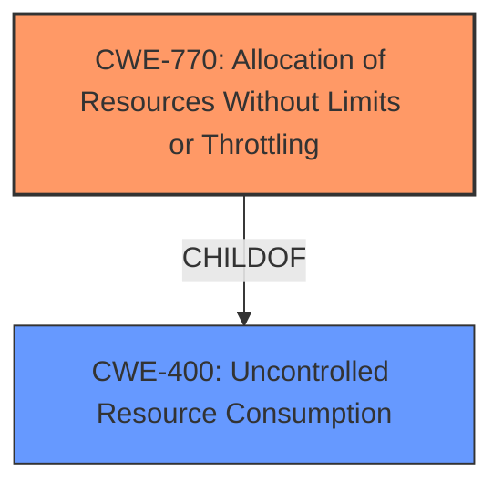

# Raw Analyzer Response for CVE-2024-34036

# Summary
| CWE ID | CWE Name | Confidence | CWE Abstraction Level | CWE Vulnerability Mapping Label | CWE-Vulnerability Mapping Notes |
|---|---|---|---|---|---|
| CWE-770 | Allocation of Resources Without Limits or Throttling | 0.9 | Base | Allowed | Primary CWE |
| CWE-400 | Uncontrolled Resource Consumption | 0.7 | Class | Discouraged | Secondary Candidate |

## Evidence and Confidence

*   **Confidence Score:** 0.8
*   **Evidence Strength:** MEDIUM

## Relationship Analysis
The primary CWE is CWE-770, Allocation of Resources Without Limits or Throttling, which is a base-level CWE. CWE-400, Uncontrolled Resource Consumption, is a class-level CWE and a parent of CWE-770. While CWE-400 could be considered, CWE-770 is more specific and accurately reflects the **lack of** limits or throttling on resource allocation, which is the **root cause**.

## Vulnerability Chain
The vulnerability chain starts with the **lack of** resource limits (CWE-770), leading to excessive resource consumption (CWE-400), and ultimately resulting in a denial-of-service condition where the initial connection between a gNB and the Near RT-RIC is disrupted.

## Summary of Analysis
The analysis concludes that CWE-770, Allocation of Resources Without Limits or Throttling, is the most appropriate primary CWE for this vulnerability. The vulnerability description and the CVE reference summary highlight the **lack of** limits on subscription requests, which allows an attacker to exhaust system resources. The relationship analysis shows that CWE-770 is a child of CWE-400, making it a more specific and accurate representation of the **root cause**. CWE-400 is considered a secondary candidate because it describes the consequence of **uncontrolled** resource usage, but it does not specify the underlying **lack of** resource management mechanisms that led to the exhaustion. The choice of CWE-770 is further supported by its base-level abstraction and allowed usage, as recommended by MITRE.

The primary evidence for selecting CWE-770 is derived from the CVE reference links summary: "The vulnerability allows disruption of the initial connection between a gNB and the Near RT-RIC due to resource exhaustion." and "An attacker can send a high volume of subscription requests via an xApp to overwhelm the system." This indicates a **lack of** limits on the number of subscription requests, which aligns directly with the description of CWE-770.

CWE-400 was considered but not chosen as the primary CWE because, while the vulnerability leads to uncontrolled resource consumption, the root cause is the **lack of** limits on the allocation of those resources. CWE-400 is a more general description of the impact rather than the specific **root cause**. Other CWEs were not selected because they did not align as closely with the vulnerability description's emphasis on the **lack of** resource limits leading to denial-of-service.