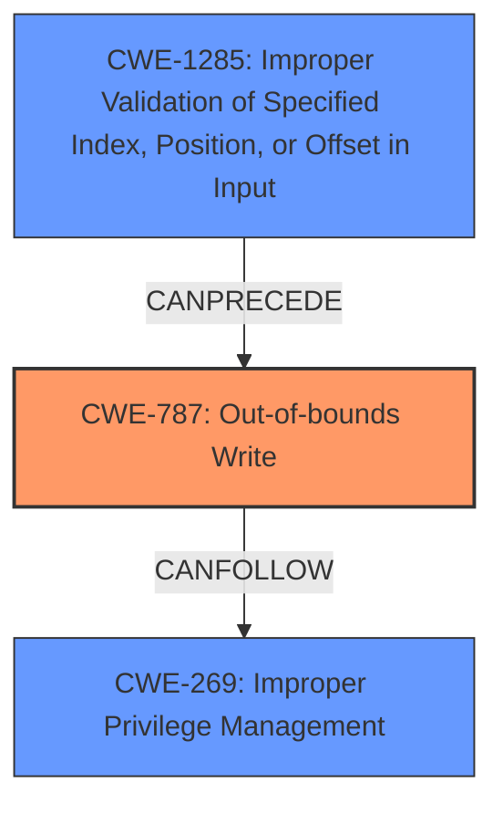

# Analysis for CVE-2024-34332

# Summary
| CWE ID    | CWE Name                                                                           | Confidence | CWE Abstraction Level | CWE Vulnerability Mapping Label | CWE-Vulnerability Mapping Notes |
| :-------- | :--------------------------------------------------------------------------------- | :--------- | :-------------------- | :------------------------------ | :------------------------------ |
| CWE-787   | Out-of-bounds Write                                                                | 0.9        | Base                  | Primary                         | Allowed                         |
| CWE-1285  | Improper Validation of Specified Index, Position, or Offset in Input             | 0.8        | Base                  | Secondary                       | Allowed                         |
| CWE-269   | Improper Privilege Management                                                      | 0.6        | Class                  | Secondary                       | Discouraged                     |

## Evidence and Confidence

*   **Confidence Score:** 0.8
*   **Evidence Strength:** HIGH

## Relationship Analysis
The primary weakness is **CWE-787: Out-of-bounds Write**, representing the actual memory corruption. This is often preceded by **CWE-1285: Improper Validation of Specified Index, Position, or Offset in Input** because the out-of-bounds write often occurs due to a failure to validate the index, position, or offset before writing to memory. The **CWE-269 Improper Privilege Management** is an impact of exploiting the memory corruption.

## Vulnerability Chain
The vulnerability chain starts with **CWE-1285: Improper Validation of Specified Index, Position, or Offset in Input**. Because the Kernel Driver does not validate data received from the IRP->SystemBuffer, this leads to **CWE-787: Out-of-bounds Write** when user-controlled parameters (physical address and size) are passed to the `MmMapIoSpace` function. The **impact** of the out-of-bounds write is **CWE-269: Improper Privilege Management** allowing a low-privileged user to escalate privileges.

## Summary of Analysis
The analysis indicates a privilege escalation vulnerability in SiSoftware SANDRA due to insufficient input validation in the kernel driver, leading to an out-of-bounds write.

The primary CWE is **CWE-787: Out-of-bounds Write** because the vulnerability centers on writing data beyond the intended buffer boundaries. This is directly supported by the CVE Reference Links Content Summary, which states that the driver passes user-controlled parameters directly to the `MmMapIoSpace` function without proper checks.

**CWE-1285: Improper Validation of Specified Index, Position, or Offset in Input** is included as a secondary CWE because the root cause is the lack of validation of the physical address and size provided by the user.

**CWE-269: Improper Privilege Management** is included as a secondary CWE because the **impact** of the vulnerability is privilege escalation. The "Privileges vs Permissions Guidance" confirms that if the root cause is known, it should be used instead of **CWE-269**.

The evidence provided in the CVE Reference Links Content Summary clearly supports this classification, particularly the statements about insufficient input validation and direct memory mapping with unvalidated data. The retriever results also indicate the relevance of CWE-787.

The selected CWEs are at the optimal level of specificity. **CWE-787** is a Base-level CWE that directly describes the memory corruption issue. **CWE-1285** is also a Base-level CWE that accurately describes the lack of input validation. **CWE-269** at the Class level describes the impact of privilege management.

Relevant CWE Information:

# Enhanced Context (25 CWEs)
The following CWEs were identified as potentially relevant to this vulnerability:

## CWE-266: Incorrect Privilege Assignment
**Abstraction Level**: Base
**Similarity Score**: 0.78
**Source**: dense

**Description**:
A product incorrectly assigns a privilege to a particular actor, creating an unintended sphere of control for that actor.

**Mapping Guidance**:
- Usage: Allowed
- Rationale: This CWE entry is at the Base level of abstraction, which is a preferred level of abstraction for mapping to the root causes of vulnerabilities.

## CWE-267: Privilege Defined With Unsafe Actions
**Abstraction Level**: Base
**Similarity Score**: 0.77
**Source**: dense

**Description**:
A particular privilege, role, capability, or right can be used to perform unsafe actions that were not intended, even when it is assigned to the correct entity.

**Mapping Guidance**:
- Usage: Allowed
- Rationale: This CWE entry is at the Base level of abstraction, which is a preferred level of abstraction for mapping to the root causes of vulnerabilities.

## CWE-280: Improper Handling of Insufficient Permissions or Privileges 
**Abstraction Level**: Base
**Similarity Score**: 0.76
**Source**: dense

**Description**:
The product does not handle or incorrectly handles when it has insufficient privileges to access resources or functionality as specified by their permissions. This may cause it to follow unexpected code paths that may leave the product in an invalid state.

**Mapping Guidance**:
- Usage: Allowed
- Rationale: This CWE entry is at the Base level of abstraction, which is a preferred level of abstraction for mapping to the root causes of vulnerabilities.

## CWE-274: Improper Handling of Insufficient Privileges
**Abstraction Level**: Base
**Similarity Score**: 0.76
**Source**: dense

**Description**:
The product does not handle or incorrectly handles when it has insufficient privileges to perform an operation, leading to resultant weaknesses.

**Mapping Guidance**:
- Usage: Discouraged
- Rationale: This CWE entry could be deprecated in a future version of CWE.

## CWE-668: Exposure of Resource to Wrong Sphere
**Abstraction Level**: Class
**Similarity Score**: 0.76
**Source**: dense

**Description**:
The product exposes a resource to the wrong control sphere, providing unintended actors with inappropriate access to the resource.

**Mapping Guidance**:
- Usage: Discouraged
- Rationale: CWE-668 is high-level and is often misused as a catch-all when lower-level CWE IDs might be applicable. It is sometimes used for low-information vulnerability reports [REF-1287]. It is a level-1 Class (i.e., a child of a Pillar). It is not useful for trend analysis.

## CWE-59: Improper Link Resolution Before File Access ('Link Following')
**Abstraction Level**: Base
**Similarity Score**: 0.75
**Source**: dense

**Description**:
The product attempts to access a file based on the filename, but it does not properly prevent that filename from identifying a link or shortcut that resolves to an unintended resource.

**Mapping Guidance**:
- Usage: Allowed
- Rationale: This CWE entry is at the Base level of abstraction, which is a preferred level of abstraction for mapping to the root causes of vulnerabilities.

## CWE-667: Improper Locking
**Abstraction Level**: Class
**Similarity Score**: 0.75
**Source**: dense

**Description**:
The product does not properly acquire or release a lock on a resource, leading to unexpected resource state changes and behaviors.

**Mapping Guidance**:
- Usage: Allowed-with-Review
- Rationale: This CWE entry is a Class and might have Base-level children that would be more appropriate

## CWE-41: Improper Resolution of Path Equivalence
**Abstraction Level**: Base
**Similarity Score**: 0.75
**Source**: dense

**Description**:
The product is vulnerable to file system contents disclosure through path equivalence. Path equivalence involves the use of special characters in file and directory names. The associated manipulations are intended to generate multiple names for the same object.

**Mapping Guidance**:
- Usage: Allowed
- Rationale: This CWE entry is at the Base level of abstraction, which is a preferred level of abstraction for mapping to the root causes of vulnerabilities.

## CWE-754: Improper Check for Unusual or Exceptional Conditions
**Abstraction Level**: Class
**Similarity Score**: 0.74
**Source**: dense

**Description**:
The product does not check or incorrectly checks for unusual or exceptional conditions that are not expected to occur frequently during day to day operation of the product.

**Mapping Guidance**:
- Usage: Allowed-with-Review
- Rationale: This CWE entry is a Class and might have Base-level children that would be more appropriate

## CWE-703: Improper Check or Handling of Exceptional Conditions
**Abstraction Level**: Pillar
**Similarity Score**: 0