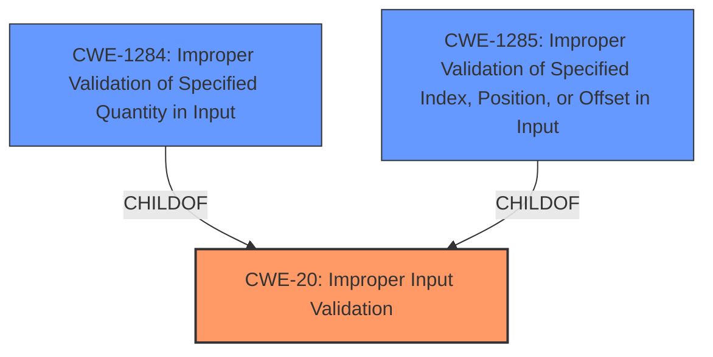

# Enhanced Analysis for CVE-2024-34597

# Summary
| CWE ID | CWE Name | Confidence | CWE Abstraction Level | CWE Vulnerability Mapping Label | CWE-Vulnerability Mapping Notes |
|---|---|---|---|---|---|
| CWE-20 | Improper Input Validation | 1.0 | Class | Primary | Discouraged |
| CWE-1284 | Improper Validation of Specified Quantity in Input | 0.7 | Base | Secondary Candidate | Allowed |
| CWE-1285 | Improper Validation of Specified Index, Position, or Offset in Input | 0.7 | Base | Secondary Candidate | Allowed |

## Evidence and Confidence

*   **Confidence Score:** 0.9
*   **Evidence Strength:** HIGH

## Relationship Analysis
The primary CWE is CWE-20, which is a class-level CWE. While it's generally discouraged to use class-level CWEs, the description explicitly mentions "**Improper input validation**" as the root cause. The retriever results also highlight CWE-1284 and CWE-1285, which are base-level CWEs related to improper validation of quantity and index/position/offset, respectively. Since the vulnerability description does not provide specific details of what type of input validation is missing, I am including these as secondary candidates that are children of CWE-20, but will still assign CWE-20 as the primary since that is what is explicitly stated.



## Vulnerability Chain
The vulnerability chain starts with the **improper input validation** (CWE-20). This leads to the ability for a local attacker to write arbitrary document files to the sandbox of Samsung Health.

## Summary of Analysis
The vulnerability description clearly states that the root cause is **improper input validation**. The CVE Reference Links Content Summary reinforces this, stating that the **root cause of vulnerability** is **improper input validation** in Samsung Health. While CWE-20 is a class-level CWE and generally discouraged, it is the most accurate representation of the **root cause** based on the provided evidence. The other CWEs were considered, but the best match is CWE-20. Given the limited information and the use of a class-level CWE, the confidence is high but not perfect. While it may be possible that it is a quantity or offset issue, the vulnerability description does not specify that.

Relevant CWE Information:

# Enhanced Context (25 CWEs)
The following CWEs were identified as potentially relevant to this vulnerability:

## CWE-20: Improper Input Validation
**Abstraction Level**: Class
**Similarity Score**: 0.73
**Source**: dense

**Description**:
The product receives input or data, but it does
        not validate or incorrectly validates that the input has the
        properties that are required to process the data safely and
        correctly.

**Mapping Guidance**:
- Usage: Discouraged
- Rationale: CWE-20 is commonly misused in low-information vulnerability reports when lower-level CWEs could be used instead, or when more details about the vulnerability are available [REF-1287]. It is not useful for trend analysis. It is also a level-1 Class (i.e., a child of a Pillar).

Justification: Although discouraged, the vulnerability description explicitly states "**Improper input validation**" as the root cause. This is direct evidence supporting the selection of CWE-20.

## CWE-1284: Improper Validation of Specified Quantity in Input
**Abstraction Level**: Base
**Similarity Score**: 511.25
**Source**: sparse

**Description**:
The product receives input that is expected to specify a quantity (such as size or length), but it does not validate or incorrectly validates that the quantity has the required properties.

**Mapping Guidance**:
- Usage: Allowed
- Rationale: This CWE entry is at the Base level of abstraction, which is a preferred level of abstraction for mapping to the root causes of vulnerabilities.

Justification: Since we are writing files, it is possible there is an improper validation of the file size.

## CWE-1285: Improper Validation of Specified Index, Position, or Offset in Input
**Abstraction Level**: Base
**Similarity Score**: 524.49
**Source**: sparse

**Description**:
The product receives input that is expected to specify an index, position, or offset into an indexable resource such as a buffer or file, but it does not validate or incorrectly validates that the specified index/position/offset has the required properties.

**Mapping Guidance**:
- Usage: Allowed
- Rationale: This CWE entry is at the Base level of abstraction, which is a preferred level of abstraction for mapping to the root causes of vulnerabilities.

Justification: Since we are writing files, it is possible there is an improper validation of an offset within the file.

## Other CWEs Considered and Rejected:

*   **CWE-125: Out-of-bounds Read:** This CWE relates to reading memory out of bounds, which is not directly indicated in the vulnerability description.
*   **CWE-367: Time-of-check Time-of-use (TOCTOU) Race Condition:** This CWE involves a race condition between checking and using a resource. This doesn't appear to be the issue described.
*   **CWE-770: Allocation of Resources Without Limits or Throttling:** The vulnerability description doesn't mention resource allocation issues, making this CWE less relevant.
*   **CWE-926: Improper Export of Android Application Components:** This CWE relates to Android application components being improperly exported and accessible. This is not explicitly mentioned in the vulnerability description, which focuses on **improper input validation**.
*   **CWE-927: Use of Implicit Intent for Sensitive Communication:** The vulnerability description doesn't mention the use of implicit intents.
*   **CWE-285: Improper Authorization:** The provided information does not suggest an authorization issue.
*   **CWE-287: Improper Authentication:** The provided information does not suggest an authentication issue.


## CWE Relationship Analysis

Current CWEs represent these abstraction levels: .


### Vulnerability Chain Analysis

**Chain starting from CWE-1284:**
- 1284 (Improper Validation of Specified Quantity in Input) - ROOT


**Chain starting from CWE-770:**
- 770 (Allocation of Resources Without Limits or Throttling) - ROOT


### CWE Relationship Diagram

```mermaid
graph TD
    classDef primary fill:#f96,stroke:#333,stroke-width:2px
    classDef secondary fill:#69f,stroke:#333
    classDef tertiary fill:#9e9,stroke:#333
```