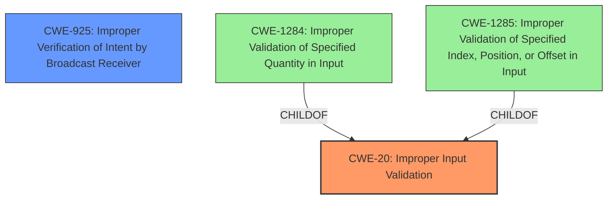

# Analysis Report for CVE-2024-34599

# Vulnerability Analysis Report: CVE-2024-34599

## Description

**Improper input validation** in Tips prior to version 6.2.9.4 in Android 14 allows local attacker to send broadcast with Tips&#39 privilege.

## Vulnerability Description Key Phrases

- **Rootcause:** Improper input validation
- **Impact:** send broadcast with Tips' privilege
- **Attacker:** local attacker
- **Product:** Tips
- **Version:** prior to version 6.2.9.4

## Analysis (with Relationship Data)

# Summary
| CWE ID | CWE Name | Confidence | CWE Abstraction Level | CWE Vulnerability Mapping Label | CWE-Vulnerability Mapping Notes |
|---|---|---|---|---|---|
| CWE-20 | Improper Input Validation | 0.9 | Class | Primary | Allowed-with-Review |
| CWE-925 | Improper Verification of Intent by Broadcast Receiver | 0.7 | Variant | Secondary | Allowed |

## Evidence and Confidence

*   **Confidence Score:** 0.8
*   **Evidence Strength:** HIGH

## Relationship Analysis
The primary relationship influencing the CWE selection is the parent-child relationship between CWE-20 and more specific input validation CWEs. While more specific CWEs like CWE-1284 and CWE-1285 exist, the provided information lacks the granularity to pinpoint the exact type of input that's not being validated. Therefore, CWE-20 is chosen as the best fit. Additionally, CWE-925 is considered as it relates to broadcast receivers, but it's secondary because the root cause is the initial **improper input validation**.



## Vulnerability Chain
The vulnerability chain begins with **improper input validation** (CWE-20). This leads to the ability of a local attacker to send a broadcast with Tips' privileges, which can be considered a form of **improper verification of intent by broadcast receiver** (CWE-925).

## Summary of Analysis
The initial assessment identified **improper input validation** as the root cause, aligning with the provided description. The retriever results also list CWE-20 as the top combined result. The "Vulnerability Description Key Phrases" section explicitly states "**rootcause:** **Improper input validation**". The CVE Reference Links Content Summary also confirms this by stating: "**Root cause of vulnerability:** Improper input validation in the Tips application." While other CWEs like CWE-1284 and CWE-1285 are more specific types of input validation issues, the provided information does not specify the *type* of input that's not being validated. Therefore, a higher-level Class like CWE-20 is more appropriate. The graph relationships highlight the parent-child relationship between CWE-20 and more specific input validation flaws, further justifying this decision. Finally, the ability to send broadcasts with Tips' privileges suggests CWE-925 as a secondary weakness, although the root cause remains CWE-20.

Relevant CWE Information:

# Enhanced Context (25 CWEs)
The following CWEs were identified as potentially relevant to this vulnerability:

## CWE-280: Improper Handling of Insufficient Permissions or Privileges 
**Abstraction Level**: Base
**Similarity Score**: 0.77

## CWE-267: Privilege Defined With Unsafe Actions
**Abstraction Level**: Base
**Similarity Score**: 0.76

## CWE-266: Incorrect Privilege Assignment
**Abstraction Level**: Base
**Similarity Score**: 0.76

## CWE-274: Improper Handling of Insufficient Privileges
**Abstraction Level**: Base
**Similarity Score**: 0.76

## CWE-807: Reliance on Untrusted Inputs in a Security Decision
**Abstraction Level**: Base
**Similarity Score**: 0.75

## CWE-754: Improper Check for Unusual or Exceptional Conditions
**Abstraction Level**: Class
**Similarity Score**: 0.75

## CWE-451: User Interface (UI) Misrepresentation of Critical Information
**Abstraction Level**: Class
**Similarity Score**: 0.74

## CWE-472: External Control of Assumed-Immutable Web Parameter
**Abstraction Level**: Base
**Similarity Score**: 0.74

## CWE-941: Incorrectly Specified Destination in a Communication Channel
**Abstraction Level**: Base
**Similarity Score**: 0.74

## CWE-345: Insufficient Verification of Data Authenticity
**Abstraction Level**: Class
**Similarity Score**: 0.74

## CWE-269: Improper Privilege Management
**Abstraction Level**: Class
**Similarity Score**: 1511.37

## CWE-863: Incorrect Authorization
**Abstraction Level**: Class
**Similarity Score**: 1506.09

## CWE-285: Improper Authorization
**Abstraction Level**: Class
**Similarity Score**: 1466.92

## CWE-267: Privilege Defined With Unsafe Actions
**Abstraction Level**: Base
**Similarity Score**: 1447.63

## CWE-862: Missing Authorization
**Abstraction Level**: Class
**Similarity Score**: 1396.03

## CWE-73: External Control of File Name or Path
**Abstraction Level**: base
**Similarity Score**: 3.80

## CWE-117: Improper Output Neutralization for Logs
**Abstraction Level**: base
**Similarity Score**: 2.87

## CWE-280: Improper Handling of Insufficient Permissions or Privileges 
**Abstraction Level**: Base
**Similarity Score**: 2.49

## CWE-274: Improper Handling of Insufficient Privileges
**Abstraction Level**: Base
**Similarity Score**: 2.49

## CWE-250: Execution with Unnecessary Privileges
**Abstraction Level**: base
**Similarity Score**: 2.47

## CWE-306: Missing Authentication for Critical Function
**Abstraction Level**: base
**Similarity Score**: 2.47

## CWE-1285: Improper Validation of Specified Index, Position, or Offset in Input
**Abstraction Level**: base
**Similarity Score**: 2.47

## CWE-1284: Improper Validation of Specified Quantity in Input
**Abstraction Level**: base
**Similarity Score**: 2.47

## CWE-93: Improper Neutralization of CRLF Sequences ('CRLF Injection')
**Abstraction Level**: base
**Similarity Score**: 2.40

## CWE-425: Direct Request ('Forced Browsing')
**Abstraction Level**: base
**Similarity Score**: 2.34

CWE-269, CWE-863, CWE-285, CWE-862, CWE-267, CWE-280, and CWE-274 were considered but not selected because they focus on privilege management or authorization, which are consequences of the **improper input validation** in this scenario, not the root cause. CWE-73 and CWE-117 are related to file paths and output neutralization respectively, and are not relevant to the vulnerability description. CWE-250 and CWE-306 are related to unnecessary privileges and missing authentication, which also do not match the vulnerability.
CWE-1284 and CWE-1285 are more specific types of input validation issues, but the provided information lacks the detail to pinpoint the exact type of input that's not being validated. Thus, they are not selected, favoring the more general CWE-20.
CWE-93 is related to CRLF injection, which is unrelated to the given vulnerability description.
CWE-425 is related to direct requests or forced browsing, which doesn't align with the description.


## CWE Relationship Analysis

Current CWEs represent these abstraction levels: .


### Vulnerability Chain Analysis

**Chain starting from CWE-925:**
- 925 (Improper Verification of Intent by Broadcast Receiver) - ROOT


**Chain starting from CWE-274:**
- 274 (Improper Handling of Insufficient Privileges) - ROOT


### CWE Relationship Diagram

```mermaid
graph TD
    classDef primary fill:#f96,stroke:#333,stroke-width:2px
    classDef secondary fill:#69f,stroke:#333
    classDef tertiary fill:#9e9,stroke:#333
```


*Report generated on 2025-07-13 08:13:30*
