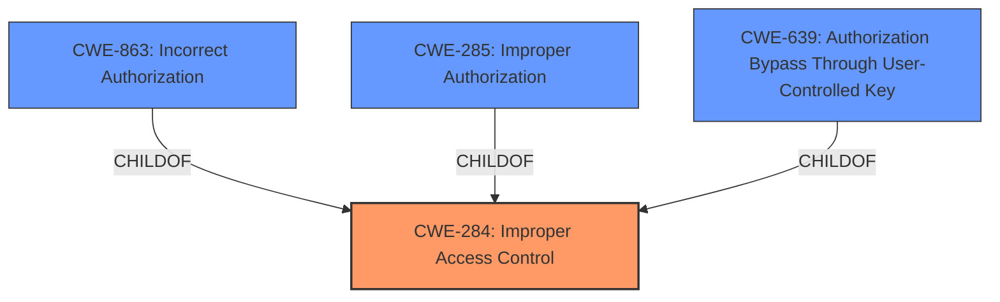

# Analysis Report for CVE-2024-34605

# Vulnerability Analysis Report: CVE-2024-34605

## Description

**Improper access control** in SamsungHealthService prior to SMR Aug-2024 Release 1 allows local attackers to bypass restrictions on starting services from the background.

## Vulnerability Description Key Phrases

- **Rootcause:** Improper access control
- **Impact:** bypass restrictions on starting services from the background
- **Attacker:** local attackers
- **Product:** SamsungHealthService
- **Version:** prior to SMR Aug-2024 Release 1

## Analysis (with Relationship Data)

# Summary
| CWE ID | CWE Name | Confidence | CWE Abstraction Level | CWE Vulnerability Mapping Label | CWE-Vulnerability Mapping Notes |
|---|---|---|---|---|---|
| CWE-284 | Improper Access Control | 0.9 | Pillar | Primary CWE | Discouraged |

## Evidence and Confidence

*   **Confidence Score:** 0.9
*   **Evidence Strength:** HIGH

## Relationship Analysis
The primary relationship considered was the hierarchical structure, specifically looking for a more specific child CWE of CWE-284. However, the provided information does not give enough detail to determine the exact nature of the **improper access control**, so the higher-level CWE-284 is appropriate. The retriever results also suggest several child CWEs like CWE-639, CWE-863, CWE-285 which point to a possible authorization issue.



## Vulnerability Chain
The vulnerability chain starts with **improper access control**, which leads to bypassing restrictions on starting services from the background.

## Summary of Analysis
The initial assessment identified **Improper access control** as the root cause based on the "Vulnerability Description Key Phrases" and "CVE Reference Links Content Summary". The retriever results also suggested CWE-284 "Improper Access Control" as a potential candidate. Given that the description lacks specific details about the exact mechanism of the access control issue (e.g., whether it's due to missing authentication, missing authorization, or incorrect authorization), CWE-284 is the most appropriate choice.

CWEs considered but not used:
*   CWE-285, CWE-863, CWE-306: These are related to authorization and authentication issues, but the provided description is too general to determine if the **improper access control** stems from a problem with authorization or authentication. Without this information, using CWE-284 is more accurate.
*   CWE-639: Authorization Bypass Through User-Controlled Key: This is a more specific authorization issue. Again, the provided description is too general.
*   CWE-306 Missing Authentication for Critical Function: Similarly, without knowing if Authentication is the main issue this CWE is not appropriate.

Relevant CWE Information:
*   **CWE-284: Improper Access Control** - This is the primary CWE because the vulnerability description explicitly mentions **improper access control**. This aligns with the CWE's definition, which covers scenarios where access to resources or functionality is not adequately controlled. The impact is that local attackers can bypass restrictions, indicating a failure in access control mechanisms. The usage is discouraged if a more specific child CWE is available.


## CWE Relationship Analysis

Current CWEs represent these abstraction levels: .


### Vulnerability Chain Analysis

**Chain starting from CWE-863:**
- 863 (Incorrect Authorization) - ROOT


**Chain starting from CWE-639:**
- 639 (Authorization Bypass Through User-Controlled Key) - ROOT


### CWE Relationship Diagram

```mermaid
graph TD
    classDef primary fill:#f96,stroke:#333,stroke-width:2px
    classDef secondary fill:#69f,stroke:#333
    classDef tertiary fill:#9e9,stroke:#333
```


*Report generated on 2025-07-13 08:14:24*
