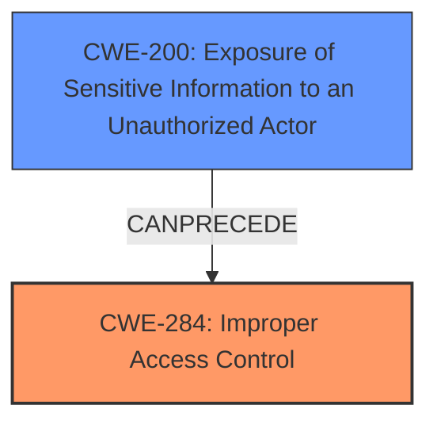

# Analysis for CVE-2024-34611

# Summary
| CWE ID  | CWE Name                                           | Confidence | CWE Abstraction Level | CWE Vulnerability Mapping Label | CWE-Vulnerability Mapping Notes |
| :------- | :------------------------------------------------- | :--------- | :---------------------- | :------------------------------ | :------------------------------ |
| CWE-284 | Improper Access Control                            | 0.9        | Pillar                  | Primary                         | Discouraged                   |
| CWE-200 | Exposure of Sensitive Information to an Unauthorized Actor | 0.7        | Class                   | Secondary                       | Discouraged                   |

## Evidence and Confidence

*   **Confidence Score:** 0.8
*   **Evidence Strength:** MEDIUM

## Relationship Analysis
The primary relationship that influenced my decision was the parent-child relationship between CWE-284 (Improper Access Control) and its potential children (e.g., CWE-285, CWE-862, CWE-863, CWE-306). The vulnerability description indicates a general **improper access control** issue without specifying whether it stems from a missing authentication, missing authorization, or incorrect authorization. Therefore, the higher-level CWE-284 is more appropriate.

## Vulnerability Chain
The vulnerability chain starts with **improper access control** (CWE-284), which leads to the exposure of sensitive information (CWE-200).

## Summary of Analysis
The initial analysis identified **improper access control** as the root cause, leading to the exposure of sensitive information. The retriever results suggested several CWEs related to authorization and access control. However, the provided description lacks the specificity to pinpoint the exact type of access control failure (missing authentication, missing authorization, or incorrect authorization). Thus, CWE-284, a more general category for **improper access control**, is the most appropriate primary mapping.

The decision is primarily based on the vulnerability description's key phrase "**improper access control**" and the CVE Reference Links Content Summary, which explicitly states "**Root Cause: Improper access control in `KnoxService`**".

CWE-284 is at the Pillar level, but more specific CWEs (Base, Variant) require more information about the type of access control failure. Without that information, choosing a more specific CWE would be speculative.

Relevant CWE Information:

# Enhanced Context (25 CWEs)
The following CWEs were identified as potentially relevant to this vulnerability:

## CWE Classification Guidance

The following guidance has been automatically included because relevant keywords were detected in the vulnerability description:

### Authentication vs Authorization vs Access Control Guidance

## ===Guidance===

### Level Set – Authentication vs Authorization vs Access Control

**Authentication**:
Determines *who* the actor is (identity validation). This is typically the *first step* in access control.

* Example phrases: "user must log in", "lack of login check", "bypasses login"
* CWE relevance: authentication is usually mapped to CWE-306 or its children.

  * **CWE-306**: *Missing Authentication for Critical Function* – used when no identity validation is enforced for sensitive functionality (e.g., password reset, user deletion).

**Authorization**:
Determines *what* an authenticated actor is allowed to do. It decides access *after* identity is verified.

* Example phrases: "unauthorized access", "regular user can access admin panel", "role checks are missing"
* CWE relevance: use CWEs like 862, 863, 285 for authorization errors:

  * **CWE-862**: *Missing Authorization* – the application doesn't check whether the user is authorized at all.
  * **CWE-863**: *Incorrect Authorization* – the application checks authorization, but does it incorrectly (e.g., flawed logic).
  * **CWE-285**: *Improper Authorization* – general category for any flawed authorization logic or design.

**Access Control**:
A broader term that includes both authentication and authorization. Governs how resources are protected and who can access them under what conditions.

* CWE relevance:

  * **CWE-284**: *Improper Access Control* – top-level category used when access control failure exists but root cause is unclear.
  * This should be avoided **if** a more specific child CWE like 285, 862, 863, or 306 is appropriate.

---

## Mapping Discussion – Common Misclassification Patterns

### 1. **CWE-306 vs CWE-862**:

* **306** is about lack of **authentication** (e.g., *no login required at all*).
* **862** is about lack of **authorization** *after* authentication (e.g., *admin check missing*).
* ✅ Example CWE-306: *“An unauthenticated attacker can invoke the password reset API.”*
* ✅ Example CWE-862: *“An authenticated user without admin privileges can delete any user account.”*

### 2. **CWE-285 vs CWE-284**:

* **285** is specific to authorization flaws – it's a better choice than 284 **if** the issue involves *improper or missing role checks*.
* **284** should be reserved for general access control issues when it’s unclear whether the issue lies in authn or authz.

---

## Technical Impact vs Root Cause Clarification

**Phrase like "unauthorized access" is not enough.**

* If you **cannot determine whether identity was checked**, assume it’s **authorization** and consider 862 or 863.
* If you **know no login happened**, lean toward **authentication** → CWE-306.
* If the **access control policy is unclear or inconsistently enforced**, but it's not due to missing checks, consider **CWE-284**.

---

## Good Mapping Examples

* ✅ **CWE-306**: “The endpoint `/admin/deleteUser` does not require any authentication.”
* ✅ **CWE-862**: “Any logged-in user can change any other user's email without being an admin.”
* ✅ **CWE-863**: “An admin check exists but incorrectly grants access to non-admin users.”
* ✅ **CWE-285**: “Application uses a static role check that fails when roles change dynamically.”
* ✅ **CWE-284**: “Inconsistent enforcement of access rules across services with unclear policy source.”

---

## Summary – Quick LLM Rules of Thumb

| **Indicator**                                              | **Likely CWE** |
| ---------------------------------------------------------- | -------------- |
| No identity check (no login)                               | CWE-306        |
| No role/privilege check after login                        | CWE-862        |
| Role check is present but flawed                           | CWE-863        |
| General or ambiguous authorization failure                 | CWE-285        |
| High-level access control problem with no clear root cause | CWE-284        |

CWE-284: Improper Access Control
The product does not adequately control access to resources, functionality, or data.

*   **Explanation:** The vulnerability description states "**Improper access control** in KnoxService prior to SMR Aug-2024 Release 1 allows local attackers to get sensitive information." This aligns with the CWE-284 definition, which is a general access control problem.
*   **Security Implications:** Unauthorized access to sensitive information.
*   **Relationship:** CWE-284 is a high-level category. More specific CWEs (e.g., CWE-285, CWE-306, CWE-862, CWE-863) could be applicable if more details about the specific access control failure were available.
*   **Primary/Secondary:** Primary, as this is the root cause.
*   **Mapping Guidance:** The MITRE guidance states that CWE-284 should be avoided if a more specific child CWE is appropriate, but in this case, the information is insufficient to determine the precise nature of the access control failure.

CWE-200: Exposure of Sensitive Information to an Unauthorized Actor
The product does not properly prevent sensitive system-level information from being accessed by unauthorized actors who do not have the same level of access to the underlying system as the product does.

*   **Explanation:** The vulnerability description states that **improper access control** allows local attackers to "get sensitive information."
*   **Security Implications:** Sensitive information leakage.
*   **Relationship:** CWE-200 is a Class-level CWE.
*   **Primary/Secondary:** Secondary, as this is the impact of the **improper access control**.
*