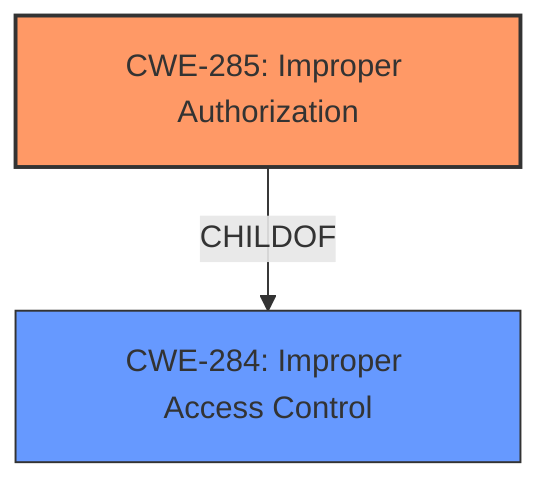

# Raw Analyzer Response for CVE-2024-34640

# Summary
| CWE ID | CWE Name | Confidence | CWE Abstraction Level | CWE Vulnerability Mapping Label | CWE-Vulnerability Mapping Notes |
|---|---|---|---|---|---|
| CWE-285 | Improper Authorization | 0.9 | Class | Discouraged | The vulnerability is due to **improper access control**, which maps to **improper authorization**. |

## Evidence and Confidence

*   **Confidence Score:** 0.9
*   **Evidence Strength:** HIGH

## Relationship Analysis
The primary CWE is CWE-285 (Improper Authorization), which is a Class-level CWE. It is a child of the Pillar CWE-284 (Improper Access Control), but CWE-285 is preferred because the description explicitly mentions authorization, aligning with the guidance to use CWE-285 over CWE-284 when authorization flaws are involved.

## Vulnerability Chain
The vulnerability chain starts with **improper access control** (specifically, authorization), leading to the ability for local attackers to bypass restrictions on process expiration.
  - **Root Cause:** **Improper access control** (authorization) in `BGProtectManager`.
  - **Impact:** Local attackers bypass restriction of process expiration.

## Summary of Analysis
The initial analysis pointed to CWE-285 as the primary weakness due to the explicit mention of **improper access control** in the context of bypassing process expiration restrictions. The vulnerability description key phrases also highlighted **improper access control** as the root cause. The CVE Reference Links Content Summary confirmed this by stating that the root cause is **improper access control** within the `BGProtectManager` component, leading to the ability to bypass restrictions.

The retriever results listed CWE-285 as the top candidate. While CWE-284 (Improper Access Control) is a parent of CWE-285, the specificity of "authorization" makes CWE-285 a more accurate fit. The Authentication vs Authorization vs Access Control Guidance also suggests using CWE-285 over CWE-284 when the issue involves improper or missing role checks or authorization.

The choice of CWE-285 is at an appropriate level of specificity. It is a Class-level CWE, but there is no direct child that is an obvious better fit. The provided evidence strongly supports the selection of CWE-285 due to the focus on authorization-related access control failures.

Relevant CWE Information:
- **CWE-285: Improper Authorization** The product does not perform or incorrectly performs an authorization check when an actor attempts to access a resource or perform an action.
- **CWE-284: Improper Access Control** The software does not restrict or incorrectly restricts access to resources (data, files, actions, etc.) to only the intended users.

CWEs considered but not used:
- CWE-284: Improper Access Control - While this is a parent of CWE-285, the vulnerability description specifies that the **improper access control** relates to authorization, making CWE-285 a more specific and accurate choice.