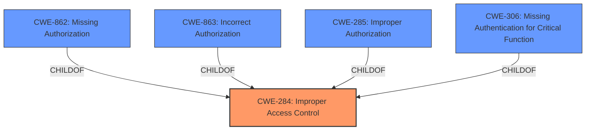

# Analysis for CVE-2024-34662

# Summary
| CWE ID | CWE Name | Confidence | CWE Abstraction Level | CWE Vulnerability Mapping Label | CWE-Vulnerability Mapping Notes |
|---|---|---|---|---|---|
| CWE-284 | Improper Access Control | 1.0 | Pillar | Allowed | Primary CWE |
| CWE-862 | Missing Authorization | 0.7 | Class | Allowed-with-Review | Secondary Candidate |

## Evidence and Confidence

*   **Confidence Score:** 0.85
*   **Evidence Strength:** HIGH

## Relationship Analysis
The primary CWE is CWE-284, which is a high-level category. CWE-862 and other authorization-related CWEs are children of CWE-284, but because the description simply mentions "**Improper access control**" without specifying whether it is due to missing authorization, incorrect authorization, or some other access control issue, CWE-284 is the most appropriate.

## Vulnerability Chain
The vulnerability chain starts with **improper access control**, which allows local attackers to execute privileged behaviors.
  - **Root Cause:** **Improper access control** (CWE-284)
  - **Impact:** Execute privileged behaviors.

## Summary of Analysis
The vulnerability description indicates "**Improper access control**" in ActivityManager, leading to the ability of local attackers to execute privileged behaviors.

Given the high-level nature of the description, the most appropriate CWE is CWE-284 (Improper Access Control). While the retriever results suggest other CWEs like CWE-862 (Missing Authorization) or CWE-285 (Improper Authorization), the lack of specific details about whether the access control issue is due to missing or incorrect authorization makes CWE-284 the most fitting choice.

The guidance suggests avoiding CWE-284 if a more specific child CWE is applicable. However, in this case, there is insufficient information to determine whether the **improper access control** is due to missing authentication (CWE-306), missing authorization (CWE-862), or incorrect authorization (CWE-863).

The selection of CWE-284 is based on the provided evidence, which clearly states "**Improper access control**" as the root cause. The hierarchical relationships support this decision, as CWE-284 is a parent of more specific access control-related CWEs. The abstraction level is appropriate given the limited information available.

Relevant CWE Information:

# Enhanced Context (25 CWEs)
The following CWEs were identified as potentially relevant to this vulnerability:

## CWE-284: Improper Access Control
**Abstraction Level**: Pillar
**Description**: The software does not restrict access to resources, functionality, or data to only those actors authorized to have such access.
**Mapping Guidance**:
- Usage: Discouraged
- Rationale: CWE-284 is high-level and should only be used if a more specific child is not available.

## CWE-862: Missing Authorization
**Abstraction Level**: Class
**Description**: The software does not perform an authorization check before an actor attempts to access a resource or perform an action.
**Mapping Guidance**:
- Usage: Allowed-with-Review
- Rationale: This CWE entry is a Class and might have Base-level children that would be more appropriate

## CWE-285: Improper Authorization
**Abstraction Level**: Class
**Description**: The product does not perform or incorrectly performs an authorization check when an actor attempts to access a resource or perform an action.
**Mapping Guidance**:
- Usage: Discouraged
- Rationale: CWE-285 is high-level and lower-level CWEs can frequently be used instead.

## CWE-306: Missing Authentication for Critical Function
**Abstraction Level**: Base
**Description**: The product does not perform any authentication for functionality that requires a provable user identity or consumes a significant amount of resources.
**Mapping Guidance**:
- Usage: Allowed
- Rationale: This CWE entry is at the Base level of abstraction, which is a preferred level of abstraction for mapping to the root causes of vulnerabilities.