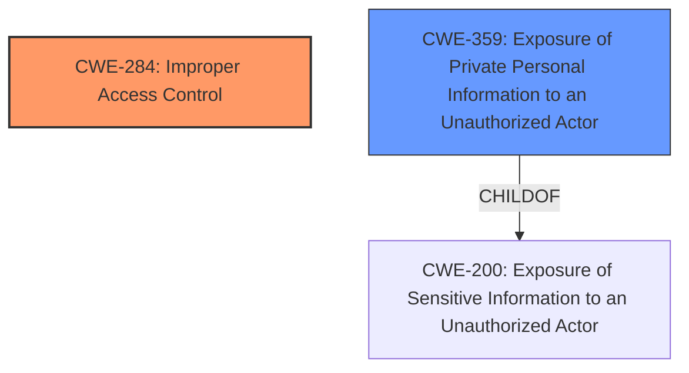

# Analysis Report for CVE-2024-34674

# Vulnerability Analysis Report: CVE-2024-34674

## Description

**Improper access control** in Contacts prior to SMR Nov-2024 Release 1 allows physical attackers to access data across multiple user profiles.

## Vulnerability Description Key Phrases

- **Rootcause:** Improper access control
- **Impact:** access data across multiple user profiles
- **Attacker:** physical attackers
- **Product:** Contacts
- **Version:** prior to SMR Nov-2024 Release 1

## Analysis (with Relationship Data)

# Summary
| CWE ID | CWE Name | Confidence | CWE Abstraction Level | CWE Vulnerability Mapping Label | CWE-Vulnerability Mapping Notes |
|---|---|---|---|---|---|
| CWE-284 | Improper Access Control | 0.8 | Pillar | Allowed-with-Review | Primary CWE.  The vulnerability lies in **improper access control**, allowing unauthorized access to data across multiple user profiles. Since the root cause is high-level and not specific to authentication or authorization, CWE-284 is the most appropriate choice. |
| CWE-359 | Exposure of Private Personal Information to an Unauthorized Actor | 0.6 | Base | Allowed | Secondary candidate. The impact of the vulnerability is that a physical attacker can access data across different user profiles, which can include private personal information. |

## Evidence and Confidence

*   **Confidence Score:** 0.7
*   **Evidence Strength:** MEDIUM

## Relationship Analysis
The primary CWE is CWE-284 (Improper Access Control), which is a high-level category. The secondary CWE is CWE-359 (Exposure of Private Personal Information to an Unauthorized Actor), which describes the impact of the vulnerability. CWE-359 is a child of CWE-200 (Exposure of Sensitive Information to an Unauthorized Actor). This relationship clarifies the kind of data being exposed due to the access control issue. CWE-284 is a parent of CWE-285 (Improper Authorization), CWE-306 (Missing Authentication for Critical Function), CWE-862 (Missing Authorization), and CWE-863 (Incorrect Authorization). However, the description does not provide enough detail to determine if the **improper access control** is due to **missing authentication**, **missing authorization**, or **incorrect authorization**. Therefore, CWE-284 is the most appropriate choice.



## Vulnerability Chain
The vulnerability chain starts with **improper access control** (CWE-284) leading to the exposure of data across multiple user profiles, potentially including private personal information (CWE-359).

## Summary of Analysis
The initial assessment identified CWE-284 as the primary weakness due to **improper access control**. The vulnerability description and CVE reference links clearly state that the root cause is **improper access control**, allowing physical attackers to access data across multiple user profiles. The retriever results suggested several CWEs related to authorization and authentication, but these were deemed too specific given the high-level nature of the description. The guidance emphasized the importance of distinguishing between authentication, authorization, and access control, which helped in selecting CWE-284. The potential exposure of private personal information as a result of the **improper access control** led to the inclusion of CWE-359 as a secondary weakness, representing the impact of the vulnerability.
The evidence supporting the selection of CWE-284 is the statement from the vulnerability description key phrases: "rootcause: **Improper access control**".

Relevant CWE Information:

# Enhanced Context (25 CWEs)
The following CWEs were identified as potentially relevant to this vulnerability:

## CWE-451: User Interface (UI) Misrepresentation of Critical Information
**Abstraction Level**: Class
**Similarity Score**: 0.75
**Source**: dense

**Description**:
The user interface (UI) does not properly represent critical information to the user, allowing the information - or its source - to be obscured or spoofed. This is often a component in phishing attacks.

**Mapping Guidance**:
- Usage: Allowed-with-Review
- Rationale: This CWE entry is a Class and might have Base-level children that would be more appropriate

NOT USED: Not relevant to the vulnerability, which focuses on **improper access control**, not UI misrepresentation.

## CWE-754: Improper Check for Unusual or Exceptional Conditions
**Abstraction Level**: Class
**Similarity Score**: 0.75
**Source**: dense

**Description**:
The product does not check or incorrectly checks for unusual or exceptional conditions that are not expected to occur frequently during day to day operation of the product.

**Mapping Guidance**:
- Usage: Allowed-with-Review
- Rationale: This CWE entry is a Class and might have Base-level children that would be more appropriate

NOT USED: Not relevant to the vulnerability, which focuses on **improper access control**, not handling of unusual conditions.

## CWE-345: Insufficient Verification of Data Authenticity
**Abstraction Level**: Class
**Similarity Score**: 0.75
**Source**: dense

**Description**:
The product does not sufficiently verify the origin or authenticity of data, in a way that causes it to accept invalid data.

**Mapping Guidance**:
- Usage: Discouraged
- Rationale: This CWE entry is a level-1 Class (i.e., a child of a Pillar). It might have lower-level children that would be more appropriate

NOT USED: Not relevant to the vulnerability, which focuses on **improper access control**, not data authenticity.

## CWE-203: Observable Discrepancy
**Abstraction Level**: Base
**Similarity Score**: 0.74
**Source**: dense

**Description**:
The product behaves differently or sends different responses under different circumstances in a way that is observable to an unauthorized actor, which exposes security-relevant information about the state of the product, such as whether a particular operation was successful or not.

**Mapping Guidance**:
- Usage: Allowed
- Rationale: This CWE entry is at the Base level of abstraction, which is a preferred level of abstraction for mapping to the root causes of vulnerabilities.

NOT USED: Not relevant to the vulnerability, which focuses on **improper access control**, not observable discrepancies.

## CWE-280: Improper Handling of Insufficient Permissions or Privileges 
**Abstraction Level**: Base
**Similarity Score**: 0.74
**Source**: dense

**Description**:
The product does not handle or incorrectly handles when it has insufficient privileges to access resources or functionality as specified by their permissions. This may cause it to follow unexpected code paths that may leave the product in an invalid state.

**Mapping Guidance**:
- Usage: Allowed
- Rationale: This CWE entry is at the Base level of abstraction, which is a preferred level of abstraction for mapping to the root causes of vulnerabilities.

NOT USED: Could be considered, but the description is too high level.

## CWE-668: Exposure of Resource to Wrong Sphere
**Abstraction Level**: Class
**Similarity Score**: 0.74
**Source**: dense

**Description**:
The product exposes a resource to the wrong control sphere, providing unintended actors with inappropriate access to the resource.

**Mapping Guidance**:
- Usage: Discouraged
- Rationale: CWE-668 is high-level and is often misused as a catch-all when lower-level CWE IDs might be applicable. It is sometimes used for low-information vulnerability reports [REF-1287]. It is a level-1 Class (i.e., a child of a Pillar). It is not useful for trend analysis.

NOT USED: Too generic.

## CWE-497: Exposure of Sensitive System Information to an Unauthorized Control Sphere
**Abstraction Level**: Base
**Similarity Score**: 0.73
**Source**: dense

**Description**:
The product does not properly prevent sensitive system-level information from being accessed by unauthorized actors who do not have the same level of access to the underlying system as the product does.

**Mapping Guidance**:
- Usage: Allowed
- Rationale: This CWE entry is at the Base level of abstraction, which is a preferred level of abstraction for mapping to the root causes of vulnerabilities.

NOT USED: Could be considered, but CWE-359 is more specific to personal information.

## CWE-703: Improper Check or Handling of Exceptional Conditions
**Abstraction Level**: Pillar
**Similarity Score**: 0.73
**Source**: dense

**Description**:
The product does not properly anticipate or handle exceptional conditions that rarely occur during normal operation of the product.

**Mapping Guidance**:
- Usage: Discouraged
- Rationale: This CWE entry is extremely high-level, a Pillar.

NOT USED: Too generic.

## CWE-472: External Control of Assumed-Immutable Web Parameter
**Abstraction Level**: Base
**Similarity Score**: 0.73
**Source**: dense

**Description**:
The web application does not sufficiently verify inputs that are assumed to be immutable but are actually externally controllable, such as hidden form fields.

**Mapping Guidance**:
- Usage: Allowed
- Rationale: This CWE entry is at the Base level of abstraction, which is a preferred level of abstraction for mapping to the root causes of vulnerabilities.

NOT USED: Not related to the described vulnerability.

## CWE-267: Privilege Defined With


## CWE Relationship Analysis

Current CWEs represent these abstraction levels: .


### Vulnerability Chain Analysis

**Chain starting from CWE-863:**
- 863 (Incorrect Authorization) - ROOT


**Chain starting from CWE-280:**
- 280 (Improper Handling of Insufficient Permissions or Privileges ) - ROOT


### CWE Relationship Diagram

```mermaid
graph TD
    classDef primary fill:#f96,stroke:#333,stroke-width:2px
    classDef secondary fill:#69f,stroke:#333
    classDef tertiary fill:#9e9,stroke:#333
```


*Report generated on 2025-07-13 08:21:20*
