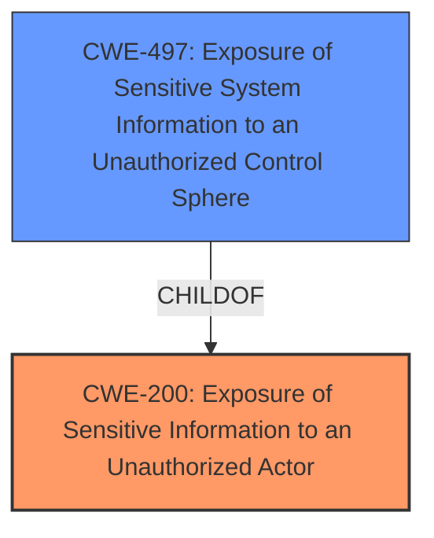

# Enhanced Analysis for CVE-2024-34677

# Summary
| CWE ID | CWE Name | Confidence | CWE Abstraction Level | CWE Vulnerability Mapping Label | CWE-Vulnerability Mapping Notes |
|---|---|---|---|---|---|
| CWE-200 | Exposure of Sensitive Information to an Unauthorized Actor | 0.8 | Class | Primary | Discouraged - but most appropriate given the available information and lack of a more specific root cause. |
| CWE-497 | Exposure of Sensitive System Information to an Unauthorized Control Sphere | 0.6 | Base | Secondary | Allowed |

## Evidence and Confidence

*   **Confidence Score:** 0.7
*   **Evidence Strength:** MEDIUM

## Relationship Analysis
The primary relationship influencing the decision is the parent-child relationship between CWE-200 and CWE-497. CWE-497 is a child of CWE-200, providing a more specific classification related to system information. However, the description doesn't explicitly state that *system* information is exposed, but it does say that *sensitive* information is exposed, so CWE-200 is taken as the primary.



## Vulnerability Chain
The vulnerability chain is relatively simple:

1.  **Root Cause:** **Exposure of sensitive information** in System UI (CWE-200)
2.  **Impact:** Local attackers can make malicious apps appear as legitimate.

## Summary of Analysis
The initial assessment identified CWE-200 as a strong candidate due to the **exposure of sensitive information**. The retriever results also listed CWE-200, but with a "Discouraged" usage. However, the rationale for discouraging CWE-200 is that it's often misused and a more specific root cause should be identified. While I agree with this in principle, the provided information doesn't allow for pinpointing a more specific **root cause**. The CVE Reference Links Content Summary section indicates the **root cause** is directly related to the **exposure of sensitive information** in the System UI.

The retriever results also suggested several other CWEs, including CWE-497 (Exposure of Sensitive System Information to an Unauthorized Control Sphere). CWE-497 is a child of CWE-200 and specifies that *system* information is exposed. This could be a more accurate mapping.

Given the information available, CWE-200 remains the most appropriate primary CWE. CWE-497 is a good secondary candidate.

Relevant CWE Information:

*   **Vulnerability Description**: Exposure of sensitive information in System UI prior to SMR Nov-2024 Release 1 allow local attackers to make malicious apps appear as legitimate.
*   **CVE Reference Links Content Summary**: **Root cause of vulnerability**: Exposure of sensitive information in System UI.

CWEs considered but not used:

*   CWE-213: Exposure of Sensitive Information Due to Incompatible Policies: While relevant, the description doesn't explicitly mention incompatible policies.
*   CWE-927: Use of Implicit Intent for Sensitive Communication: This is specific to Android applications using implicit intents, which isn't mentioned in the vulnerability description.
*   CWE-285: Improper Authorization: This is too broad and doesn't directly relate to the exposure of information.
*   CWE-280: Improper Handling of Insufficient Permissions or Privileges: Similar to CWE-285, this is too broad.
*   CWE-284: Improper Access Control: This is a very high-level category and less specific than CWE-200.
*   CWE-926: Improper Export of Android Application Components: Similar to CWE-927, this is specific to Android component exports, which isn't mentioned.
*   CWE-287: Improper Authentication: Not relevant as the issue isn't about authentication.
*   CWE-1021: Improper Restriction of Rendered UI Layers or Frames: While this relates to UI, it is specific to frame objects and UI layers, which are not mentioned in the description.
*   CWE-1272: Sensitive Information Uncleared Before Debug/Power State Transition: Not relevant as there is no mention of debug or power state transition.


## CWE Relationship Analysis

Current CWEs represent these abstraction levels: .


### Vulnerability Chain Analysis

**Chain starting from CWE-1272:**
- 1272 (Sensitive Information Uncleared Before Debug/Power State Transition) - ROOT


**Chain starting from CWE-280:**
- 280 (Improper Handling of Insufficient Permissions or Privileges ) - ROOT


### CWE Relationship Diagram

```mermaid
graph TD
    classDef primary fill:#f96,stroke:#333,stroke-width:2px
    classDef secondary fill:#69f,stroke:#333
    classDef tertiary fill:#9e9,stroke:#333
```