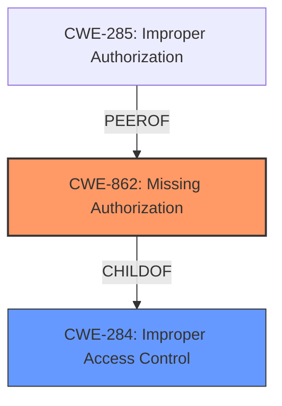

# Raw Analyzer Response for CVE-2024-34682

# Summary
| CWE ID | CWE Name | Confidence | CWE Abstraction Level | CWE Vulnerability Mapping Label | CWE-Vulnerability Mapping Notes |
|---|---|---|---|---|---|
| CWE-862 | Missing Authorization | 0.9 | Class | Primary CWE | Allowed-with-Review |
| CWE-284 | Improper Access Control | 0.5 | Pillar | Secondary Candidate | Discouraged |

## Evidence and Confidence

*   **Confidence Score:** 0.7
*   **Evidence Strength:** MEDIUM

## Relationship Analysis
The primary CWE is CWE-862, which is a child of CWE-284. This indicates a hierarchical relationship where CWE-862 is a more specific case of the broader access control issue described by CWE-284. The mapping guidance advises against using CWE-284 if a more specific CWE is available, so CWE-862 is preferred.

## Vulnerability Chain
The vulnerability chain starts with the **missing authorization** check. This leads to a physical attacker being able to access stored WiFi passwords in Maintenance Mode.

## Summary of Analysis
The initial assessment identified **improper authorization** as the root cause. The retriever results suggested CWE-285 (Improper Authorization), CWE-862 (Missing Authorization), and CWE-863 (Incorrect Authorization) as potential candidates. After reviewing the vulnerability description and the provided guidance, CWE-862 (Missing Authorization) was chosen as the primary CWE because the description specifically states that there's **improper authorization** which means the authorization check is likely missing altogether, especially given the context of "Maintenance Mode." CWE-284 is considered as a secondary candidate because it is a more general form of an authorization issue, but the details suggest a missing authorization check.

The selection is based on the evidence that the vulnerability lies in **improper authorization** during Maintenance Mode, allowing access to WiFi passwords.

Relevant CWE Information:

# Enhanced Context (25 CWEs)
The following CWEs were identified as potentially relevant to this vulnerability:

## CWE-284: Improper Access Control
**Abstraction Level**: Pillar
**Similarity Score**: 0.800
**Source**: alternate_terms

**Description**:
The product does not adequately enforce appropriate authorization on all restricted URLs, scripts, or files.

**Mapping Guidance**:
- Usage: Discouraged
- Rationale: CWE-285 is high-level and lower-level CWEs can frequently be used instead. It is a level-1 Class (i.e., a child of a Pillar).

## CWE-862: Missing Authorization
**Abstraction Level**: Class
**Similarity Score**: 0.134
**Source**: sparse

**Description**:
The product does not perform or incorrectly performs an authorization check when an actor attempts to access a resource or perform an action.

**Mapping Guidance**:
- Usage: Allowed-with-Review
- Rationale: This CWE entry is a Class and might have Base-level children that would be more appropriate

## CWE-285: Improper Authorization
**Abstraction Level**: Class
**Similarity Score**: 0.162
**Source**: sparse

**Description**:
The product does not perform or incorrectly performs an authorization check when an actor attempts to access a resource or perform an action.

**Mapping Guidance**:
- Usage: Discouraged
- Rationale: CWE-285 is high-level and lower-level CWEs can frequently be used instead. It is a level-1 Class (i.e., a child of a Pillar).

**CWE-863: Incorrect Authorization** was considered but not selected because the vulnerability is due to **missing authorization** rather than an incorrect authorization check.

**CWE-287: Improper Authentication** was considered but not selected because the vulnerability lies in the authorization phase, not the authentication phase.

**CWE-280: Improper Handling of Insufficient Permissions or Privileges** was considered but not selected because the core issue is a **missing authorization** check.

**CWE-425: Direct Request ('Forced Browsing')** was considered but not selected because the issue is not about direct requests but the **missing authorization** in Maintenance Mode.