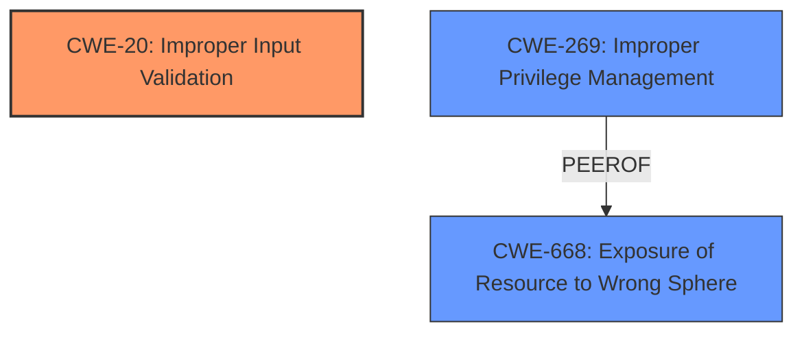

# Analysis Report for CVE-2024-34693

# Vulnerability Analysis Report: CVE-2024-34693

## Description

**Improper Input Validation** vulnerability in Apache Superset, allows for an authenticated attacker to create a MariaDB connection with local_infile enabled. If both the MariaDB server (off by default) and the local mysql client on the web server are set to allow for local infile, its possible for the attacker to execute a specific MySQL/MariaDB SQL command that is able to read files from the server and insert their content on a MariaDB database table.This issue affects Apache Superset before 3.1.3 and version 4.0.0 Users are recommended to upgrade to version 4.0.1 or 3.1.3, which fixes the issue.

## Vulnerability Description Key Phrases

- **Rootcause:** ['Improper Input Validation', 'Input Validation vulnerability']
- **Impact:** ['create a MariaDB connection with local_infile enabled', 'read files']
- **Attacker:** authenticated attacker
- **Product:** Apache Superset
- **Version:** before 3.1.3 and version 4.0.0

## Analysis (with Relationship Data)

# Summary
| CWE ID    | CWE Name                                                                 | Confidence | CWE Abstraction Level | CWE Vulnerability Mapping Label | CWE-Vulnerability Mapping Notes |
| --------- | ------------------------------------------------------------------------ | ---------- | --------------------- | ------------------------------- | ------------------------------- |
| CWE-20    | Improper Input Validation                                                | 0.9        | Class                 | Primary CWE                     | Discouraged                   |
| CWE-269   | Improper Privilege Management                                            | 0.6        | Base                  | Secondary Candidate             | Allowed                       |
| CWE-668   | Exposure of Resource to Wrong Sphere                                     | 0.5        | Class                 | Secondary Candidate             | Discouraged                   |

## Evidence and Confidence

*   **Confidence Score:** 0.8
*   **Evidence Strength:** HIGH

## Relationship Analysis
The primary weakness is **Improper Input Validation**, which is a Class-level CWE. While more specific CWEs could potentially apply, the description focuses on the general failure to validate input when creating a MariaDB connection. CWE-269 and CWE-668 are considered as secondary weaknesses due to the ability to read files from the server and insert content into a MariaDB database table which might involve privilege and resource exposure issues, but the evidence is less direct. The mermaid diagram visualizes these relationships.



## Vulnerability Chain
The vulnerability chain starts with **Improper Input Validation** (CWE-20). This allows an authenticated attacker to create a MariaDB connection with `local_infile` enabled. If the MariaDB server and client allow local `infile`, the attacker can execute a SQL command to read files from the server and insert their content into a database table. This leads to potential **Improper Privilege Management** (CWE-269) and **Exposure of Resource to Wrong Sphere** (CWE-668).

## Summary of Analysis
The primary weakness identified is **Improper Input Validation** (CWE-20) because the application **does not validate or incorrectly validates** that the input has the properties that are required to process the data safely and correctly when creating a MariaDB connection. The description explicitly states: "**Improper Input Validation** vulnerability in Apache Superset, allows for an authenticated attacker to create a MariaDB connection with local_infile enabled."

CWE-269 and CWE-668 are considered secondary because the attacker can then **read files** from the server and insert them in a MariaDB table, so privilege and resources are exposed. This is a consequence of the initial input validation issue, though there isn't explicit detail to confirm this.

The selection is based on the provided evidence and the retriever scores, with a focus on the root cause. The relatively high retriever scores of CWE-20 support this decision. The other CWEs were considered, but the evidence most strongly supports CWE-20 as the primary weakness.

Relevant CWE Information:

# Enhanced Context (25 CWEs)
The following CWEs were identified as potentially relevant to this vulnerability:

## CWE-303: Incorrect Implementation of Authentication Algorithm
**Abstraction Level**: Base
**Similarity Score**: 0.75

## CWE-497: Exposure of Sensitive System Information to an Unauthorized Control Sphere
**Abstraction Level**: Base
**Similarity Score**: 0.75

## CWE-807: Reliance on Untrusted Inputs in a Security Decision
**Abstraction Level**: Base
**Similarity Score**: 0.74

## CWE-668: Exposure of Resource to Wrong Sphere
**Abstraction Level**: Class
**Similarity Score**: 0.74

## CWE-138: Improper Neutralization of Special Elements
**Abstraction Level**: Class
**Similarity Score**: 0.73

## CWE-184: Incomplete List of Disallowed Inputs
**Abstraction Level**: Base
**Similarity Score**: 0.73

## CWE-74: Improper Neutralization of Special Elements in Output Used by a Downstream Component ('Injection')
**Abstraction Level**: Class
**Similarity Score**: 0.73

## CWE-267: Privilege Defined With Unsafe Actions
**Abstraction Level**: Base
**Similarity Score**: 0.73

## CWE-212: Improper Removal of Sensitive Information Before Storage or Transfer
**Abstraction Level**: Base
**Similarity Score**: 0.73

## CWE-941: Incorrectly Specified Destination in a Communication Channel
**Abstraction Level**: Base
**Similarity Score**: 0.73

## CWE-22: Improper Limitation of a Pathname to a Restricted Directory ('Path Traversal')
**Abstraction Level**: Base
**Similarity Score**: 3291.84

## CWE-23: Relative Path Traversal
**Abstraction Level**: Base
**Similarity Score**: 2886.78

## CWE-24: Path Traversal: '../filedir'
**Abstraction Level**: Variant
**Similarity Score**: 2857.45

## CWE-668: Exposure of Resource to Wrong Sphere
**Abstraction Level**: Class
**Similarity Score**: 2836.14

## CWE-347: Improper Verification of Cryptographic Signature
**Abstraction Level**: Base
**Similarity Score**: 2829.15

## CWE-22: Improper Limitation of a Pathname to a Restricted Directory ('Path Traversal')
**Abstraction Level**: base
**Similarity Score**: 4.33

## CWE-73: External Control of File Name or Path
**Abstraction Level**: base
**Similarity Score**: 2.87

## CWE-322: Key Exchange without Entity Authentication
**Abstraction Level**: base
**Similarity Score**: 2.87

## CWE-942: Permissive Cross-domain Policy with Untrusted Domains
**Abstraction Level**: variant
**Similarity Score**: 2.68

## CWE-350: Reliance on Reverse DNS Resolution for a Security-Critical Action
**Abstraction Level**: variant
**Similarity Score**: 2.68

## CWE-20: Improper Input Validation
**Abstraction Level**: class
**Similarity Score**: 2.55

## CWE-23: Relative Path Traversal
**Abstraction Level**: base
**Similarity Score**: 2.47

## CWE-306: Missing Authentication for Critical Function
**Abstraction Level**: base
**Similarity Score**: 2.47

## CWE-347: Improper Verification of Cryptographic Signature
**Abstraction Level**: base
**Similarity Score**: 2.40

## CWE-502: Deserialization of Untrusted Data
**Abstraction Level**: base
**Similarity Score**: 2.33


## CWE Relationship Analysis

Current CWEs represent these abstraction levels: .


### Vulnerability Chain Analysis

**Chain starting from CWE-350:**
- 350 (Reliance on Reverse DNS Resolution for a Security-Critical Action) - ROOT


**Chain starting from CWE-269:**
- 269 (Improper Privilege Management) - ROOT


### CWE Relationship Diagram

```mermaid
graph TD
    classDef primary fill:#f96,stroke:#333,stroke-width:2px
    classDef secondary fill:#69f,stroke:#333
    classDef tertiary fill:#9e9,stroke:#333
```


*Report generated on 2025-07-13 08:23:04*
