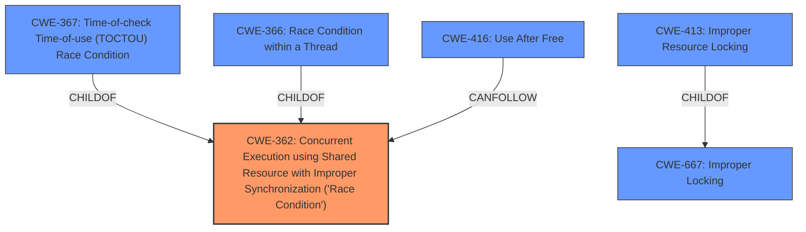

# Enhanced Analysis for CVE-2024-34725

# Summary
| CWE ID  | CWE Name                                                                                               | Confidence | CWE Abstraction Level | CWE Vulnerability Mapping Label | CWE-Vulnerability Mapping Notes |
| :-------- | :----------------------------------------------------------------------------------------------------- | :--------- | :---------------------- | :------------------------------ | :-------------------------------- |
| CWE-362   | Concurrent Execution using Shared Resource with Improper Synchronization ('**Race Condition**') | 0.9        | Class                     | Primary                         | Allowed-with-Review               |
| CWE-416   | Use After Free                                                                                         | 0.3        | Variant                   | Secondary                       | Allowed                           |

## Evidence and Confidence

*   **Confidence Score:** 0.7
*   **Evidence Strength:** MEDIUM

## Relationship Analysis

The primary identified weakness is CWE-362, a class-level CWE representing a **race condition**. Several related CWEs were considered, including more specific base-level CWEs like CWE-367 (Time-of-check Time-of-use) and CWE-366 (Race Condition within a Thread). However, the provided description lacks the specificity to definitively choose either of those. CWE-667 (Improper Locking) and CWE-413 (Improper Resource Locking) were also considered, as locking issues often lead to race conditions, but the description doesn't explicitly mention locking problems. CWE-416 (Use After Free) was also considered given the "memory context" aspect.



## Vulnerability Chain

The vulnerability chain starts with a **race condition** (CWE-362) in `DevmemIntUnexportCtx` within `devicemem_server.c`. This **race condition** can lead to arbitrary code execution and local escalation of privilege. The specific steps between the **race condition** and arbitrary code execution are not detailed in the description, creating a missing link in the chain.

## Summary of Analysis

The primary weakness is clearly a **race condition**, making CWE-362 the most appropriate choice. The description states "In DevmemIntUnexportCtx of devicemem_server.c, there is a possible arbitrary code execution due to a **race condition**".
The retriever results also list CWE-362 as the top combined result.
While other more specific CWEs related to concurrency and resource management exist (e.g., CWE-367, CWE-366, CWE-667, CWE-413), the lack of detailed information prevents selecting a more precise base or variant-level CWE. Therefore, opting for the class-level CWE-362 provides a balance between accuracy and generality, given the available evidence.
CWE-416 was considered as a follow-on since the DevmemIntUnexportCtx function deals with memory context, but there is no explicit mention of a Use-After-Free condition.

Relevant CWE Information:
*   CWE-362: Concurrent Execution using Shared Resource with Improper Synchronization ('**Race Condition**'): The product contains a concurrent code sequence that requires temporary, exclusive access to a shared resource, but a timing window exists in which the shared resource can be modified by another code sequence operating concurrently.
*   CWE-416: Use After Free: After memory is freed, it can be accessed, which leads to arbitrary code execution.


## CWE Relationship Analysis

Current CWEs represent these abstraction levels: .


### Vulnerability Chain Analysis

**Chain starting from CWE-416:**
- 416 (Use After Free) - ROOT


**Chain starting from CWE-667:**
- 667 (Improper Locking) - ROOT


### CWE Relationship Diagram

```mermaid
graph TD
    classDef primary fill:#f96,stroke:#333,stroke-width:2px
    classDef secondary fill:#69f,stroke:#333
    classDef tertiary fill:#9e9,stroke:#333
```