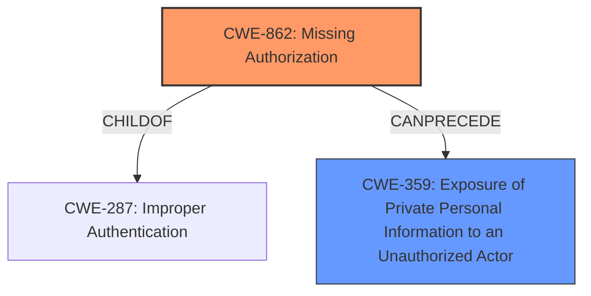

# Enhanced Analysis for CVE-2024-34991

# Summary
| CWE ID | CWE Name | Confidence | CWE Abstraction Level | CWE Vulnerability Mapping Label | CWE-Vulnerability Mapping Notes |
|---|---|---|---|---|---|
| CWE-862 | Missing Authorization | 0.9 | Class | Primary | Allowed-with-Review |
| CWE-359 | Exposure of Private Personal Information to an Unauthorized Actor | 0.7 | Base | Secondary | Allowed |

## Evidence and Confidence

*   **Confidence Score:** 0.8
*   **Evidence Strength:** HIGH

## Relationship Analysis
The primary relationship influencing the decision is that CWE-862 [Missing Authorization] is a child of CWE-287 [Improper Authentication], indicating a more specific type of authentication failure. CWE-359 [Exposure of Private Personal Information to an Unauthorized Actor] represents the impact of the missing authorization, which makes it a secondary CWE. The abstraction levels were considered to ensure the most specific and accurate representation of the vulnerability.



## Vulnerability Chain
The vulnerability chain starts with the **lack of permissions control**, leading to **missing authorization** (CWE-862), which then results in the **exposure of private personal information** (CWE-359) to an unauthorized actor (guest).
  - **Root Cause:** **Lack of permissions control** leading to CWE-862
  - **Weakness:** CWE-862: Missing Authorization
  - **Impact:** CWE-359: Exposure of Private Personal Information to an Unauthorized Actor

## Summary of Analysis
The initial analysis focused on the **lack of permissions control** as the root cause. The Retriever Results suggested several CWEs related to authorization and access control. The vulnerability description clearly indicates a **lack of authorization**, allowing a guest to download sensitive information.

The evidence from the vulnerability description is: "a guest can download partial credit card information (expiry date) / postal address / email / etc. without restriction due to a **lack of permissions control**."
The **CVE Reference Links Content Summary** also points to a "Lack of permission control in the 'Axepta' module for PrestaShop allows unauthorized access to debug logs."

CWE-862 [Missing Authorization] is the most appropriate primary CWE because it directly addresses the **lack of authorization** that allows unauthorized access. CWE-359 [Exposure of Private Personal Information to an Unauthorized Actor] is a secondary CWE that describes the impact of the missing authorization.

The selection is based on the provided evidence, relationship analysis, and mapping guidance. The chosen CWEs are at the optimal level of specificity, with CWE-862 being a Class-level CWE, which is more specific than its parent, CWE-287 [Improper Authentication].

Relevant CWE Information:

# Enhanced Context (25 CWEs)

## CWE-862: Missing Authorization
**Explanation:** The vulnerability description explicitly states a "**lack of permissions control**". This directly corresponds to a missing authorization check for a critical function, which allows unauthorized access.
**Security Implications:** Unauthorized access to sensitive data such as partial credit card information, postal addresses, and email addresses.
**Relationships:** CWE-862 [Missing Authorization] is a Class-level weakness and a child of CWE-287 [Improper Authentication]. This indicates a more specific type of authentication failure.
**Usage:** Allowed-with-Review, which is acceptable since it is a class-level CWE and there are no lower-level CWEs that are more descriptive.
**Confidence:** 0.9

## CWE-359: Exposure of Private Personal Information to an Unauthorized Actor
**Explanation:** The vulnerability results in the exposure of sensitive information (partial credit card details, addresses, emails) to a guest, who is an unauthorized actor.
**Security Implications:** GDPR violation and potential for identity theft or fraud.
**Relationships:** This CWE represents the impact of the missing authorization (CWE-862).
**Usage:** Allowed, as it accurately describes the impact of the vulnerability.
**Confidence:** 0.7

### Considered but not used:
*   CWE-284 [Improper Access Control]: While this is a high-level classification that might seem relevant, it is too general. The description provides enough information to identify the specific issue as missing authorization.
*   CWE-285 [Improper Authorization] and CWE-863 [Incorrect Authorization]: These CWEs imply that an authorization check exists but is either flawed or incorrect. The vulnerability description indicates a **lack of** authorization, making these CWEs inappropriate.
*   CWE-306 [Missing Authentication for Critical Function]: While related, the issue is more specifically about authorization (access control after authentication) rather than the authentication process itself.
*   CWE-639 [Authorization Bypass Through User-Controlled Key]: This CWE refers to bypassing authorization through a user-controlled key, which is not the case here.
*   CWE-732 [Incorrect Permission Assignment for Critical Resource]: This CWE is about incorrect assignment of permissions, while the described vulnerability is about missing permission checks altogether.


## CWE Relationship Analysis

Current CWEs represent these abstraction levels: .


### Vulnerability Chain Analysis

**Chain starting from CWE-863:**
- 863 (Incorrect Authorization) - ROOT


**Chain starting from CWE-359:**
- 359 (Exposure of Private Personal Information to an Unauthorized Actor) - ROOT


### CWE Relationship Diagram

```mermaid
graph TD
    classDef primary fill:#f96,stroke:#333,stroke-width:2px
    classDef secondary fill:#69f,stroke:#333
    classDef tertiary fill:#9e9,stroke:#333
```