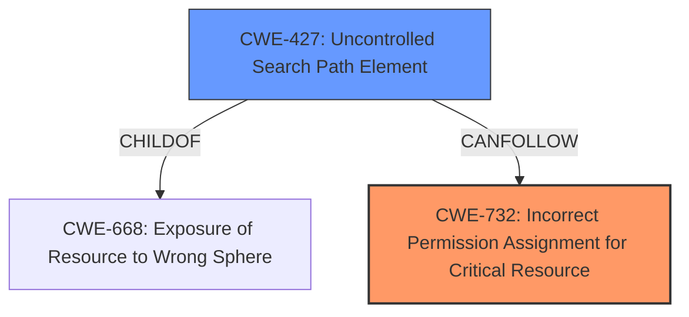

# Analysis Report for CVE-2024-35177

# Vulnerability Analysis Report: CVE-2024-35177

## Description

Wazuh is a free and open source platform used for threat prevention, detection, and response. It is capable of protecting workloads across on-premises, virtualized, containerized, and cloud-based environments. The wazuh-agent for Windows is vulnerable to a Local **Privilege Escalation vulnerability** due to **improper ACL of the non-default installation directory**. A local malicious user could potentially exploit this vulnerability by placing one of the many DLL that are loaded and not present on the system in the installation folder of the agent OR by replacing the service executable binary itself with a malicious one. The root cause is an **improper ACL applied on the installation folder when a non-default installation path is specified** (e.g, C\\wazuh). Many DLLs are loaded from the installation folder and by creating a malicious DLLs that exports the functions of a legit one (and that is not found on the system where the agent is installed, such as rsync.dll) it is possible to escalate privileges from a low-privileged user and obtain code execution under the context of NT AUTHORITY\\SYSTEM. This issue has been addressed in version 4.9.0 and all users are advised to upgrade. There are no known workarounds for this vulnerability.

## Vulnerability Description Key Phrases

- **Rootcause:** ['improper ACL applied on the installation folder when a non-default installation path is specified', 'improper ACL of the non-default installation directory']
- **Weakness:** Privilege Escalation vulnerability
- **Impact:** ['Local Privilege Escalation', 'escalate privileges']
- **Vector:** placing DLL that are loaded and not present on the system in the installation folder OR replacing the service executable binary itself
- **Attacker:** local malicious user
- **Product:** wazuh-agent
- **Version:** Windows

## Analysis (with Relationship Data)

# Summary

| CWE ID  | CWE Name                                                                 | Confidence | CWE Abstraction Level | CWE Vulnerability Mapping Label | CWE-Vulnerability Mapping Notes |
| :-------- | :----------------------------------------------------------------------- | :--------- | :-------------------- | :------------------------------ | :------------------------------ |
| CWE-732 | Incorrect Permission Assignment for Critical Resource | 0.95      | Class                   | Primary CWE                   | Allowed-with-Review                   |
| CWE-427 | Uncontrolled Search Path Element                                           | 0.85      | Base                      | Secondary Candidate               | Allowed                       |

## Evidence and Confidence

*   **Confidence Score:** 0.90
*   **Evidence Strength:** HIGH

## Relationship Analysis

The primary CWE is CWE-732, which is a Class-level CWE. The secondary CWE is CWE-427, which is a Base-level CWE and a child of CWE-668.
CWE-732 focuses on the incorrect assignment of permissions for critical resources, while CWE-427 addresses the broader issue of uncontrolled search paths. CWE-427 is often a consequence of **improper permission assignments**. The **improper ACL** on the installation folder (ROOTCAUSE) is a specific instance of **incorrect permission assignment**, leading to a situation where a malicious user can control parts of the search path, thus achieving **privilege escalation**.



## Vulnerability Chain

The vulnerability chain starts with the **improper ACL applied on the installation folder** (ROOTCAUSE), leading to **incorrect permission assignment** (CWE-732). This allows a **local malicious user** to place or replace DLLs, which are then loaded by the system, resulting in **privilege escalation** (IMPACT). The key weakness here is the initial **incorrect permission assignment**, which enables the subsequent steps in the attack chain.

## Summary of Analysis

The analysis is based on the provided evidence. The vulnerability description explicitly states the **root cause** as an "**improper ACL applied on the installation folder when a non-default installation path is specified**". This directly relates to **incorrect permission assignment** on a critical resource (the installation folder), which makes CWE-732 the most appropriate primary CWE.

The description also details how a local user can exploit this by placing malicious DLLs in the **uncontrolled installation folder**, which then leads to **privilege escalation**. This is related to CWE-427, since the **improper ACL** leads to an **uncontrolled search path**.

CWE-732 is chosen as the primary CWE because it directly addresses the **root cause** of the vulnerability: the **incorrect permission assignment** on a critical resource. CWE-427 is a secondary CWE because it represents a consequence of the **improper permission assignment**. Both are at appropriate levels of specificity, with CWE-732 being a Class-level CWE and CWE-427 a Base-level CWE.

Relevant CWE Information:

# Enhanced Context (25 CWEs)
The following CWEs were identified as potentially relevant to this vulnerability:

## CWE-427: Uncontrolled Search Path Element
**Abstraction Level**: Base
**Similarity Score**: 0.76
**Source**: dense

**Description**:
The product uses a fixed or controlled search path to find resources, but one or more locations in that path can be under the control of unintended actors.

**Mapping Guidance**:
- Usage: Allowed
- Rationale: This CWE entry is at the Base level of abstraction, which is a preferred level of abstraction for mapping to the root causes of vulnerabilities.

## CWE-59: Improper Link Resolution Before File Access ('Link Following')
**Abstraction Level**: Base
**Similarity Score**: 0.75
**Source**: dense

**Description**:
The product attempts to access a file based on the filename, but it does not properly prevent that filename from identifying a link or shortcut that resolves to an unintended resource.

**Mapping Guidance**:
- Usage: Allowed
- Rationale: This CWE entry is at the Base level of abstraction, which is a preferred level of abstraction for mapping to the root causes of vulnerabilities.

## CWE-266: Incorrect Privilege Assignment
**Abstraction Level**: Base
**Similarity Score**: 0.74
**Source**: dense

**Description**:
A product incorrectly assigns a privilege to a particular actor, creating an unintended sphere of control for that actor.

**Mapping Guidance**:
- Usage: Allowed
- Rationale: This CWE entry is at the Base level of abstraction, which is a preferred level of abstraction for mapping to the root causes of vulnerabilities.

## CWE-276: Incorrect Default Permissions
**Abstraction Level**: Base
**Similarity Score**: 0.73
**Source**: dense

**Description**:
During installation, installed file permissions are set to allow anyone to modify those files.

**Mapping Guidance**:
- Usage: Allowed
- Rationale: This CWE entry is at the Base level of abstraction, which is a preferred level of abstraction for mapping to the root causes of vulnerabilities.

## CWE-73: External Control of File Name or Path
**Abstraction Level**: Base
**Similarity Score**: 0.73
**Source**: dense

**Description**:
The product allows user input to control or influence paths or file names that are used in filesystem operations.

**Mapping Guidance**:
- Usage: Allowed
- Rationale: This CWE entry is at the Base level of abstraction, which is a preferred level of abstraction for mapping to the root causes of vulnerabilities.

## CWE-497: Exposure of Sensitive System Information to an Unauthorized Control Sphere
**Abstraction Level**: Base
**Similarity Score**: 0.73
**Source**: dense

**Description**:
The product does not properly prevent sensitive system-level information from being accessed by unauthorized actors who do not have the same level of access to the underlying system as the product does.

**Mapping Guidance**:
- Usage: Allowed
- Rationale: This CWE entry is at the Base level of abstraction, which is a preferred level of abstraction for mapping to the root causes of vulnerabilities.

## CWE-668: Exposure of Resource to Wrong Sphere
**Abstraction Level**: Class
**Similarity Score**: 0.72
**Source**: dense

**Description**:
The product exposes a resource to the wrong control sphere, providing unintended actors with inappropriate access to the resource.

**Mapping Guidance**:
- Usage: Discouraged
- Rationale: CWE-668 is high-level and is often misused as a catch-all when lower-level CWE IDs might be applicable. It is sometimes used for low-information vulnerability reports [REF-1287]. It is a level-1 Class (i.e., a child of a Pillar). It is not useful for trend analysis.

## CWE-267: Privilege Defined With Unsafe Actions
**Abstraction Level**: Base
**Similarity Score**: 0.72
**Source**: dense

**Description**:
A particular privilege, role, capability, or right can be used to perform unsafe actions that were not intended, even when it is assigned to the correct entity.

**Mapping Guidance**:
- Usage: Allowed
- Rationale: This CWE entry is at the Base level of abstraction, which is a preferred level of abstraction for mapping to the root causes of vulnerabilities.

## CWE-732: Incorrect Permission Assignment for Critical Resource
**Abstraction Level**: Class
**Similarity Score**: 0.72
**Source**: dense

**Description**:
The product specifies permissions for a security-critical resource in a way that allows that resource to be read or modified by unintended actors.

**Mapping Guidance**:
- Usage: Allowed-with-Review
- Rationale: While the name itself indicates an assignment of permissions for resources, this is often misused for vulnerabilities in which "permissions" are not checked, which is an "authorization" weakness (CWE-285 or descendants) within CWE's model [REF-1287].

## CWE-250: Execution with Unnecessary Privileges
**Abstraction Level**: Base
**Similarity Score**: 0.72
**Source**: dense

**Description**:
The product performs an operation at a privilege level that is higher than the minimum level required, which creates new weaknesses or amplifies the consequences of other weaknesses.

**Mapping Guidance**:
- Usage: Allowed
- Rationale: This CWE entry is at the Base level of abstraction, which is a preferred level of abstraction for mapping to the root causes of vulnerabilities.

## CWE-732: Incorrect Permission Assignment for Critical Resource
**Abstraction Level**: Class
**Similarity Score**: 3637.44
**Source**: sparse

**Description**:


## CWE Relationship Analysis

Current CWEs represent these abstraction levels: .


### Vulnerability Chain Analysis

**Chain starting from CWE-427:**
- 427 (Uncontrolled Search Path Element) - ROOT


**Chain starting from CWE-732:**
- 732 (Incorrect Permission Assignment for Critical Resource) - ROOT


### CWE Relationship Diagram

```mermaid
graph TD
    classDef primary fill:#f96,stroke:#333,stroke-width:2px
    classDef secondary fill:#69f,stroke:#333
    classDef tertiary fill:#9e9,stroke:#333
```


*Report generated on 2025-07-13 08:29:45*
