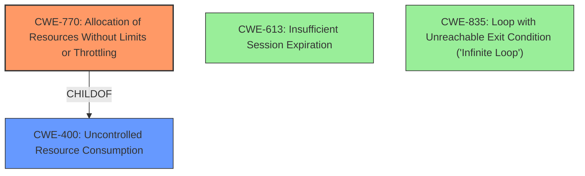

# Analysis Report for CVE-2024-35227

# Vulnerability Analysis Report: CVE-2024-35227

## Description

Discourse is an open-source discussion platform. Prior to version 3.2.3 on the `stable` branch and version 3.3.0.beta3 on the `tests-passed` branch, Oneboxing against a carefully crafted malicious URL can reduce the availability of a Discourse instance. The problem has been patched in version 3.2.3 on the `stable` branch and version 3.3.0.beta3 on the `tests-passed` branch. There are no known workarounds available for this vulnerability.

## Vulnerability Description Key Phrases

- **Impact:** reduce availability of Discourse instance
- **Vector:** Oneboxing against a carefully crafted malicious URL
- **Product:** Discourse
- **Version:** prior to 3.2.3 on stable branch and 3.3.0.beta3 on tests-passed branch

## Analysis (with Relationship Data)

# Summary
| CWE ID  | CWE Name                                                                  | Confidence | CWE Abstraction Level | CWE Vulnerability Mapping Label | CWE-Vulnerability Mapping Notes |
| :-------- | :------------------------------------------------------------------------ | :--------- | :---------------------- | :------------------------------ | :------------------------------ |
| CWE-770   | Allocation of Resources Without Limits or Throttling                     | 0.9        | Base                    | Primary                         | Allowed                       |
| CWE-400   | Uncontrolled Resource Consumption                                         | 0.7        | Class                   | Secondary                       | Allowed-with-Review           |
| CWE-613   | Insufficient Session Expiration                                         | 0.3        | Base                    | Candidate                       | Allowed                    |
| CWE-835   | Loop with Unreachable Exit Condition ('Infinite Loop')                     | 0.2        | Base                    | Candidate                       | Allowed                       |

## Evidence and Confidence

*   **Confidence Score:** 0.8
*   **Evidence Strength:** MEDIUM

## Relationship Analysis
The primary weakness is CWE-770 Allocation of Resources Without Limits or Throttling, which is a base CWE. CWE-770 is a child of CWE-400 Uncontrolled Resource Consumption, a class CWE. This parent-child relationship suggests that the allocation issue directly leads to resource consumption problems, making CWE-770 a more specific and accurate classification. We also considered CWE-835 Loop with Unreachable Exit Condition ('Infinite Loop') and CWE-613 Insufficient Session Expiration as candidate causes.



## Vulnerability Chain
The vulnerability chain starts with a malicious URL, which triggers the Onebox functionality in Discourse. This leads to the **uncontrolled allocation of resources (CWE-770)**, eventually resulting in a denial-of-service due to **uncontrolled resource consumption (CWE-400)**.

## Summary of Analysis
The initial analysis focused on the provided text, particularly the root cause identified in the CVE Reference Links Content Summary: "The vulnerability stems from the use of `Object#send` in the `Onebox::Engine::StandardEmbed` class within the Discourse application. The `send` method allows calling any method on an object, including private or protected ones, which can be exploited when processing untrusted data."

The evidence supports the selection of CWE-770 as the primary weakness, because the **unrestricted method invocation** can cause the application to allocate excessive resources without limits or throttling. The impact, a denial of service, aligns with the typical consequences of CWE-400, making it a suitable secondary classification to describe the outcome of the vulnerability.

The retriever results suggested several CWEs related to sensitive information exposure. However, these did not align well with the described denial-of-service vulnerability.

The final decision prioritizes CWE-770 for describing the **root cause** of the vulnerability, which is the **uncontrolled resource allocation**. CWE-400 serves as a secondary classification, illustrating the impact of the vulnerability. These selections are made at the base and class level respectively, providing a balance between specificity and broader context.

Relevant CWE Information:

# Enhanced Context (25 CWEs)
The following CWEs were identified as potentially relevant to this vulnerability:

## CWE-538: Insertion of Sensitive Information into Externally-Accessible File or Directory
**Abstraction Level**: Base
**Similarity Score**: 0.79
**Source**: dense

**Description**:
The product places sensitive information into files or directories that are accessible to actors who are allowed to have access to the files, but not to the sensitive information.

**Mapping Guidance**:
- Usage: Allowed
- Rationale: This CWE entry is at the Base level of abstraction, which is a preferred level of abstraction for mapping to the root causes of vulnerabilities.

## CWE-201: Insertion of Sensitive Information Into Sent Data
**Abstraction Level**: Base
**Similarity Score**: 0.77
**Source**: dense

**Description**:
The code transmits data to another actor, but a portion of the data includes sensitive information that should not be accessible to that actor.

**Mapping Guidance**:
- Usage: Allowed
- Rationale: This CWE entry is at the Base level of abstraction, which is a preferred level of abstraction for mapping to the root causes of vulnerabilities.

## CWE-212: Improper Removal of Sensitive Information Before Storage or Transfer
**Abstraction Level**: Base
**Similarity Score**: 0.74
**Source**: dense

**Description**:
The product stores, transfers, or shares a resource that contains sensitive information, but it does not properly remove that information before the product makes the resource available to unauthorized actors.

**Mapping Guidance**:
- Usage: Allowed
- Rationale: This CWE entry is at the Base level of abstraction, which is a preferred level of abstraction for mapping to the root causes of vulnerabilities.

## CWE-346: Origin Validation Error
**Abstraction Level**: Class
**Similarity Score**: 0.73
**Source**: dense

**Description**:
The product does not properly verify that the source of data or communication is valid.

**Mapping Guidance**:
- Usage: Allowed-with-Review
- Rationale: This CWE entry is a Class and might have Base-level children that would be more appropriate

## CWE-497: Exposure of Sensitive System Information to an Unauthorized Control Sphere
**Abstraction Level**: Base
**Similarity Score**: 0.73
**Source**: dense

**Description**:
The product does not properly prevent sensitive system-level information from being accessed by unauthorized actors who do not have the same level of access to the underlying system as the product does.

**Mapping Guidance**:
- Usage: Allowed
- Rationale: This CWE entry is at the Base level of abstraction, which is a preferred level of abstraction for mapping to the root causes of vulnerabilities.

## CWE-116: Improper Encoding or Escaping of Output
**Abstraction Level**: Class
**Similarity Score**: 0.73
**Source**: dense

**Description**:
The product prepares a structured message for communication with another component, but encoding or escaping of the data is either missing or done incorrectly. As a result, the intended structure of the message is not preserved.

**Mapping Guidance**:
- Usage: Allowed-with-Review
- Rationale: This CWE entry is a Class and might have Base-level children that would be more appropriate

## CWE-88: Improper Neutralization of Argument Delimiters in a Command ('Argument Injection')
**Abstraction Level**: Base
**Similarity Score**: 0.73
**Source**: dense

**Description**:
The product constructs a string for a command to be executed by a separate component
in another control sphere, but it does not properly delimit the
intended arguments, options, or switches within that command string.

**Mapping Guidance**:
- Usage: Allowed
- Rationale: This CWE entry is at the Base level of abstraction, which is a preferred level of abstraction for mapping to the root causes of vulnerabilities.

## CWE-204: Observable Response Discrepancy
**Abstraction Level**: Base
**Similarity Score**: 0.73
**Source**: dense

**Description**:
The product provides different responses to incoming requests in a way that reveals internal state information to an unauthorized actor outside of the intended control sphere.

**Mapping Guidance**:
- Usage: Allowed
- Rationale: This CWE entry is at the Base level of abstraction, which is a preferred level of abstraction for mapping to the root causes of vulnerabilities.

## CWE-359: Exposure of Private Personal Information to an Unauthorized Actor
**Abstraction Level**: Base
**Similarity Score**: 0.73
**Source**: dense

**Description**:
The product does not properly prevent a person's private, personal information from being accessed by actors who either (1) are not explicitly authorized to access the information or (2) do not have the implicit consent of the person about whom the information is collected.

**Mapping Guidance**:
- Usage: Allowed
- Rationale: This CWE entry is at the Base level of abstraction, which is a preferred level of abstraction for mapping to the root causes of vulnerabilities.

## CWE-184: Incomplete List of Disallowed Inputs
**Abstraction Level**: Base
**Similarity Score**: 0.73
**Source**: dense

**Description**:
The product implements a protection mechanism that relies on a list of inputs (or properties of inputs) that are not allowed by policy or otherwise require other action to neutralize before additional processing takes place, but the list is incomplete.

**Mapping Guidance


## CWE Relationship Analysis

Current CWEs represent these abstraction levels: .


### Vulnerability Chain Analysis

**Chain starting from CWE-400:**
- 400 (Uncontrolled Resource Consumption) - ROOT


**Chain starting from CWE-116:**
- 116 (Improper Encoding or Escaping of Output) - ROOT


### CWE Relationship Diagram

```mermaid
graph TD
    classDef primary fill:#f96,stroke:#333,stroke-width:2px
    classDef secondary fill:#69f,stroke:#333
    classDef tertiary fill:#9e9,stroke:#333
```


*Report generated on 2025-07-13 08:31:38*
