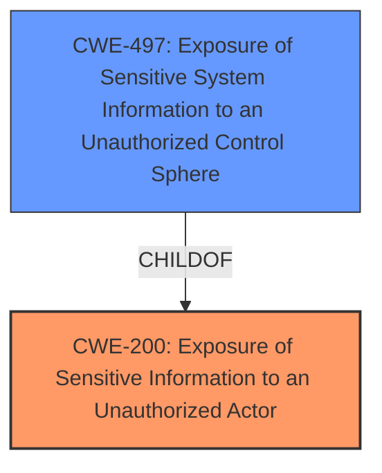

# Analysis for CVE-2024-35230

# Summary

| CWE ID | CWE Name | Confidence | CWE Abstraction Level | CWE Vulnerability Mapping Label | CWE-Vulnerability Mapping Notes |
|---|---|---|---|---|---|
| CWE-200 | Exposure of Sensitive Information to an Unauthorized Actor | 0.9 | Class | Primary | Allowed-with-Review |
| CWE-497 | Exposure of Sensitive System Information to an Unauthorized Control Sphere | 0.7 | Base | Secondary | Allowed |

## Evidence and Confidence

*   **Confidence Score:** 0.8
*   **Evidence Strength:** HIGH

## Relationship Analysis

The primary CWE is CWE-200, which is a Class-level CWE. CWE-200 has child CWEs that are more specific, but none of them fit the description exactly. CWE-497, which represents exposure of sensitive *system* information, is a closely related Base CWE and is added as a secondary CWE since the version and revision information are considered system level.

## Vulnerability Chain

The vulnerability chain starts with the **improper access control** leading to the **exposure of sensitive information**, which in turn allows attackers to identify vulnerable software components and plan targeted attacks.

## Summary of Analysis

The initial analysis focused on identifying the root cause of the vulnerability. The description clearly states that the welcome and about pages expose sensitive version and revision information, allowing attackers to identify vulnerable software components. The key phrase "**improper access control**" and impact "information disclosure" helped narrow down the possible CWEs.

The retriever results suggested several CWEs related to authorization and information exposure. However, after reviewing the CWE specifications and the vulnerability description, CWE-200 (Exposure of Sensitive Information to an Unauthorized Actor) emerged as the most appropriate primary CWE. This is because the vulnerability directly involves the exposure of sensitive information (version details) to unauthorized actors (unauthenticated users). Since the information disclosed is system-level, CWE-497 is added as a secondary CWE.

The graph relationships confirm that CWE-497 is a child of CWE-200, making it a more specific representation of the vulnerability. The selected CWEs are at the optimal level of specificity, as they accurately capture the nature of the weakness and its potential impact.

Relevant CWE Information:

# Enhanced Context (25 CWEs)
The following CWEs were identified as potentially relevant to this vulnerability:

## CWE-497: Exposure of Sensitive System Information to an Unauthorized Control Sphere
**Abstraction Level**: Base
**Similarity Score**: 0.78
**Source**: dense

**Description**:
The product does not properly prevent sensitive system-level information from being accessed by unauthorized actors who do not have the same level of access to the underlying system as the product does.

**Mapping Guidance**:
- Usage: Allowed
- Rationale: This CWE entry is at the Base level of abstraction, which is a preferred level of abstraction for mapping to the root causes of vulnerabilities.

## CWE-200: Exposure of Sensitive Information to an Unauthorized Actor
**Abstraction Level**: Class
**Similarity Score**: 0.486
**Source**: sparse

**Description**:
The product exposes sensitive information about its environment, users, or associated data to an actor that is not explicitly authorized to have that information. The sensitive information is not critical to the operation of the product, but it could be used to perform a different attack, gain additional knowledge, or compromise the product or system.

**Mapping Guidance**:
- Usage: Discouraged
- Rationale: CWE-200 is high-level and is often misused as a catch-all when lower-level CWE IDs might be applicable. It is sometimes used for low-information vulnerability reports [REF-1287]. It is a level-1 Class (i.e., a child of a Pillar). It is not useful for trend analysis.

**CWE-200** Exposure of Sensitive Information to an Unauthorized Actor is the most appropriate because the description explicitly states that version and revision information is exposed to unauthenticated users. The security implication is that attackers can use this information to identify and exploit known vulnerabilities in the software.

**CWE-497** Exposure of Sensitive System Information to an Unauthorized Control Sphere is added as a secondary because the version and revision information exposed relates to the system.