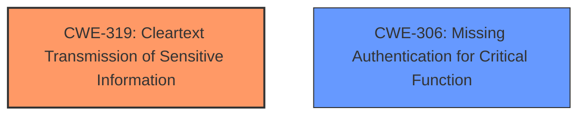

# Analysis for CVE-2024-35294

# Summary
| CWE ID | CWE Name | Confidence | CWE Abstraction Level | CWE Vulnerability Mapping Label | CWE-Vulnerability Mapping Notes |
|---|---|---|---|---|---|
| CWE-319 | Cleartext Transmission of Sensitive Information | 0.9 | Base | Primary CWE | Allowed |
| CWE-306 | Missing Authentication for Critical Function | 0.7 | Base | Secondary | Allowed |

## Evidence and Confidence

*   **Confidence Score:** 0.8
*   **Evidence Strength:** MEDIUM

## Relationship Analysis
The primary CWE is CWE-319, which describes the transmission of sensitive information in cleartext. This is directly supported by the vulnerability description, which states that administrative credentials can be grabbed in plaintext. CWE-306 is a secondary CWE, because traffic capture does not require authentication. These two CWEs are related but distinct issues that contribute to the overall vulnerability. There is no direct parent-child relationship between CWE-319 and CWE-306, but both are related to broader security concerns, such as improper access control.

## Vulnerability Chain
The vulnerability chain starts with **missing authentication** for traffic capture (CWE-306), which allows an attacker to capture network traffic. This captured traffic contains **administrative credentials transmitted in cleartext** (CWE-319), leading to unauthorized access.

## Summary of Analysis
Based on the provided information, the primary weakness is the **cleartext transmission of sensitive information** (CWE-319), as the administrative credentials are being transmitted without encryption. The vulnerability description states that an unauthenticated remote attacker can grab plaintext administrative credentials using the device's traffic capture without authentication, indicating the credentials are not protected during transmission. This is further supported by the "CVE Reference Links Content Summary," which mentions "HTTP login resulting in credentials being transmitted in plain text." Additionally, the **lack of authentication** for traffic capture download (CWE-306) is a contributing factor, as it allows the attacker to capture the traffic in the first place.

The retriever results also listed CWE-319 as the top candidate.

CWE-306 is a contributing factor because the traffic capture should require authentication.

Other CWEs considered but not used:

*   CWE-614: Sensitive Cookie in HTTPS Session Without 'Secure' Attribute: While related to cleartext transmission, this is specific to cookies, which is not mentioned in the description.
*   CWE-522: Insufficiently Protected Credentials: This is a broader category and less specific than CWE-319, which directly addresses the cleartext transmission.
*   CWE-294: Authentication Bypass by Capture-replay: This is related but not the primary issue. The main problem is the cleartext transmission, not the bypass itself.
*   CWE-312: Cleartext Storage of Sensitive Information: This is about storage, not transmission, so it doesn't fit the vulnerability description.
*   CWE-256: Plaintext Storage of a Password: Similar to CWE-312, this is about storage, not transmission.
*   CWE-912: Hidden Functionality: This doesn't seem relevant to the vulnerability description.
*   CWE-291: Reliance on IP Address for Authentication: Not relevant to the vulnerability description.
*   CWE-1392: Use of Default Credentials: Not relevant to the vulnerability description.

Relevant CWE Information: