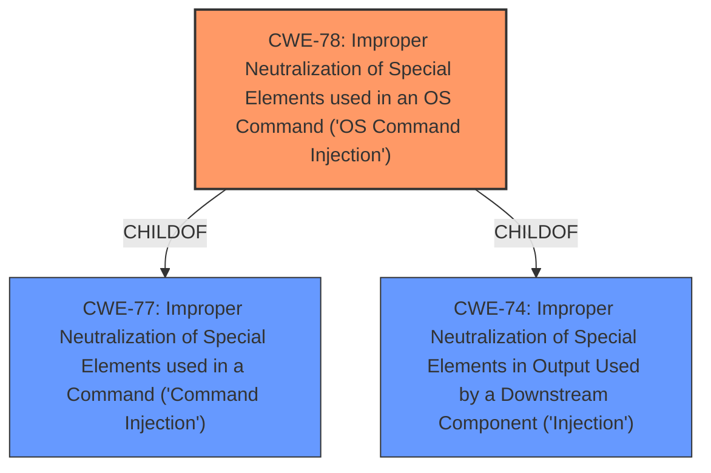

# Analysis for CVE-2024-35518

# Summary
| CWE ID | CWE Name | Confidence | CWE Abstraction Level | CWE Vulnerability Mapping Label | CWE-Vulnerability Mapping Notes |
|---|---|---|---|---|---|
| CWE-78 | Improper Neutralization of Special Elements used in an OS Command ('OS Command Injection') | 1.0 | Base | Primary | Allowed |

## Evidence and Confidence

*   **Confidence Score:** 1.0
*   **Evidence Strength:** HIGH

## Relationship Analysis
The primary relationship that influenced my decision was the ChildOf relationship between CWE-78 and CWE-77, and CWE-74. While CWE-77 is a parent of CWE-78, CWE-78 is more specific because the command injection is happening at the OS level. CWE-74 is a higher level *Injection* Class weakness, and is also not appropriate.

## Vulnerability Chain
The vulnerability chain starts with the **improper neutralization** of the `wan_dns1_pri` parameter, leading to **OS Command Injection**, and ultimately resulting in arbitrary code execution on the Netgear device.
  - **Root Cause:** CWE-78 Improper Neutralization of Special Elements used in an OS Command ('OS Command Injection')
  - **Impact:** Code Execution

## Summary of Analysis
The analysis is based on the provided vulnerability description and CVE reference. The description clearly states a **command injection** vulnerability in `genie_fix2.cgi` via the `wan_dns1_pri` parameter. The CVE reference confirms this, indicating that the **improper handling** of the `wan_dns1_pri` parameter allows for arbitrary command execution.

The Retriever results strongly support CWE-78 as the primary CWE. CWE-77 is a close alternative, but CWE-78 is more specific to OS commands, aligning with the details in the vulnerability description. The other CWEs in the Retriever results are less relevant as they address different types of vulnerabilities (e.g., SQL injection, XSS).

The decision to choose CWE-78 is based on its direct match to the vulnerability description, the supporting evidence from the CVE reference, and the high score in the Retriever results. The CWE is at the optimal level of specificity (Base) and accurately reflects the root cause of the vulnerability.

Relevant CWE Information:

# Enhanced Context (25 CWEs)
The following CWEs were identified as potentially relevant to this vulnerability:

## CWE-77: Improper Neutralization of Special Elements used in a Command ('Command Injection')
**Abstraction Level**: Class
**Similarity Score**: 0.75
**Source**: dense

**Description**:
The product constructs all or part of a command using externally-influenced input from an upstream component, but it does not neutralize or incorrectly neutralizes special elements that could modify the intended command when it is sent to a downstream component.

**Mapping Guidance**:
- Usage: Allowed-with-Review
- Rationale: CWE-77 is often misused when OS command injection (CWE-78) was intended instead [REF-1287].

## CWE-78: Improper Neutralization of Special Elements used in an OS Command ('OS Command Injection')
**Abstraction Level**: Base
**Similarity Score**: 0.74
**Source**: dense

**Description**:
The product constructs all or part of an OS command using externally-influenced input from an upstream component, but it does not neutralize or incorrectly neutralizes special elements that could modify the intended OS command when it is sent to a downstream component.

**Mapping Guidance**:
- Usage: Allowed
- Rationale: This CWE entry is at the Base level of abstraction, which is a preferred level of abstraction for mapping to the root causes of vulnerabilities.

## CWE-74: Improper Neutralization of Special Elements in Output Used by a Downstream Component ('Injection')
**Abstraction Level**: Class
**Similarity Score**: 0.75
**Source**: dense

**Description**:
The product constructs all or part of a command, data structure, or record using externally-influenced input from an upstream component, but it does not neutralize or incorrectly neutralizes special elements that could modify how it is parsed or interpreted when it is sent to a downstream component.

**Mapping Guidance**:
- Usage: Discouraged
- Rationale: CWE-74 is high-level and often misused when lower-level weaknesses are more appropriate.

### Other CWEs Considered:

*   **CWE-77 Improper Neutralization of Special Elements used in a Command ('Command Injection')**: While this is a closely related CWE, it is a class-level CWE. Since the command injection is specifically an OS command injection, CWE-78 is more appropriate.
*   **CWE-74 Improper Neutralization of Special Elements in Output Used by a Downstream Component ('Injection')**: This is a high-level *Injection* Class weakness, and is not appropriate because CWE-78 is more specific and accurate.
*   **CWE-790 Improper Filtering of Special Elements**: This CWE is too general. The vulnerability is specifically related to command injection, not just general filtering issues.
*   **CWE-89 Improper Neutralization of Special Elements used in an SQL Command ('SQL Injection')**: This is specific to SQL injection, which is not relevant to the vulnerability description.
*   **CWE-134 Use of Externally-Controlled Format String**: This is specific to format string vulnerabilities, which are not mentioned in the description.
*   **CWE-80 Improper Neutralization of Script-Related HTML Tags in a Web Page (Basic XSS)**: This is specific to Cross-Site Scripting (XSS) vulnerabilities, which are not mentioned in the description.