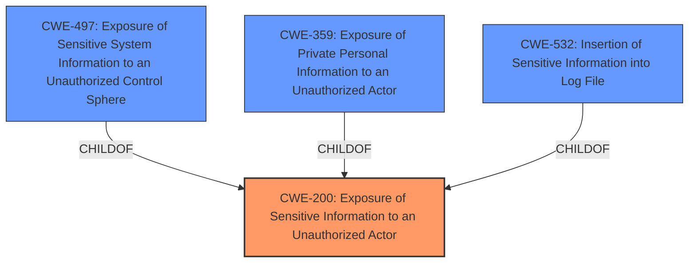

# Enhanced Analysis for CVE-2024-35691

# Summary

| CWE ID | CWE Name | Confidence | CWE Abstraction Level | CWE Vulnerability Mapping Label | CWE-Vulnerability Mapping Notes |
|---|---|---|---|---|---|
| **CWE-200** | Exposure of Sensitive Information to an Unauthorized Actor | 0.8 | Class | Primary CWE | Discouraged, but chosen due to lack of more specific evidence about the root cause. |

## Evidence and Confidence

*   **Confidence Score:** 0.8
*   **Evidence Strength:** MEDIUM

## Relationship Analysis
The primary CWE selected is CWE-200. This is a Class-level CWE, and more specific Base or Variant level CWEs would normally be preferred. However, the provided information lacks specific details about the root cause. The Retriever results list other potential CWEs, especially those related to broken access control or exposure of specific types of sensitive data.



## Vulnerability Chain
The vulnerability chain starts with the **weakness** in the plugin that allows unauthorized access to sensitive information, leading to the **impact** of sensitive data exposure. The root cause is a **lack of proper access controls**.

## Summary of Analysis
The vulnerability is described as an "Exposure of Sensitive Information to an Unauthorized Actor". The CVE Reference Links Content Summary highlights the root cause as "Sensitive Data Exposure" and states that "The plugin allows a malicious actor to view sensitive information that is normally not available to regular users."

CWE-200 (Exposure of Sensitive Information to an Unauthorized Actor) is a Class-level CWE that describes the general case where a product exposes sensitive information to an actor that is not authorized to have access to it. While the mapping guidance discourages using CWE-200 directly due to its high level of abstraction, the limited information available prevents assigning a more specific CWE.

CWE-497 (Exposure of Sensitive System Information to an Unauthorized Control Sphere), CWE-359 (Exposure of Private Personal Information to an Unauthorized Actor) and CWE-532 (Insertion of Sensitive Information into Log File) were considered as more specific alternatives. However, without more information about the exact nature of the exposed information and the mechanism of exposure, it is difficult to justify selecting one of these over CWE-200.

Therefore, CWE-200 is selected as the primary CWE with a confidence of 0.8. This choice reflects the high-level nature of the vulnerability description and the lack of specific details about the root cause.


## CWE Relationship Analysis

Current CWEs represent these abstraction levels: .


### Vulnerability Chain Analysis

**Chain starting from CWE-200:**
- 200 (Exposure of Sensitive Information to an Unauthorized Actor) - ROOT


**Chain starting from CWE-359:**
- 359 (Exposure of Private Personal Information to an Unauthorized Actor) - ROOT


### CWE Relationship Diagram

```mermaid
graph TD
    classDef primary fill:#f96,stroke:#333,stroke-width:2px
    classDef secondary fill:#69f,stroke:#333
    classDef tertiary fill:#9e9,stroke:#333
```