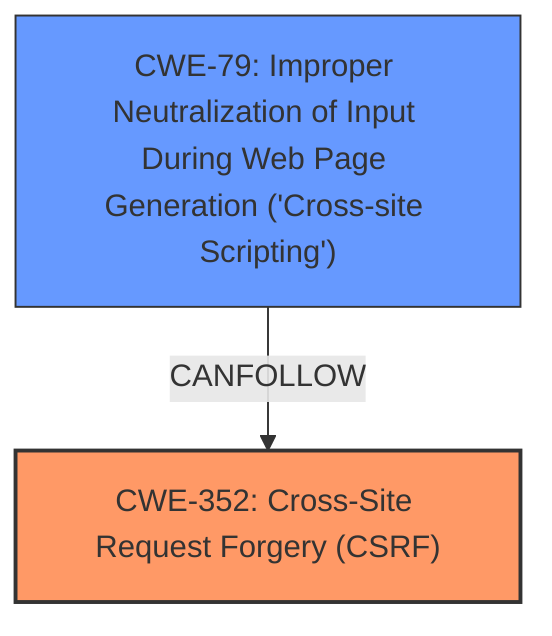

# Enhanced Analysis for CVE-2024-35773

# Summary
| CWE ID | CWE Name | Confidence | CWE Abstraction Level | CWE Vulnerability Mapping Label | CWE-Vulnerability Mapping Notes |
|---|---|---|---|---|---|
| CWE-352 | Cross-Site Request Forgery (CSRF) | 0.9 | Compound | Primary | Allowed |
| CWE-79 | Improper Neutralization of Input During Web Page Generation ('Cross-site Scripting') | 0.9 | Base | Secondary | Allowed |

## Evidence and Confidence

*   **Confidence Score:** 0.9
*   **Evidence Strength:** HIGH

## Relationship Analysis
The primary relationship is that **lack of CSRF protection** (CWE-352) can lead to cross-site scripting (CWE-79) if an attacker can forge requests to inject malicious scripts. CWE-352 is a compound weakness, representing a combination of factors that enable the attack. CWE-79 is a base weakness describing the improper neutralization of input.



## Vulnerability Chain
The vulnerability chain starts with the **lack of CSRF protection** (CWE-352). This allows an attacker to potentially forge requests, leading to the injection of malicious scripts. The **cross-site scripting** (CWE-79) vulnerability occurs because the application **fails to properly neutralize input** during web page generation, allowing the injected script to be executed. Thus, the chain is: CWE-352 -> CWE-79.

## Summary of Analysis
The vulnerability description clearly states a Cross-Site Request Forgery (CSRF) vulnerability that allows Cross-Site Scripting (XSS). The **Vulnerability Description Key Phrases** section highlights "**rootcause: lack of CSRF protection**" and "**weakness: cross-site scripting**". The CVE Reference Links Content Summary confirms this by stating the **root_cause** as "The WordPress Comment Reply Email Plugin is vulnerable to Cross-Site Scripting (XSS)" and listing "Cross-Site Scripting (XSS)" as one of the **weaknesses**. It also indicates that an "Unauthenticated attacker can inject malicious scripts."

CWE-352 (Cross-Site Request Forgery (CSRF)) is selected as the primary CWE because the root cause is the **lack of CSRF protection**. This allows an attacker to potentially forge requests. CWE-352 is a compound weakness, which accurately reflects that multiple conditions must be met for a CSRF attack to be successful.

CWE-79 (Improper Neutralization of Input During Web Page Generation ('Cross-site Scripting')) is selected as a secondary CWE because the forged requests can lead to the injection of malicious scripts due to the application **failing to properly neutralize input**.

The retriever results list CWE-352 and CWE-79 as top candidates, supporting this assessment. The graph relationships also suggest that CWE-79 can follow CWE-352, representing the chain of events.

The selected CWEs are at the optimal level of specificity, with CWE-352 being a compound weakness and CWE-79 being a base weakness.

Relevant CWE Information:
* CWE-352: The web application does not, or cannot, sufficiently verify whether a well-formed, valid, consistent request was intentionally provided by the user who submitted the request.
* CWE-79: The product does not neutralize or incorrectly neutralizes user-controllable input before it is placed in output that is used as a web page that is served to other users.


## CWE Relationship Analysis

Current CWEs represent these abstraction levels: .


### Vulnerability Chain Analysis

**Chain starting from CWE-352:**
- 352 (Cross-Site Request Forgery (CSRF)) - ROOT


**Chain starting from CWE-79:**
- 79 (Improper Neutralization of Input During Web Page Generation ('Cross-site Scripting')) - ROOT


### CWE Relationship Diagram

```mermaid
graph TD
    classDef primary fill:#f96,stroke:#333,stroke-width:2px
    classDef secondary fill:#69f,stroke:#333
    classDef tertiary fill:#9e9,stroke:#333
```