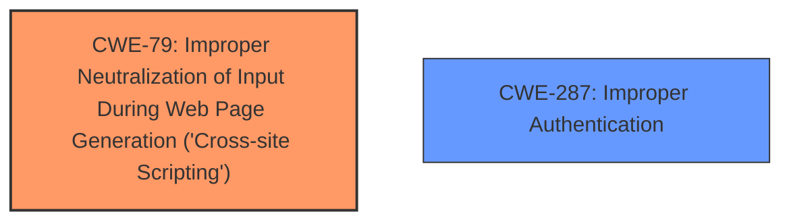

# Analysis Report for CVE-2024-35775

# Vulnerability Analysis Report: CVE-2024-35775

## Description

**Improper Neutralization of Input During Web Page Generation** (XSS or Cross-site Scripting), **Improper Authentication vulnerability** in Soliloquy Team Slider by Soliloquy allows Cross-Site Scripting (XSS).This issue affects Slider by Soliloquy from n/a through 2.7.6.

## Vulnerability Description Key Phrases

- **Rootcause:** ['Improper Authentication vulnerability', 'Improper Neutralization of Input During Web Page Generation']
- **Weakness:** cross-site scripting
- **Product:** Soliloquy Team Slider
- **Version:** n/a through 2.7.6

## Analysis (with Relationship Data)

# Summary
| CWE ID | CWE Name | Confidence | CWE Abstraction Level | CWE Vulnerability Mapping Label | CWE-Vulnerability Mapping Notes |
|---|---|---|---|---|---|
| CWE-79 | Improper Neutralization of Input During Web Page Generation ('Cross-site Scripting') | 1.0 | Base | Primary | Allowed |
| CWE-287 | Improper Authentication | 0.8 | Base | Secondary | Allowed |

## Evidence and Confidence

*   **Confidence Score:** 0.9
*   **Evidence Strength:** HIGH

## Relationship Analysis
The primary CWE is CWE-79 which is a base level CWE describing **improper neutralization of input during web page generation** leading to Cross-site Scripting. There are parent relationships to CWE-79 (e.g. CWE-119) but these are less specific. There is a secondary CWE of CWE-287 due to **improper authentication** also being described.



## Vulnerability Chain
The vulnerability chain starts with **improper neutralization of input** (CWE-79) which leads to Cross-Site Scripting (XSS). There is also an **improper authentication vulnerability** (CWE-287), but the relationship between the two is not specified. The root cause of the XSS vulnerability is the **improper neutralization of input**.

## Summary of Analysis
The vulnerability description clearly indicates that the Slider by Soliloquy plugin is vulnerable to Cross-Site Scripting (XSS) due to **improper neutralization of input**. This aligns perfectly with CWE-79, which describes this **improper neutralization** at the base level. The description also states there is an **improper authentication vulnerability**, which is mapped to CWE-287.

The evidence supporting the primary CWE mapping is strong: "Improper Neutralization of Input During Web Page Generation (XSS or Cross-site Scripting)". The retriever results also strongly suggest CWE-79, with high similarity scores across multiple categories.

I also considered other CWEs such as CWE-80 (Improper Neutralization of Script-Related HTML Tags in a Web Page (Basic XSS)), but it is a more specific variant of XSS and the description doesn't provide enough detail to narrow it down to just script-related HTML tags. CWE-352 (Cross-Site Request Forgery (CSRF)) was also considered, but it doesn't directly address the **improper neutralization of input** aspect of the vulnerability.

The final decision to map CWE-79 as the primary CWE and CWE-287 as a secondary CWE is based on the evidence from the vulnerability description, the retriever results, and the CWE specifications. The selected CWEs are at the optimal level of specificity, providing a clear and accurate representation of the weaknesses.


## CWE Relationship Analysis

Current CWEs represent these abstraction levels: .


### Vulnerability Chain Analysis

**Chain starting from CWE-80:**
- 80 (Improper Neutralization of Script-Related HTML Tags in a Web Page (Basic XSS)) - ROOT


**Chain starting from CWE-79:**
- 79 (Improper Neutralization of Input During Web Page Generation ('Cross-site Scripting')) - ROOT


### CWE Relationship Diagram

```mermaid
graph TD
    classDef primary fill:#f96,stroke:#333,stroke-width:2px
    classDef secondary fill:#69f,stroke:#333
    classDef tertiary fill:#9e9,stroke:#333
```


*Report generated on 2025-07-13 08:44:32*
