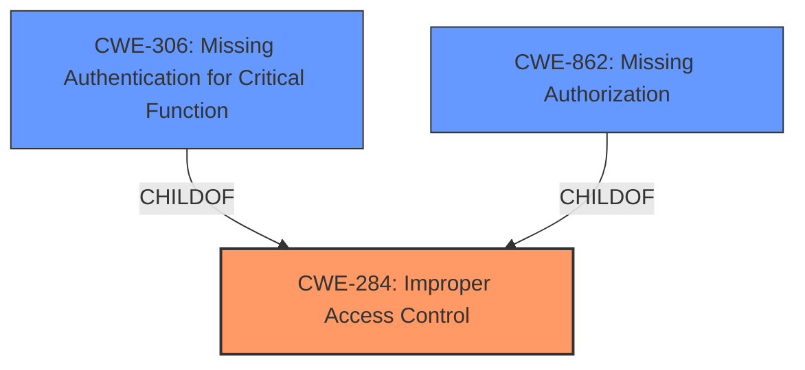

# Raw Analyzer Response for CVE-2024-36068

# Summary
| CWE ID  | CWE Name                                                        | Confidence | CWE Abstraction Level | CWE Vulnerability Mapping Label | CWE-Vulnerability Mapping Notes |
| :-------- | :-------------------------------------------------------------- | :--------- | :---------------------- | :------------------------------ | :------------------------------ |
| CWE-284 | Improper Access Control                                           | 0.9        | Pillar                  | Primary                         | Discouraged                   |
| CWE-306 | Missing Authentication for Critical Function                      | 0.7        | Base                    | Secondary                       | Allowed                       |
| CWE-862 | Missing Authorization                                             | 0.7        | Base                    | Secondary                       | Allowed                       |

## Evidence and Confidence

*   **Confidence Score:** 0.9
*   **Evidence Strength:** MEDIUM

## Relationship Analysis
The primary relationship influencing the CWE selection is the hierarchical structure concerning access control, authentication, and authorization. CWE-284 is a high-level category encompassing both authentication and authorization failures. Given the evidence of **incorrect access control** due to a **weak authentication** mechanism, CWE-284 serves as the initial classification, with consideration for more specific children.

CWE-306 and CWE-862 are considered as secondary classifications, representing potential root causes contributing to the **incorrect access control**. CWE-306 addresses the absence of authentication, while CWE-862 focuses on missing authorization checks. These CWEs offer more granular insight into the nature of the weakness.

## Vulnerability Chain
The vulnerability chain begins with **incorrect access control**, potentially stemming from **weak authentication** or **missing authorization**. This leads to the capability to execute arbitrary code.

Incorrect Access Control (CWE-284) -> {Missing Authentication (CWE-306) OR Missing Authorization (CWE-862)} -> Arbitrary Code Execution (Impact)

## Summary of Analysis
The initial assessment considered the provided evidence of **incorrect access control** and **weak authentication**. The retriever results suggested several CWEs related to authorization and authentication. Based on the vulnerability description and CVE reference, the root cause is an **incorrect access control** vulnerability due to a **weak authentication** mechanism, which can lead to arbitrary code execution.

CWE-284 (Improper Access Control) is chosen as the primary CWE due to the initial high-level description of **incorrect access control**. However, since the CVE reference specifies a **weak authentication** mechanism, we also consider CWE-306 (Missing Authentication for Critical Function) and CWE-862 (Missing Authorization) as contributing factors. Given the evidence, CWE-284 is the most appropriate high-level classification, with CWE-306 and CWE-862 providing more specific details on the root cause.

The selection of CWE-284 is influenced by the guidance that it should be used when the root cause is unclear. While **weak authentication** is mentioned, the broader issue is **incorrect access control**. The selection of CWE-306 and CWE-862 is based on the evidence of **weak authentication** and the possibility of missing authorization checks, respectively. These CWEs are at the optimal level of specificity, providing valuable insight into the vulnerability.

Relevant CWE Information:

# Enhanced Context (25 CWEs)
The following CWEs were identified as potentially relevant to this vulnerability:

## CWE-668: Exposure of Resource to Wrong Sphere
**Abstraction Level**: Class
**Similarity Score**: 0.75
**Source**: dense

**Description**:
The product exposes a resource to the wrong control sphere, providing unintended actors with inappropriate access to the resource.

**Mapping Guidance**:
- Usage: Discouraged
- Rationale: CWE-668 is high-level and is often misused as a catch-all when lower-level CWE IDs might be applicable. It is sometimes used for low-information vulnerability reports [REF-1287]. It is a level-1 Class (i.e., a child of a Pillar). It is not useful for trend analysis.

*Not Used:* This CWE is too broad and doesn't directly address the authentication or authorization issues.

## CWE-280: Improper Handling of Insufficient Permissions or Privileges 
**Abstraction Level**: Base
**Similarity Score**: 0.75
**Source**: dense

**Description**:
The product does not handle or incorrectly handles when it has insufficient privileges to access resources or functionality as specified by their permissions. This may cause it to follow unexpected code paths that may leave the product in an invalid state.

**Mapping Guidance**:
- Usage: Allowed
- Rationale: This CWE entry is at the Base level of abstraction, which is a preferred level of abstraction for mapping to the root causes of vulnerabilities.

*Not Used:* While related to access control, the vulnerability's description focuses more on the **incorrect** nature of the access control rather than the **insufficient** handling of permissions.

## CWE-639: Authorization Bypass Through User-Controlled Key
**Abstraction Level**: Base
**Similarity Score**: 0.74
**Source**: dense

**Description**:
The system's authorization functionality does not prevent one user from gaining access to another user's data or record by modifying the key value identifying the data.

**Mapping Guidance**:
- Usage: Allowed
- Rationale: This CWE entry is at the Base level of abstraction, which is a preferred level of abstraction for mapping to the root causes of vulnerabilities.

*Not Used:* This CWE is too specific, as there is no mention of user-controlled keys in the vulnerability description.

## CWE-41: Improper Resolution of Path Equivalence
**Abstraction Level**: Base
**Similarity Score**: 0.74
**Source**: dense

**Description**:
The product is vulnerable to file system contents disclosure through path equivalence. Path equivalence involves the use of special characters in file and directory names. The associated manipulations are intended to generate multiple names for the same object.

**Mapping Guidance**:
- Usage: Allowed
- Rationale: This CWE entry is at the Base level of abstraction, which is a preferred level of abstraction for mapping to the root causes of vulnerabilities.

*Not Used:* This CWE is irrelevant to the vulnerability.

## CWE-212: Improper Removal of Sensitive Information Before Storage or Transfer
**Abstraction Level**: Base
**Similarity Score**: 0.74
**Source**: dense

**Description**:
The product stores, transfers, or shares a resource that contains sensitive information, but it does not properly remove that information before the product makes the resource available to unauthorized actors.

**Mapping Guidance**:
- Usage: Allowed
- Rationale: This CWE entry is at the Base level of abstraction, which is a preferred level of abstraction for mapping to the root causes of vulnerabilities.

*Not Used:* This CWE is not applicable as the vulnerability does not involve the removal of sensitive information.

## CWE-274: Improper Handling of Insufficient Privileges
**Abstraction Level**: Base
**Similarity Score**: 0.74
**Source**: dense

**Description**:
The product does not handle or incorrectly handles when it has insufficient privileges to perform an operation, leading to resultant weaknesses.

**Mapping Guidance**:
- Usage: Discouraged
- Rationale: This CWE entry could be deprecated in a future version of CWE.

*Not Used:* Similar to CWE-280, it focuses on insufficient privileges rather than the broader access control issue.

## CWE-267: Privilege Defined With Unsafe Actions
**Abstraction Level**: Base
**Similarity Score**: 0.74
**Source**: dense

**Description**:
A particular privilege, role, capability, or right can be used to perform unsafe actions that were not intended, even when it is assigned to the correct entity.

**Mapping Guidance**:
- Usage: Allowed
- Rationale: This CWE entry is at the Base level of abstraction, which is a preferred level of abstraction for mapping to the root causes of vulnerabilities.

*Not Used:* This CWE is too specific, as the vulnerability's description doesn't provide sufficient information to determine whether a privilege is defined with unsafe actions.

## CWE-807: Reliance on Untrusted Inputs in a Security Decision
**Abstraction Level**: Base
**Similarity Score**: 0.74
**Source**: dense

**Description**:
The product uses a protection mechanism that relies on the existence or values of an input, but the input can be modified by an untrusted actor in a way that bypasses the protection mechanism.

**Mapping Guidance**:
- Usage: Allowed
- Rationale: This CWE entry is at the Base level of abstraction, which is a preferred level of abstraction for mapping to the root causes of vulnerabilities.

*Not