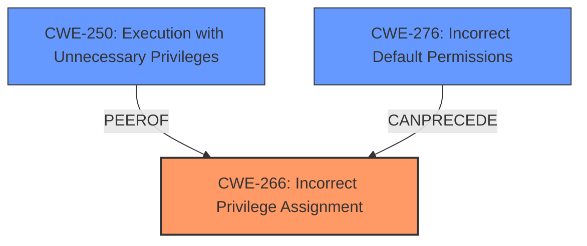

# Analysis for CVE-2024-36073

# Summary
| CWE ID | CWE Name | Confidence | CWE Abstraction Level | CWE Vulnerability Mapping Label | CWE-Vulnerability Mapping Notes |
|---|---|---|---|---|---|
| CWE-266 | Incorrect Privilege Assignment | 0.8 | Base | Primary | Allowed |
| CWE-250 | Execution with Unnecessary Privileges | 0.7 | Base | Secondary | Allowed |
| CWE-276 | Incorrect Default Permissions | 0.6 | Base | Secondary | Allowed |

## Evidence and Confidence

*   **Confidence Score:** 0.8
*   **Evidence Strength:** MEDIUM

## Relationship Analysis
The primary weakness identified is CWE-266, **Incorrect Privilege Assignment**, because the attacker, who has administrative access to the server, is able to overwrite sensitive configuration files and execute commands with SYSTEM/root privileges on the client endpoint. This suggests that the initial privilege assignment for modifying the configuration files was incorrect, allowing the attacker to gain elevated privileges on the client. CWE-250, **Execution with Unnecessary Privileges**, is considered because the configuration overwrite leads to the execution of system commands with SYSTEM/root privileges, which might indicate that the system is running with higher privileges than necessary. CWE-276, **Incorrect Default Permissions**, is considered as a possible root cause, assuming the default permissions on the configuration files were overly permissive, allowing them to be overwritten by an attacker with admin access to the server.

## Vulnerability Chain
The vulnerability chain starts with the **incorrect privilege assignment** (CWE-266) on the configuration files. This allows an attacker with administrative access to the server to overwrite these files. Overwriting the configuration leads to the ability to execute system commands with SYSTEM/root privileges on the client endpoint, resulting in **execution with unnecessary privileges** (CWE-250).

CWE-266 (Incorrect Privilege Assignment) -> Overwrite Sensitive Configuration -> CWE-250 (Execution with Unnecessary Privileges)

## Summary of Analysis
Based on the vulnerability description, the attacker with administrative access to the Endpoint Protector or Unify server can overwrite sensitive configuration files, leading to remote code execution with SYSTEM/root privileges on a client endpoint. This indicates that the **incorrect privilege assignment** (CWE-266) is the root cause. The ability to execute commands with SYSTEM/root privileges after overwriting the configuration further suggests that the system might be running with **unnecessary privileges** (CWE-250). The **incorrect default permissions** (CWE-276) may be a contributing factor, as the default permissions on the configuration files might have been overly permissive.

The provided evidence supports these classifications. The vulnerability description explicitly mentions that an attacker with administrative access to the server can overwrite sensitive configuration and subsequently execute system commands with SYSTEM/root privileges on a chosen client endpoint.

The selected CWEs are at the optimal level of specificity, providing a clear and accurate representation of the vulnerability.

CWEs Considered But Not Used:

*   **CWE-306: Missing Authentication for Critical Function**: While authentication is implicitly involved (the attacker needs admin access), the core issue is not the missing authentication itself, but rather what the attacker can do after gaining access (overwrite configurations and execute commands).
*   **CWE-732: Incorrect Permission Assignment for Critical Resource**: Similar to CWE-266 and CWE-276, but CWE-266 and CWE-276 are more precise, as they explicitly address the incorrect privilege assignment, while CWE-732 is more generic.
*   **CWE-269: Improper Privilege Management**: This is a class-level CWE and is too broad for this specific vulnerability. The issue is not a general management problem but a specific assignment issue.
*   **CWE-23: Relative Path Traversal**: This CWE is related to file access using relative paths. The vulnerability description does not indicate any path traversal issues.
*   **CWE-863: Incorrect Authorization**: Although authorization is a factor, the initial **incorrect privilege assignment** is the more direct root cause.
*   **CWE-284: Improper Access Control**: This is a high-level CWE. CWE-266, CWE-250 and CWE-276 are more specific and thus better choices.
*   **CWE-1336: Improper Neutralization of Special Elements Used in a Template Engine**: This CWE is related to template injection vulnerabilities. The vulnerability description does not indicate any template injection issues.
*   **CWE-912: Hidden Functionality**: There is no hidden functionality mentioned in the description.
*   **CWE-1272: Sensitive Information Uncleared Before Debug/Power State Transition**: This is not related to the description.