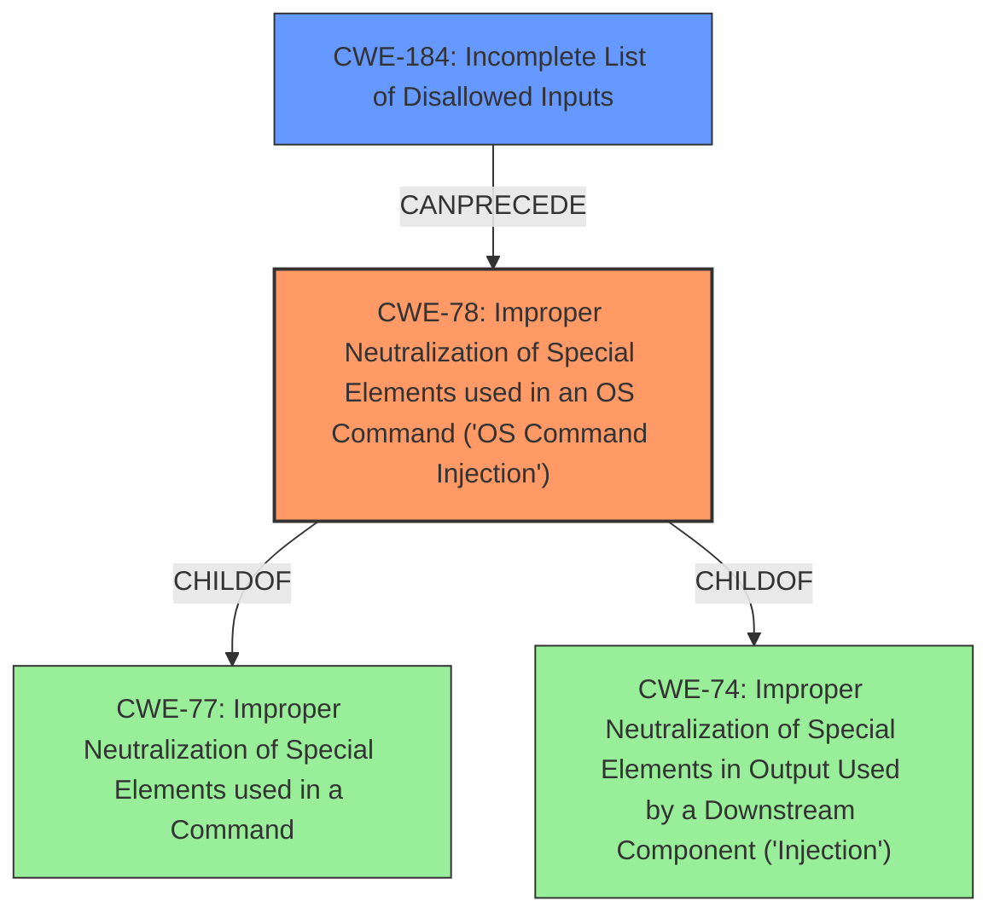

# Analysis Report for CVE-2024-36138

# Vulnerability Analysis Report: CVE-2024-36138

## Description

Bypass **incomplete fix** of CVE-2024-27980, that arises from **improper handling of batch files with all possible extensions on Windows** via child_process.spawn / child_process.spawnSync. A malicious command line argument can inject arbitrary commands and achieve code execution even if the shell option is not enabled.

## Vulnerability Description Key Phrases

- **Rootcause:** ['improper handling of batch files with all possible extensions on Windows', 'incomplete fix']
- **Impact:** ["['arbitrary command injection'", "'code execution']"]
- **Vector:** malicious command line argument
- **Component:** ["['child_process.spawn'", "'child_process.spawnSync']"]

## Analysis (with Relationship Data)

# Summary
| CWE ID | CWE Name | Confidence | CWE Abstraction Level | CWE Vulnerability Mapping Label | CWE-Vulnerability Mapping Notes |
|---|---|---|---|---|---|
| CWE-78 | Improper Neutralization of Special Elements used in an OS Command ('OS Command Injection') | 0.9 | Base | Primary | Allowed |
| CWE-184 | Incomplete List of Disallowed Inputs | 0.7 | Base | Secondary | Allowed |

## Evidence and Confidence

*   **Confidence Score:** 0.8
*   **Evidence Strength:** HIGH

## Relationship Analysis
The primary CWE is CWE-78, which describes **improper neutralization** of special elements used in an OS command. This vulnerability allows for the injection of arbitrary commands due to **improper handling of batch files**. CWE-78 is a base level CWE. The secondary CWE is CWE-184, which addresses an **incomplete list of disallowed inputs**. This is because the fix was incomplete, meaning there are still inputs that aren't being properly handled. CWE-78 is a child of CWE-77 (Improper Neutralization of Special Elements used in a Command) and CWE-74 (Improper Neutralization of Special Elements in Output Used by a Downstream Component ('Injection')). CWE-184 can precede CWE-78 in an attack chain, where an incomplete list of disallowed inputs allows for command injection.



## Vulnerability Chain
The vulnerability chain starts with an **incomplete fix**, leading to **improper handling of batch files**. This allows a **malicious command line argument** to inject arbitrary commands, resulting in **code execution**.

*   Root Cause: **incomplete fix**, **improper handling of batch files**
*   Weakness: CWE-184 Incomplete List of Disallowed Inputs
*   Exploitation Vector: malicious command line argument
*   Vulnerability: CWE-78 Improper Neutralization of Special Elements used in an OS Command ('OS Command Injection')
*   Impact: arbitrary command injection, code execution

## Summary of Analysis
The primary weakness is CWE-78 because the **improper handling** leads directly to OS command injection. The vulnerability description states the issue arises from **improper handling of batch files** allowing a malicious command line argument to inject arbitrary commands. The **incomplete fix** is a contributing factor represented by CWE-184.

The relationship graph shows that CWE-78 is related to CWE-77 and CWE-74 as a child and also CWE-184 can precede CWE-78. This further solidifies the choice of CWE-78 as the primary issue.

The selected CWEs are at the optimal level of specificity. CWE-78 is a Base level CWE that directly addresses the **improper neutralization** of special elements in OS commands. CWE-184 is also a Base level CWE.

Relevant CWE Information:

# Enhanced Context (25 CWEs)
The following CWEs were identified as potentially relevant to this vulnerability:

## CWE-138: Improper Neutralization of Special Elements
**Abstraction Level**: Class
**Similarity Score**: 0.75
**Source**: dense

**Description**:
The product receives input from an upstream component, but it does not neutralize or incorrectly neutralizes special elements that could be interpreted as control elements or syntactic markers when they are sent to a downstream component.

**Mapping Guidance**:
- Usage: Discouraged
- Rationale: This CWE entry is a level-1 Class (i.e., a child of a Pillar). It might have lower-level children that would be more appropriate

CWE-138 is a class-level CWE and is too general. While it is related to the **improper neutralization**, CWE-78 provides a more specific classification for OS command injection.

## CWE-74: Improper Neutralization of Special Elements in Output Used by a Downstream Component ('Injection')
**Abstraction Level**: Class
**Similarity Score**: 0.75
**Source**: dense

**Description**:
The product constructs all or part of a command, data structure, or record using externally-influenced input from an upstream component, but it does not neutralize or incorrectly neutralizes special elements that could modify how it is parsed or interpreted when it is sent to a downstream component.

**Mapping Guidance**:
- Usage: Discouraged
- Rationale: CWE-74 is high-level and often misused when lower-level weaknesses are more appropriate.

CWE-74 is also a class-level CWE and is too general. The description targets more specifically on output to a downstream component whereas CWE-78 is more specific to OS commands.

## CWE-184: Incomplete List of Disallowed Inputs
**Abstraction Level**: Base
**Similarity Score**: 0.74
**Source**: dense

**Description**:
The product implements a protection mechanism that relies on a list of inputs (or properties of inputs) that are not allowed by policy or otherwise require other action to neutralize before additional processing takes place, but the list is incomplete.

**Mapping Guidance**:
- Usage: Allowed
- Rationale: This CWE entry is at the Base level of abstraction, which is a preferred level of abstraction for mapping to the root causes of vulnerabilities.

CWE-184 is a valid secondary CWE as the **incomplete fix** relates to an **incomplete list of disallowed inputs**.

## CWE-41: Improper Resolution of Path Equivalence
**Abstraction Level**: Base
**Similarity Score**: 0.73
**Source**: dense

**Description**:
The product is vulnerable to file system contents disclosure through path equivalence. Path equivalence involves the use of special characters in file and directory names. The associated manipulations are intended to generate multiple names for the same object.

**Mapping Guidance**:
- Usage: Allowed
- Rationale: This CWE entry is at the Base level of abstraction, which is a preferred level of abstraction for mapping to the root causes of vulnerabilities.

CWE-41 is not applicable because the vulnerability is related to command injection, not file system contents disclosure.

## CWE-668: Exposure of Resource to Wrong Sphere
**Abstraction Level**: Class
**Similarity Score**: 0.73
**Source**: dense

**Description**:
The product exposes a resource to the wrong control sphere, providing unintended actors with inappropriate access to the resource.

**Mapping Guidance**:
- Usage: Discouraged
- Rationale: CWE-668 is high-level and is often misused as a catch-all when lower-level CWE IDs might be applicable. It is sometimes used for low-information vulnerability reports [REF-1287]. It is a level-1 Class (i.e., a child of a Pillar). It is not useful for trend analysis.

CWE-668 is too general and does not accurately describe the specific vulnerability.

## CWE-73: External Control of File Name or Path
**Abstraction Level**: Base
**Similarity Score**: 0.73
**Source**: dense

**Description**:
The product allows user input to control or influence paths or file names that are used in filesystem operations.

**Mapping Guidance**:
- Usage: Allowed
- Rationale: This CWE entry is at the Base level of abstraction, which is a preferred level of abstraction for mapping to the root causes of vulnerabilities.

CWE-73 is not applicable because the vulnerability is related to command injection, not direct file path manipulation.

## CWE-703: Improper Check or Handling of Exceptional Conditions
**Abstraction Level**: Pillar
**Similarity Score**: 0.72
**Source**: dense

**Description**:
The product does not properly anticipate or handle exceptional conditions that rarely occur during normal operation of the product.

**Mapping Guidance**:
- Usage: Discouraged
- Rationale: This CWE entry is extremely high-level, a Pillar.

CWE-703 is a pillar and too general.

## CWE-59: Improper Link Resolution Before File Access ('Link Following')
**Abstraction Level**: Base
**Similarity Score**: 0.72
**Source**: dense

**Description**:
The product attempts to access a file based on the filename, but it does not properly prevent that filename from identifying a link or shortcut that resolves to an unintended resource.

**Mapping Guidance**:
- Usage: Allowed
- Rationale: This CWE entry is at the Base level of abstraction, which is a preferred


## CWE Relationship Analysis

Current CWEs represent these abstraction levels: .


### Vulnerability Chain Analysis

**Chain starting from CWE-77:**
- 77 (Improper Neutralization of Special Elements used in a Command ('Command Injection')) - ROOT


**Chain starting from CWE-59:**
- 59 (Improper Link Resolution Before File Access ('Link Following')) - ROOT


### CWE Relationship Diagram

```mermaid
graph TD
    classDef primary fill:#f96,stroke:#333,stroke-width:2px
    classDef secondary fill:#69f,stroke:#333
    classDef tertiary fill:#9e9,stroke:#333
```


*Report generated on 2025-07-13 08:50:47*
